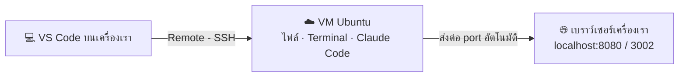

# 02 — เข้าเครื่อง VM ของตัวเองด้วย VS Code (Remote - SSH)

**เวลา:** ทดสอบครั้งแรกช่วงพักเบรก 10.15–10.30 น. · ใช้จริงใน Module 2 และช่วง Deploy

## สิ่งที่ต้องรู้ก่อน

| คำ | ความหมายแบบง่าย |
|---|---|
| **VM (Virtual Machine)** | คอมพิวเตอร์เสมือนบนคลาวด์ เปิดทิ้งไว้ 24 ชม. ไม่มีจอ ไม่มีเมาส์ |
| **Ubuntu** | ระบบปฏิบัติการ Linux ที่ติดตั้งบน VM (เหมือน Windows แต่สำหรับเซิร์ฟเวอร์) |
| **SSH** | "รีโมตเข้าเครื่อง" ผ่านข้อความ — พิมพ์คำสั่งที่เครื่องเรา แต่ไปทำงานที่ VM |
| **VS Code** | โปรแกรมแก้ไขไฟล์ของ Microsoft (ฟรี) มีทั้งหน้าต่างไฟล์ ตัวแก้ไข และ Terminal ในหน้าจอเดียว |
| **Remote - SSH** | ส่วนเสริม (Extension) ของ VS Code ที่ทำให้เปิดไฟล์และ Terminal **บน VM** ได้เหมือนอยู่ในเครื่องตัวเอง |
| **Terminal** | หน้าต่างสำหรับพิมพ์คำสั่ง |
| **Prompt ของ Terminal** | ข้อความหน้าเคอร์เซอร์ บอกว่าตอนนี้เราอยู่ "เครื่องไหน" |

### ดูยังไงว่าตอนนี้อยู่เครื่องไหน?

| ข้อความหน้าเคอร์เซอร์ | อยู่ที่ |
|---|---|
| `PS C:\Users\somchai>` | เครื่อง Windows ของเราเอง |
| `somchai@MacBook ~ %` | เครื่อง Mac ของเราเอง |
| `trainee01@training-vm-01:~$` | **VM ✅** (หลัง SSH สำเร็จ) |
| มุมซ้ายล่างของ VS Code ขึ้น `SSH: 203.0.113.10` | **VS Code เชื่อม VM อยู่ ✅** |

> 📌 **จำไว้:** คำสั่งในคู่มือส่วนใหญ่ต้องรัน **บน VM** — ก่อนวางคำสั่งให้ดูว่าหน้าเคอร์เซอร์เป็น `trainee01@...:~$` แล้ว

---

## 1. เชื่อม VM ด้วย VS Code Remote - SSH (วิธีหลักที่ใช้ทั้งวัน)

VS Code ทำให้เห็น **ไฟล์บน VM** เป็นรายการทางซ้าย แก้ไฟล์ได้เหมือนใช้ Notepad และมี **Terminal ของ VM** อยู่ด้านล่าง — ไม่ต้องจำคำสั่งเปิดไฟล์ และเปิดดูเว็บที่ AI สร้างบนเบราว์เซอร์ของเราได้ง่าย



### 1.1 ติดตั้ง VS Code (ทำก่อนวันอบรม หรือช่วงลงทะเบียน)

1. เข้า <https://code.visualstudio.com> → กด **Download** (เลือก Windows / Mac ให้ตรงเครื่อง)
2. ติดตั้งตามค่าเริ่มต้น (Windows: ติ๊ก **Add to PATH** ไว้)
3. เปิด VS Code

> ⚠️ **เครื่องของหน่วยงานที่ติดตั้งโปรแกรมเองไม่ได้:** Windows ให้ดาวน์โหลดแบบ **User Installer** (ไม่ต้องใช้สิทธิ์ Admin) หรือแบบ **.zip** แตกไฟล์แล้วเปิด `Code.exe` ได้เลย — ถ้ายังไม่ได้ แจ้ง TA

### 1.2 ติดตั้งส่วนเสริม Remote - SSH

1. คลิกไอคอน **Extensions** แถบซ้าย (รูปสี่เหลี่ยม 4 ช่อง) หรือกด `Ctrl + Shift + X` (Mac: `⌘ + Shift + X`)
2. ช่องค้นหา พิมพ์ `Remote - SSH`
3. เลือกตัวที่ผู้พัฒนาคือ **Microsoft** → กด **Install**

✅ **ผลที่ควรเห็น:** มุมซ้ายล่างของ VS Code มีปุ่มสีฟ้า/เขียวรูป `><`

### 1.3 เชื่อมต่อ VM ครั้งแรก

1. กดปุ่ม `><` มุมซ้ายล่าง → เลือก **Connect to Host...**
2. เลือก **+ Add New SSH Host...**
3. พิมพ์คำสั่งนี้ (แก้ชื่อผู้ใช้และ IP ตามบัตร) แล้วกด `Enter`

```text
ssh trainee01@203.0.113.10
```

4. ถามว่าจะบันทึกลงไฟล์ไหน → เลือก **ตัวเลือกแรก** (เช่น `C:\Users\ชื่อคุณ\.ssh\config`)
5. มุมขวาล่างขึ้น **Host added!** → กด **Connect**
6. หน้าต่างใหม่เปิดขึ้น ตอบคำถามด้านบนตามนี้:

| คำถามที่ขึ้นด้านบน | ตอบ |
|---|---|
| Select the platform of the remote host | **Linux** |
| "…" has fingerprint … Are you sure you want to continue? | **Continue** |
| Enter password for trainee01@… | พิมพ์รหัสผ่านจากซอง → `Enter` |

7. รอประมาณ 1 นาที (ครั้งแรก VS Code จะติดตั้งตัวเชื่อมต่อบน VM ให้เอง)

✅ **ผลที่ควรเห็น:** มุมซ้ายล่างขึ้น `SSH: 203.0.113.10` = **VS Code เชื่อม VM แล้ว** 🎉

> 💡 ครั้งต่อไปกด `><` → **Connect to Host...** → เลือก `203.0.113.10` ที่บันทึกไว้ได้เลย ไม่ต้องพิมพ์ใหม่

### 1.4 เปิดโฟลเดอร์งานบน VM

1. เมนู **File → Open Folder...**
2. พิมพ์ `/home/trainee01/` (แก้ชื่อผู้ใช้ให้ตรง) → กด **OK**
3. ถ้าถามรหัสผ่านอีกครั้ง ใส่รหัสเดิม
4. ถ้าถาม **Do you trust the authors of the files in this folder?** → กด **Yes, I trust the authors**

✅ **ผลที่ควรเห็น:** แถบซ้าย (Explorer) แสดงไฟล์และโฟลเดอร์บน VM

### 1.5 เปิด Terminal ของ VM

เมนู **Terminal → New Terminal** (หรือ `` Ctrl + ` ``)

✅ **ผลที่ควรเห็น:** ช่องด้านล่างขึ้น `trainee01@training-vm-01:~$` — **คำสั่งทุกอย่างในคู่มือวางที่นี่**

> 💡 ใน Terminal ของ VS Code วางข้อความด้วย `Ctrl + V` (Mac: `⌘ + V`) หรือคลิกขวา → Paste ได้เลย

### 1.6 เปิดดูเว็บบน VM ผ่านเบราว์เซอร์ของเรา (Ports)

เมื่อ AI รันเว็บทดสอบบน VM (เช่น port `8080`) VS Code จะขึ้นกล่องมุมขวาล่าง **Your application running on port 8080 is available** → กด **Open in Browser** ได้เลย

ถ้าไม่ขึ้น ให้เพิ่มเอง:

1. แถบด้านล่าง เลือกแท็บ **PORTS** (ข้าง TERMINAL)
2. กด **Forward a Port** → พิมพ์ `8080` → `Enter`
3. ทำซ้ำอีกครั้งด้วย `3002` (ใช้ดูวิดีโอใน Module 3)

| Port | ใช้ดูอะไร | เปิดที่ |
|---|---|---|
| `8080` | เว็บเครื่องมือที่ AI สร้าง (Module 2) | `http://localhost:8080` |
| `3002` | Studio ตัดต่อวิดีโอ HyperFrames (Module 3) | `http://localhost:3002` |

> 📌 ใช้ VS Code แล้ว **ไม่ต้องพิมพ์ `ssh -L ...` เอง** — แท็บ PORTS ทำหน้าที่เดียวกัน

### 1.7 ปุ่มที่ใช้บ่อยใน VS Code

| ทำอะไร | วิธี |
|---|---|
| เปิด / ปิด Terminal | `` Ctrl + ` `` |
| เปิดไฟล์จาก Terminal | `code ชื่อไฟล์` เช่น `code ~/myapp/index.html` |
| บันทึกไฟล์ | `Ctrl + S` (Mac: `⌘ + S`) |
| ดูไฟล์ทั้งหมด | แถบซ้าย ไอคอน Explorer (รูปเอกสาร) |
| ตัดการเชื่อมต่อ VM | กด `SSH: …` มุมซ้ายล่าง → **Close Remote Connection** |

---

## 2. ทางสำรอง: SSH ด้วย Terminal

ใช้เมื่อ VS Code เชื่อมต่อไม่ได้ หรืออยากทดสอบว่า VM เปิดอยู่ไหม

### 2.1 พิมพ์คำสั่ง ssh

เปิด Terminal (ดู [00_BEFORE_YOU_START](00_BEFORE_YOU_START.md) หัวข้อ 2) แล้วคัดลอกคำสั่งนี้ **แก้ `trainee01` และ `203.0.113.10` เป็นของตัวเอง** ก่อนกด `Enter`:

```bash
# รูปแบบ: ssh ชื่อผู้ใช้@IP
ssh trainee01@203.0.113.10
```

> 💡 วิธีแก้ง่ายที่สุด: วางคำสั่งลงใน Terminal ก่อน **ยังไม่กด Enter** แล้วใช้ปุ่มลูกศร ← → เลื่อนไปแก้ชื่อและ IP จากนั้นค่อยกด `Enter`

### 2.2 ตอบ `yes` ครั้งแรก

ครั้งแรกที่เชื่อมต่อจะเห็นข้อความประมาณนี้:

```text
The authenticity of host '203.0.113.10 (203.0.113.10)' can't be established.
ED25519 key fingerprint is SHA256:xxxxxxxxxxxxxxxxxxxxxxxxxxxxxxxxxxxxxxx.
Are you sure you want to continue connecting (yes/no/[fingerprint])?
```

พิมพ์คำว่า `yes` (ทั้งคำ ไม่ใช่แค่ `y`) แล้วกด `Enter`

### 2.3 ใส่รหัสผ่าน

```text
trainee01@203.0.113.10's password:
```

พิมพ์รหัสผ่านจากซอง แล้วกด `Enter`

> ⚠️ **ขณะพิมพ์รหัสผ่าน หน้าจอจะไม่แสดงอะไรเลย** ไม่มีจุด ไม่มีดอกจัน — **นี่คือเรื่องปกติ** เพื่อความปลอดภัย พิมพ์ให้ครบแล้วกด Enter ได้เลย
>
> 💡 จะวางรหัสผ่านด้วยคลิกขวา (Windows) หรือ `⌘ + V` (Mac) ก็ได้ — วางครั้งเดียวแล้วกด Enter

### ✅ ผลที่ควรเห็น

```text
Welcome to Ubuntu 24.04 LTS (GNU/Linux 6.8.0-xx-generic x86_64)
...
trainee01@training-vm-01:~$
```

เห็น `trainee01@...:~$` = **เข้า VM สำเร็จ** 🎉

❌ เจอ `Permission denied`, `Connection timed out` หรืออื่น ๆ → ดู [09_TROUBLESHOOTING](09_TROUBLESHOOTING.md#ssh)

---

## 3. คำสั่งพื้นฐาน 6 คำสั่งที่ต้องรู้

ลองวางทีละบรรทัดใน **Terminal ของ VS Code** (บน VM) เพื่อทำความคุ้นเคย — **ไม่ต้องจำ** เปิดดูคู่มือได้ตลอด

```bash
# 1) pwd = ตอนนี้อยู่โฟลเดอร์ไหน (Print Working Directory)
pwd
```

✅ ควรเห็น `/home/trainee01`

```bash
# 2) mkdir = สร้างโฟลเดอร์ใหม่ชื่อ myapp (ใช้ใน Module 2)
mkdir -p ~/myapp
```

```bash
# 3) ls = ดูว่าในโฟลเดอร์มีอะไรบ้าง
ls
```

✅ ควรเห็น `myapp`

```bash
# 4) cd = เข้าไปในโฟลเดอร์ myapp
cd ~/myapp
```

✅ หน้าเคอร์เซอร์เปลี่ยนเป็น `trainee01@...:~/myapp$`

```bash
# 5) cat = แสดงเนื้อหาไฟล์ (ตัวอย่าง: ดูข้อมูลเวอร์ชัน Ubuntu)
cat /etc/os-release
```

```bash
# 6) exit = ปิด Terminal นี้ (ถ้า SSH ผ่าน Terminal ธรรมดา = ออกจาก VM)
exit
```

✅ ใน VS Code: หน้าต่าง Terminal ปิดไป (VS Code ยังเชื่อม VM อยู่ เปิด Terminal ใหม่ได้ด้วย `` Ctrl + ` ``)

### สรุปคำสั่ง

| คำสั่ง | ทำอะไร | เทียบกับ Windows |
|---|---|---|
| `pwd` | ดูว่าอยู่โฟลเดอร์ไหน | ดูแถบที่อยู่ใน File Explorer |
| `ls` | ดูรายการไฟล์ | เปิดโฟลเดอร์ดูไฟล์ |
| `cd ชื่อโฟลเดอร์` | เข้าโฟลเดอร์ | ดับเบิลคลิกโฟลเดอร์ |
| `cd ~` | กลับโฟลเดอร์บ้าน | กลับไปที่ "Documents" |
| `mkdir ชื่อ` | สร้างโฟลเดอร์ | คลิกขวา → New Folder |
| `cat ชื่อไฟล์` | ดูเนื้อหาไฟล์ | เปิดไฟล์ด้วย Notepad |
| `exit` | ออกจาก VM | ปิดรีโมต |
| `clear` | ล้างหน้าจอ | — |

### ปุ่มลัดที่ช่วยชีวิต

| ปุ่ม | ทำอะไร |
|---|---|
| `↑` (ลูกศรขึ้น) | เรียกคำสั่งที่เคยพิมพ์ก่อนหน้า |
| `Tab` | เติมชื่อไฟล์/โฟลเดอร์ให้อัตโนมัติ |
| `Ctrl + C` | **ยกเลิก**คำสั่งที่ค้างอยู่ (ใน Terminal ปุ่มนี้ไม่ใช่ Copy!) |
| `Ctrl + L` | ล้างหน้าจอ |

---

## 4. ✅ ทดสอบช่วงพักเบรก (ทำให้สำเร็จก่อน 10.30 น.)

1. เชื่อม VM ด้วย VS Code ให้สำเร็จ (หัวข้อ 1.3–1.5) — มุมซ้ายล่างขึ้น `SSH: …`
2. วางคำสั่งนี้ใน Terminal ของ VS Code เพื่อตรวจเครื่อง:

```bash
# ตรวจข้อมูลเครื่องและเครื่องมือพื้นฐาน
echo "ผู้ใช้: $(whoami)  เครื่อง: $(hostname)"
python3 --version 2>/dev/null || echo "python3: ยังไม่มี (ไม่เป็นไร)"
curl --version 2>/dev/null | head -n 1 || echo "curl: ยังไม่มี (จะติดตั้งใน Module 2)"
sudo -n true && echo "sudo: OK" || echo "sudo: ต้องใส่รหัสผ่าน (แจ้ง TA)"
```

✅ **ผลที่ควรเห็น** (เวอร์ชันอาจต่างเล็กน้อย):

```text
ผู้ใช้: trainee01  เครื่อง: training-vm-01
Python 3.12.3
curl 8.5.0 (x86_64-pc-linux-gnu) ...
sudo: OK
```

3. เปิด VS Code ค้างไว้ได้เลย — ใช้ต่อใน Module 2

> ❗ ถ้าบรรทัดสุดท้ายขึ้น `sudo: ต้องใส่รหัสผ่าน` ให้ยกมือเรียก TA — AI CLI ต้องใช้สิทธิ์นี้ตอนติดตั้ง Nginx ช่วง Deploy

> 📘 **อ่านเพิ่มเติม (ไม่บังคับ):** คำสั่ง Linux อื่น ๆ ใน [linux/01_LINUX.md](linux/01_LINUX.md) · เข้า VM โดยไม่ต้องพิมพ์รหัสผ่านด้วย SSH Key ใน [linux/02_PUBLICKEY.md](linux/02_PUBLICKEY.md) · รายละเอียด VS Code Remote - SSH เพิ่มเติมใน [linux/04_VSCODE.md](linux/04_VSCODE.md)

➡️ ต่อไป: [03_VIBE_CODING_WORKSHOP.md](03_VIBE_CODING_WORKSHOP.md)
