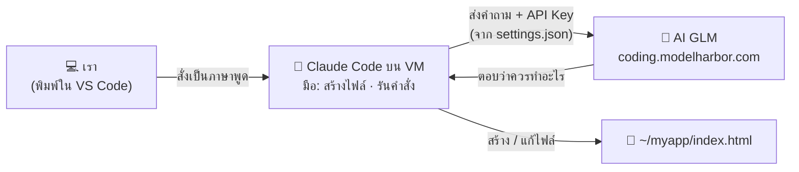

# 03 — Module 2: ใช้ AI สร้างเครื่องมือโดยไม่ต้องเขียนโปรแกรม (Workshop 2)

**เวลา:** 10.30–11.20 น. (50 นาที) · **Workshop 2:** 30 นาที · **ใช้:** VM ของตัวเอง + Claude Code (AI CLI)

## สิ่งที่ต้องรู้ก่อน


| เรื่อง | จำสั้น ๆ |
|---|---|
| **Vibe Coding** | สั่งงาน AI เป็น **ภาษาพูด** → AI เขียนโปรแกรมให้ทั้งหมด → เราแค่ **ทดสอบและบอกว่าต้องแก้อะไร** |
| **AI CLI (Claude Code)** | ตัวช่วยที่ทำงานใน Terminal สร้างไฟล์ รันคำสั่ง ทดสอบผลได้เอง (เหมือนมีโปรแกรมเมอร์นั่งข้าง ๆ) |
| **AI GLM** | "สมอง" ที่ Claude Code ส่งงานไปให้คิด — ทีมงานเตรียมไว้ให้ ใช้ API Key ในซอง |
| **ทักษะที่ต้องใช้** | ทักษะเดียวกับ Module 1 — **อธิบายสิ่งที่ต้องการให้ชัด** (prompt 5 องค์ประกอบ) |
| **เราเป็นคนตัดสินใจ** | AI จะ **ขออนุญาต** ก่อนสร้างไฟล์/รันคำสั่งทุกครั้ง อ่านแล้วค่อยกดอนุญาต |

### งานไหนทำเองได้ / งานไหนควรส่งต่อ IT


| ✅ ทำเองได้ด้วย Vibe Coding | ⛔ ควรส่งต่อ IT / ผู้เชี่ยวชาญ |
|---|---|
| สูตร Excel, จัดระเบียบข้อมูลตาราง | ระบบที่เชื่อมฐานข้อมูลจริงของหน่วยงาน |
| เครื่องคำนวณ, แบบฟอร์มส่วนตัว | ระบบที่เกี่ยวกับสิทธิ์การเข้าถึงข้อมูล / ความปลอดภัย |
| หน้าเว็บแนะนำหน่วยงานอย่างง่าย | ระบบที่เปิดให้ประชาชนใช้ในวงกว้าง |
| เครื่องมือต้นแบบ (prototype) ไว้คุยกับทีม IT | ระบบที่เก็บข้อมูลส่วนบุคคล |

---

## Part A — ให้ AI สร้างสูตร Excel (ทำบนเว็บ AI ไม่ต้องใช้ VM)

ใช้เว็บ ChatGPT / Claude / Copilot เหมือน Module 1

ไฟล์ตัวอย่าง (ข้อมูลสมมติ): [samples/04_visitors_sep2569.csv](samples/04_visitors_sep2569.csv) — เปิดใน Excel หรือ Google Sheets ได้

| คอลัมน์ | A | B | C | D | E |
|---|---|---|---|---|---|
| หัวตาราง | วันที่ | สถานะ | ประเภทบริการ | จังหวัด | จำนวนตำแหน่งที่สมัคร |

### Prompt ตัวอย่าง (คัดลอกได้เลย)

**นับตามเงื่อนไข:**

```text
ฉันมีตาราง Excel คอลัมน์ A = วันที่ (รูปแบบ dd/mm/yyyy ปี ค.ศ.), B = สถานะ, C = ประเภทบริการ, D = จังหวัด, E = จำนวนตำแหน่งที่สมัคร
ข้อมูลอยู่แถว 2 ถึง 200
ช่วยเขียนสูตรนับจำนวนผู้มาติดต่อในเดือนกันยายน 2026 ที่มีสถานะ "Active" ในคอลัมน์ B
อธิบายสั้น ๆ ว่าสูตรทำงานอย่างไร
```

✅ AI ควรตอบสูตรประมาณ `=COUNTIFS(B2:B200,"Active",A2:A200,">="&DATE(2026,9,1),A2:A200,"<="&DATE(2026,9,30))`

**สรุปเป็นตาราง:**

```text
จากตารางเดิม ช่วยเขียนสูตรหา "ผลรวมจำนวนตำแหน่งที่สมัคร" แยกตามจังหวัด
โดยให้ฉันพิมพ์ชื่อจังหวัดไว้ที่คอลัมน์ G แล้วสูตรอยู่คอลัมน์ H
```

**จัดระเบียบข้อมูล:**

```text
คอลัมน์ D (จังหวัด) มีการพิมพ์ไม่เหมือนกัน เช่น "กทม", "กรุงเทพ", "กรุงเทพฯ", "Bangkok"
ช่วยเขียนสูตรในคอลัมน์ใหม่ที่แปลงทุกแบบให้เป็น "กรุงเทพมหานคร" และคงจังหวัดอื่นไว้เหมือนเดิม
```

> 💡 **เทคนิค:** คัดลอกข้อมูล 5–10 แถวแรก (ที่ไม่มีข้อมูลส่วนบุคคล) แปะให้ AI ดูด้วย จะได้สูตรที่ตรงกว่าการอธิบายอย่างเดียว

---

## Part B — 🛠️ Workshop 2: SSH + ติดตั้ง AI CLI + สร้างเครื่องมือ (30 นาที)

**เป้าหมาย:** ได้เว็บเครื่องมือ 1 ชิ้น อยู่บน VM ของตัวเอง โดย **ไม่ได้เขียนโค้ดเองเลยสักบรรทัด** (ช่วงบ่ายจะนำขึ้นเว็บจริง)

### ขั้นที่ 1 — เข้า VM และเตรียมโฟลเดอร์ (5 นาที)

เปิด **VS Code** แล้วเชื่อม VM ด้วย Remote - SSH (ดู [02_SSH_VM](02_SSH_VM.md) หัวข้อ 1.3–1.5):

1. กด `><` มุมซ้ายล่าง → **Connect to Host...** → เลือก IP ของตัวเอง → ใส่รหัสผ่าน
2. รอจนมุมซ้ายล่างขึ้น `SSH: 203.0.113.10`
3. เปิด Terminal: เมนู **Terminal → New Terminal**
4. แท็บ **PORTS** → **Forward a Port** → `8080` (ไว้เปิดดูเว็บที่ AI สร้าง — ดู [02_SSH_VM](02_SSH_VM.md) หัวข้อ 1.6)

เมื่อ Terminal ขึ้น `trainee01@...:~$` แล้ว วางคำสั่งนี้:

```bash
# สร้างโฟลเดอร์ myapp สำหรับเก็บเครื่องมือของเรา แล้วเข้าไปในโฟลเดอร์
mkdir -p ~/myapp && cd ~/myapp && pwd
```

✅ **ผลที่ควรเห็น:** `/home/trainee01/myapp`

### ขั้นที่ 2 — ติดตั้ง Claude Code + Engineer Skills และเชื่อมกับ AI GLM (10 นาที)

**2.0 เตรียมเครื่องมือพื้นฐาน** (VM ใหม่ยังไม่มีอะไรเลย วางครั้งเดียว)

```bash
# อัปเดตรายการโปรแกรม แล้วติดตั้งเครื่องมือพื้นฐานที่ตัวติดตั้ง Claude Code ต้องใช้
sudo apt-get update -y
sudo apt-get install -y curl git ca-certificates nano python3

# ติดตั้ง Node.js 22 (ใช้ติดตั้ง Engineer Skills ในขั้นที่ 2.4 และ HyperFrames ใน Module 3) — ถ้ามีแล้วจะข้าม
node -v 2>/dev/null | grep -qE '^v(2[2-9]|[3-9][0-9])' || { curl -fsSL https://deb.nodesource.com/setup_22.x | sudo -E bash - && sudo apt-get install -y nodejs; }

# ดาวน์โหลดคู่มือและไฟล์ตัวอย่างไว้ที่ ~/training (ถ้ามีอยู่แล้วจะอัปเดตให้)
[ -d ~/training/.git ] && git -C ~/training pull --ff-only || git clone --depth 1 https://github.com/Krit03W/ai-vibe-training.git ~/training

# ตรวจว่า sudo ใช้ได้โดยไม่ต้องใส่รหัส (AI ต้องใช้ตอนติดตั้งโปรแกรม)
sudo -n true && echo "sudo: OK ✅" || echo "sudo: ต้องใส่รหัสผ่าน ❌ (แจ้ง TA)"
```

✅ **ผลที่ควรเห็น:** ไม่มีข้อความ `E:` (error) · มีโฟลเดอร์ `~/training` · `node -v` ขึ้น `v22.x` · บรรทัดสุดท้ายขึ้น `sudo: OK ✅`

> ❗ ถ้าขึ้น `sudo: ต้องใส่รหัสผ่าน` — AI จะติดตั้งโปรแกรมให้ไม่ได้ ให้ TA ตั้งค่า sudo แบบไม่ใส่รหัส (คู่มือทีมงาน `setup_vm.sh`) หรือรันคำสั่งที่มี `sudo` ด้วยตัวเองใน Terminal

**2.1 ติดตั้ง Claude Code**

```bash
# ดาวน์โหลดและติดตั้ง Claude Code (AI CLI) — ใช้เวลาประมาณ 30 วินาที
curl -fsSL https://claude.ai/install.sh | bash
```

```bash
# ให้ Terminal รู้จักคำสั่ง claude (เพิ่ม ~/.local/bin เข้า PATH) แล้วโหลดค่าใหม่
grep -q '.local/bin' ~/.bashrc || echo 'export PATH="$HOME/.local/bin:$PATH"' >> ~/.bashrc
source ~/.bashrc
```

```bash
# ตรวจว่าติดตั้งสำเร็จ
claude --version
```

✅ **ผลที่ควรเห็น:** เลขเวอร์ชัน เช่น `2.x.x (Claude Code)`

❌ ขึ้น `claude: command not found` → ดู [09_TROUBLESHOOTING](09_TROUBLESHOOTING.md#claude-command-not-found)

**2.2 สร้างคำสั่งลัด `ccc`**


ปกติ Claude Code จะถามขออนุญาตก่อนสร้างไฟล์หรือรันคำสั่งทุกครั้ง คำสั่งลัด `ccc` จะเปิด Claude Code แบบ **ไม่ต้องถาม** (`bypassPermissions`) ทำงานได้เร็วขึ้นมากใน Workshop

```bash
# เพิ่มคำสั่งลัด ccc ลงใน ~/.bashrc (ถ้ามีอยู่แล้วจะไม่เพิ่มซ้ำ) แล้วโหลดค่าใหม่
grep -q 'alias ccc=' ~/.bashrc || echo 'alias ccc="claude --permission-mode bypassPermissions"' >> ~/.bashrc
source ~/.bashrc
```

```bash
# ตรวจว่ามีคำสั่งลัดแล้ว
type ccc
```

✅ **ผลที่ควรเห็น:** `ccc is aliased to 'claude --permission-mode bypassPermissions'`

| พิมพ์ | ต่างกันอย่างไร | ใช้เมื่อ |
|---|---|---|
| `claude` | AI **ถามก่อนทุกครั้ง** ให้เรากด Yes / No | อยากเห็นว่า AI จะทำอะไรทีละขั้น |
| `ccc` | AI **ทำเลยไม่ถาม** | ทำงานในโฟลเดอร์ฝึก (`~/myapp`, `~/myvideo`) ให้เสร็จเร็ว |

> ⚠️ **`ccc` ให้ AI รันคำสั่งได้ทุกอย่างโดยไม่ถาม** รวมถึงคำสั่ง `sudo` บน VM นี้ — ใช้ได้เพราะเป็นเครื่องฝึกที่สร้างใหม่ได้ **ห้ามใช้ `ccc` บนเครื่องทำงานจริงหรือเครื่องที่มีข้อมูลสำคัญ** และถ้าเห็น AI กำลังทำสิ่งที่ไม่ได้สั่ง ให้กด `Esc` หยุดทันที

### ขั้นที่ 2.3 — เชื่อม Claude Code เข้ากับ AI GLM ของเรา



> 📌 ไฟล์ `settings.json` คือ "ที่อยู่ + กุญแจ" ที่บอก Claude Code ว่าต้องไปคุยกับ AI ตัวไหน — ไม่มีไฟล์นี้ Claude Code จะไม่รู้ว่าต้องส่งงานไปที่ไหน

Claude Code เป็นแค่ "ตัวช่วยทำงาน" ใน Terminal ส่วน "สมอง" ที่คิดและเขียนโค้ดจะเป็น **AI GLM** ที่ทีมงานเตรียมไว้ ขั้นนี้คือการบอก Claude Code ว่าให้ไปคุยกับ GLM ที่ไหน

คุณจะได้ **API Key** ในซองจากทีมงาน ทำใน **VS Code (Remote - SSH)** ที่เชื่อมกับ VM อยู่:

**1) เปิดไฟล์ตั้งค่าของ Claude Code** — พิมพ์ใน Terminal ของ VS Code (เมนู **Terminal → New Terminal**)

```bash
code ~/.claude/settings.json
```

ไฟล์ `settings.json` จะเปิดขึ้นในแท็บของ VS Code (ถ้ายังไม่มีไฟล์ VS Code จะสร้างให้ใหม่เป็นไฟล์ว่าง)

> 🛟 ถ้า `code` ใช้ไม่ได้: เมนู **File → Open File...** แล้วพิมพ์ `~/.claude/settings.json` → **OK**

**2) คัดลอกข้อความนี้ไปวางในไฟล์** — ถ้าในไฟล์มีข้อความเดิมอยู่ ให้กด `Ctrl + A` (Mac: `⌘ + A`) เลือกทั้งหมดแล้ววางทับ

```json
{
  "env": {
    "ANTHROPIC_AUTH_TOKEN": "your-api-key",
    "ANTHROPIC_BASE_URL": "https://coding.modelharbor.com",
    "ANTHROPIC_DEFAULT_OPUS_MODEL": "glm-latest",
    "ANTHROPIC_DEFAULT_SONNET_MODEL": "glm-latest",
    "ANTHROPIC_DEFAULT_HAIKU_MODEL": "deepseek-flash-latest",
    "CLAUDE_CODE_SUBAGENT_MODEL": "deepseek-flash-latest"
  }
}
```

**3) แก้ `your-api-key` เป็น API Key จากซอง** (ให้อยู่ในเครื่องหมาย `" "` เหมือนเดิม) แล้วกด `Ctrl + S` (Mac: `⌘ + S`) บันทึก

บรรทัดที่ 3 ควรหน้าตาแบบนี้ (key ของจริงยาวกว่านี้):

```text
    "ANTHROPIC_AUTH_TOKEN": "sk-xxxxxxxxxxxxxxxx",
```

**4) ตรวจว่าใส่ key แล้ว** — พิมพ์ใน Terminal ของ VS Code

```bash
chmod 600 ~/.claude/settings.json
grep -q '"your-api''-key"' ~/.claude/settings.json && echo "❌ ยังไม่ได้ใส่ key — แก้ในไฟล์แล้วบันทึกใหม่" || echo "ตั้งค่าเสร็จแล้ว ✅"
```

> 💡 ถ้า VS Code ขีดเส้นแดงใต้ข้อความในไฟล์ แปลว่ารูปแบบผิด — มักเกิดจากลบเครื่องหมาย `"` หรือ `,` ไป ให้วางข้อความชุดเดิมทับใหม่แล้วใส่ key อีกครั้ง

| บรรทัดในไฟล์ตั้งค่า | ความหมาย |
|---|---|
| `ANTHROPIC_AUTH_TOKEN` | API Key ของเรา (แทน `your-api-key`) — **เหมือนรหัสผ่าน** |
| `ANTHROPIC_BASE_URL` | ที่อยู่ของ AI (ModelHarbor) — ทีมงานกำหนดไว้แล้ว |
| `ANTHROPIC_DEFAULT_OPUS_MODEL` / `SONNET_MODEL` | โมเดลหลักที่คิดและเขียนโค้ด: `glm-latest` |
| `ANTHROPIC_DEFAULT_HAIKU_MODEL` / `CLAUDE_CODE_SUBAGENT_MODEL` | โมเดลเล็กสำหรับงานย่อยให้เร็วขึ้น: `deepseek-flash-latest` |

✅ **ผลที่ควรเห็น:** `ตั้งค่าเสร็จแล้ว ✅`

> ⚠️ **API Key = รหัสผ่าน** ไฟล์ `~/.claude/settings.json` อยู่ในเครื่องเราเท่านั้น — ห้ามคัดลอกไฟล์นี้ไปที่อื่น, ห้ามส่ง key ในแชทกลุ่ม, ห้ามถ่ายภาพหน้าจอที่เห็น key (เชื่อมกับ Module 4)

### ขั้นที่ 2.4 — ติดตั้ง Engineer Skills (krit-skills)


**Skill** คือ "คู่มือการทำงาน" ที่ติดตั้งให้ Claude Code เช่น ให้ AI **สัมภาษณ์เราก่อนสร้าง** (`/grill-with-docs`) หรือ **ทำหน้าตาหลายแบบให้เลือก** (`/prototype`) — ติดตั้งครั้งเดียว ใช้ได้ทุกโฟลเดอร์

```bash
# ติดตั้ง Engineer Skills ทั้งชุดให้ Claude Code (ใช้เวลาประมาณ 30 วินาที)
npx -y skills@latest add Krit03W/krit-engineer-skills -g -a claude-code -s '*' -y
```

```bash
# ตรวจว่าติดตั้งแล้ว
ls ~/.claude/skills
```

✅ **ผลที่ควรเห็น:** รายชื่อ skill 16 ตัว เช่น `grill-with-docs`, `prototype`, `to-spec`, `to-tickets`, `implement`, `code-review`

| Skill ที่ใช้ในวันนี้ | ทำอะไร |
|---|---|
| `/grill-with-docs` | AI **สัมภาษณ์เราทีละคำถาม** จนชัดว่าจะสร้างอะไร ก่อนเริ่มเขียนโค้ด |
| `/prototype` | AI ทำ **หน้าตาหลายแบบ** ในหน้าเดียว ให้เราสลับดูแล้วเลือก |
| `/to-spec` → `/to-tickets` → `/implement` → `/code-review` | ขั้นตอนแบบวิศวกร: เขียนสเปก → แตกงาน → ทำทีละงาน → ตรวจงาน (Workshop สำรอง 2K–2M) |

> 📘 รายละเอียดทุก skill: <https://github.com/Krit03W/krit-engineer-skills>

### ขั้นที่ 2.5 — เปิด Claude Code

**ต้องอยู่ในโฟลเดอร์ `~/myapp` ก่อนเปิดเสมอ** (AI จะทำงานในโฟลเดอร์ที่เปิด)

```bash
cd ~/myapp && claude
```

> 💡 จะใช้ `cd ~/myapp && ccc` แทนก็ได้ (ไม่ต้องกด Yes ทุกครั้ง — ดูขั้นที่ 2.2) แนะนำให้ครั้งแรกใช้ `claude` ก่อน จะได้เห็นว่า AI ขออนุญาตทำอะไรบ้าง

ครั้งแรกจะมีคำถามทีละหน้า ใช้ปุ่ม `↑` `↓` เลือก แล้วกด `Enter`:

| หน้าจอถาม | เลือก |
|---|---|
| เลือกธีมสี (Choose the text style) | กด `Enter` (ค่าเริ่มต้น) |
| ถามว่าจะใช้ API Key / ตั้งค่าที่พบหรือไม่ (ถ้ามี) | เลือก **Yes** |
| Do you trust the files in this folder? | เลือก **Yes, proceed** |

ทดสอบว่าเชื่อม GLM สำเร็จ — พิมพ์ในช่อง `>`:

```text
สวัสดี ช่วยแนะนำตัวสั้น ๆ เป็นภาษาไทย 1 ประโยค
```

✅ **ผลที่ควรเห็น:** AI ตอบกลับเป็นภาษาไทย = **เชื่อมกับ GLM สำเร็จ** 🎉

❌ ขึ้น `API Error`, `401`, `Invalid API key` หรือค้างนาน → ดู [09_TROUBLESHOOTING](09_TROUBLESHOOTING.md#claude-glm)

### ขั้นที่ 3 — สั่งสร้างเครื่องมือ (12 นาที)

#### 3.1 วิธีคุยกับ Claude Code

- **วาง prompt** ในช่อง `>` แล้วกด `Enter` (วางข้อความหลายบรรทัดได้เลย)
- AI จะคิดแล้ว **ขออนุญาต** ก่อนสร้างไฟล์หรือรันคำสั่ง เช่น:

```text
 Do you want to create index.html?
 ❯ 1. Yes
   2. Yes, allow all edits during this session (shift+tab)
   3. No, and tell Claude what to do differently (esc)
```

| ตัวเลือก | ความหมาย | ใช้เมื่อ |
|---|---|---|
| **1. Yes** | อนุญาตครั้งนี้ | ค่าเริ่มต้น — อ่านแล้วโอเค |
| **2. Yes, allow all...** | อนุญาตแบบนี้ทั้งหมดจนจบเซสชัน | เมื่อไว้ใจงานที่ทำอยู่ ไม่อยากกดบ่อย |
| **3. No** | ไม่อนุญาต แล้วบอกให้ทำแบบอื่น | เห็นว่า AI จะทำอะไรที่ไม่ได้สั่ง |

> ⚠️ **อ่านก่อนกด** — ถ้า AI ขอรันคำสั่งที่ลบไฟล์ (`rm`) หรือทำสิ่งที่ไม่ได้สั่ง ให้เลือก **No** แล้วถาม TA

#### 3.2 เลือกโจทย์ 1 ข้อ แล้ววาง prompt

ทุกโจทย์ลงท้ายด้วยส่วน **"ข้อกำหนดทางเทคนิค"** เหมือนกัน — **ห้ามลบส่วนนี้** เพราะช่วงบ่ายการ Deploy อาศัยข้อกำหนดนี้

**โจทย์ A — เครื่องคำนวณวันลาคงเหลือ** (แนะนำสำหรับคนที่ยังไม่มีไอเดีย)

```text
สร้างเว็บเพจหน้าเดียว เป็นเครื่องคำนวณวันลาคงเหลือสำหรับข้าราชการ
- มีช่องกรอก: วันลาพักผ่อนสะสมทั้งหมด, วันลาพักผ่อนที่ใช้ไปแล้ว, วันลากิจที่ใช้ไปแล้ว, วันลาป่วยที่ใช้ไปแล้ว
- กดปุ่ม "คำนวณ" แล้วแสดงวันลาพักผ่อนคงเหลือเป็นตัวเลขใหญ่ ๆ
- ถ้าคงเหลือน้อยกว่า 3 วัน ให้แสดงข้อความเตือนสีส้ม
- หน้าตาเรียบร้อยแบบเว็บราชการ ใช้สีน้ำเงินเข้มเป็นหลัก ใช้งานบนมือถือได้ ข้อความทั้งหมดเป็นภาษาไทย
- ส่วนท้ายหน้าเขียนว่า "เครื่องมือนี้สร้างด้วย AI เพื่อการอบรม — ผลคำนวณใช้ประกอบเท่านั้น"

ข้อกำหนดทางเทคนิค:
- เขียนทั้งหมดเป็นไฟล์เดียวชื่อ index.html ในโฟลเดอร์ปัจจุบัน (HTML + CSS + JavaScript อยู่ในไฟล์เดียว) ไม่ใช้ไฟล์อื่น ไม่ต้องมี backend
- ห้ามเก็บหรือส่งข้อมูลที่ผู้ใช้กรอกออกไปที่ไหน
- สร้างเสร็จแล้วให้เปิดทดสอบด้วยคำสั่ง python3 -m http.server 8080 แบบรันเบื้องหลัง (background) แล้วใช้ curl เรียก http://localhost:8080 เพื่อตรวจว่าหน้าเว็บตอบกลับได้
- สรุปให้ฉันฟังเป็นภาษาไทยสั้น ๆ ว่าสร้างอะไรไปบ้าง
```

**โจทย์ B — แบบฟอร์มลงทะเบียนงานนัดพบแรงงาน (ทำงานในเบราว์เซอร์)**

```text
สร้างเว็บเพจหน้าเดียว เป็นแบบฟอร์มลงทะเบียนเข้าร่วม "งานนัดพบแรงงาน" (ใช้สาธิต)
- ช่องกรอก: ชื่อเล่น, ช่วงอายุ (เลือกจากรายการ), ประเภทงานที่สนใจ (เลือกได้หลายข้อ), ระดับการศึกษา
- กด "ลงทะเบียน" แล้วแสดงบัตรคิวบนหน้าจอ มีเลขคิว วันที่ และประเภทงานที่เลือก
- ห้ามมีช่องเลขบัตรประชาชน เบอร์โทร หรือที่อยู่ (เพราะเป็นระบบสาธิต)
- หน้าตาสดใส สีน้ำเงิน-ส้ม ใช้บนมือถือได้ ข้อความภาษาไทย

ข้อกำหนดทางเทคนิค:
- เขียนทั้งหมดเป็นไฟล์เดียวชื่อ index.html ในโฟลเดอร์ปัจจุบัน (HTML + CSS + JavaScript อยู่ในไฟล์เดียว) ไม่ใช้ไฟล์อื่น ไม่ต้องมี backend
- ห้ามเก็บหรือส่งข้อมูลที่ผู้ใช้กรอกออกไปที่ไหน
- สร้างเสร็จแล้วให้เปิดทดสอบด้วยคำสั่ง python3 -m http.server 8080 แบบรันเบื้องหลัง (background) แล้วใช้ curl เรียก http://localhost:8080 เพื่อตรวจว่าหน้าเว็บตอบกลับได้
- สรุปให้ฉันฟังเป็นภาษาไทยสั้น ๆ ว่าสร้างอะไรไปบ้าง
```

**โจทย์ C — หน้าเว็บแนะนำหน่วยงาน**

```text
สร้างเว็บเพจหน้าเดียวแนะนำ "[ชื่อหน่วยงาน/กองของคุณ]"
- ส่วนหัว: ชื่อหน่วยงาน และคำขวัญสั้น ๆ
- ส่วน "บริการของเรา" เป็นการ์ด 4 ใบ: [บริการที่ 1], [บริการที่ 2], [บริการที่ 3], [บริการที่ 4]
- ส่วน "ขั้นตอนการขอรับบริการ" เป็นลำดับ 1-2-3
- ส่วน "ติดต่อเรา" ใส่ข้อความ "เวลาทำการ จันทร์–ศุกร์ 08.30–16.30 น."
- ใช้สีน้ำเงินเข้มกับสีทอง ดูเป็นทางการ ใช้บนมือถือได้ ภาษาไทย ไม่ใช้รูปภาพจากภายนอก (ใช้อีโมจิหรือ SVG แทน)

ข้อกำหนดทางเทคนิค:
- เขียนทั้งหมดเป็นไฟล์เดียวชื่อ index.html ในโฟลเดอร์ปัจจุบัน (HTML + CSS + JavaScript อยู่ในไฟล์เดียว) ไม่ใช้ไฟล์อื่น ไม่ต้องมี backend
- สร้างเสร็จแล้วให้เปิดทดสอบด้วยคำสั่ง python3 -m http.server 8080 แบบรันเบื้องหลัง (background) แล้วใช้ curl เรียก http://localhost:8080 เพื่อตรวจว่าหน้าเว็บตอบกลับได้
- สรุปให้ฉันฟังเป็นภาษาไทยสั้น ๆ ว่าสร้างอะไรไปบ้าง
```

**โจทย์ D — เครื่องคำนวณค่าธรรมเนียม / วันครบกำหนด**

```text
สร้างเว็บเพจหน้าเดียว เป็นเครื่องคำนวณ "วันครบกำหนด" สำหรับงานเอกสาร
- กรอกวันที่รับเรื่อง (เลือกจากปฏิทิน) และจำนวนวันทำการที่ต้องดำเนินการให้เสร็จ
- คำนวณวันครบกำหนด โดยไม่นับวันเสาร์-อาทิตย์
- แสดงผลเป็นวันที่แบบไทย เช่น "วันพุธที่ 14 ตุลาคม พ.ศ. 2569"
- มีช่องเพิ่มวันหยุดราชการเองได้ (กรอกทีละวัน) และจะไม่นับวันเหล่านั้นด้วย
- หน้าตาเรียบง่าย ภาษาไทย ใช้บนมือถือได้

ข้อกำหนดทางเทคนิค:
- เขียนทั้งหมดเป็นไฟล์เดียวชื่อ index.html ในโฟลเดอร์ปัจจุบัน (HTML + CSS + JavaScript อยู่ในไฟล์เดียว) ไม่ใช้ไฟล์อื่น ไม่ต้องมี backend
- สร้างเสร็จแล้วให้เปิดทดสอบด้วยคำสั่ง python3 -m http.server 8080 แบบรันเบื้องหลัง (background) แล้วใช้ curl เรียก http://localhost:8080 เพื่อตรวจว่าหน้าเว็บตอบกลับได้
- สรุปให้ฉันฟังเป็นภาษาไทยสั้น ๆ ว่าสร้างอะไรไปบ้าง
```

**โจทย์ E — โจทย์ของตัวเอง** (ใช้โครง 5 องค์ประกอบจาก Module 1)

```text
สร้างเว็บเพจหน้าเดียว เป็น[เครื่องมืออะไร] สำหรับ[ใครใช้]
- สิ่งที่ผู้ใช้กรอก/เลือก: [...]
- สิ่งที่ต้องแสดงผล: [...]
- หน้าตา: [สี / โทน / ต้องใช้บนมือถือได้]
- ข้อจำกัด: ข้อความภาษาไทย [สิ่งที่ห้ามมี เช่น ห้ามมีช่องข้อมูลส่วนบุคคล]

ข้อกำหนดทางเทคนิค:
- เขียนทั้งหมดเป็นไฟล์เดียวชื่อ index.html ในโฟลเดอร์ปัจจุบัน (HTML + CSS + JavaScript อยู่ในไฟล์เดียว) ไม่ใช้ไฟล์อื่น ไม่ต้องมี backend
- ห้ามเก็บหรือส่งข้อมูลที่ผู้ใช้กรอกออกไปที่ไหน
- สร้างเสร็จแล้วให้เปิดทดสอบด้วยคำสั่ง python3 -m http.server 8080 แบบรันเบื้องหลัง (background) แล้วใช้ curl เรียก http://localhost:8080 เพื่อตรวจว่าหน้าเว็บตอบกลับได้
- สรุปให้ฉันฟังเป็นภาษาไทยสั้น ๆ ว่าสร้างอะไรไปบ้าง
```

**โจทย์ F — ให้ AI สัมภาษณ์ก่อนสร้าง** (ไม่ต้องเขียน prompt เอง · ใช้ skill ที่ติดตั้งในขั้นที่ 2.4)

```text
/grill-with-docs ฉันอยากได้เครื่องมือเล็ก ๆ ช่วยงานของฉัน สัมภาษณ์ฉันทีละคำถามเป็นภาษาไทย ไม่เกิน 6 คำถาม ไม่ต้องตั้งค่า issue tracker และไม่ต้องสร้าง ADR เมื่อได้คำตอบครบให้สรุปสิ่งที่จะสร้าง แล้วรอฉันยืนยันก่อน
```

ตอบคำถามของ AI ไปเรื่อย ๆ พอ AI สรุปแล้ว ถ้าตรงใจให้พิมพ์ต่อ:

```text
ยืนยัน สร้างได้เลย ตามข้อกำหนดทางเทคนิค: ไฟล์เดียว index.html ในโฟลเดอร์ปัจจุบัน ไม่มี backend ไม่เก็บข้อมูลที่กรอก และรัน python3 -m http.server 8080 แบบ background ให้ทดสอบ
```

#### 3.3 ตรวจผลด้วยตัวเอง

ใน Claude Code พิมพ์เครื่องหมาย `!` นำหน้า จะเป็นการรันคำสั่งเองโดยไม่ผ่าน AI:

```bash
!curl -s http://localhost:8080 | head -n 15
```

✅ **ผลที่ควรเห็น:** โค้ด HTML ขึ้นต้นด้วย `<!DOCTYPE html>` และมีข้อความภาษาไทยของเครื่องมือเรา = **สำเร็จ** 🎉

> 🛟 ถ้าขึ้น `Connection refused` (เซิร์ฟเวอร์ทดสอบไม่ได้รันอยู่) พิมพ์บอก AI:
>
> ```text
> curl ไปที่ localhost:8080 แล้วขึ้น Connection refused ช่วยตรวจและรันเซิร์ฟเวอร์ทดสอบใหม่แบบ background ให้หน่อย
> ```

#### 3.3.1 เปิดดูในเบราว์เซอร์บนเครื่องตัวเอง 🎉

VS Code ส่งต่อ port `8080` ให้แล้ว (ขั้นที่ 1) — กด **Open in Browser** ที่กล่องมุมขวาล่าง หรือเปิดเบราว์เซอร์ **บนเครื่องตัวเอง** ไปที่:

```text
http://localhost:8080
```

✅ **ผลที่ควรเห็น:** หน้าเว็บเครื่องมือของเรา ลองกรอกตัวเลขและกดปุ่มได้เลย

> 📌 ตอนนี้มีแค่เราที่เห็น (ผ่าน VS Code) — **ช่วงบ่ายจะติดตั้ง Nginx แล้วเปิดให้ทุกคนเห็นผ่านโดเมนจริง**
>
> ❌ เปิดไม่ขึ้น → ดูแท็บ **PORTS** ว่ามี `8080` หรือยัง ถ้าไม่มีให้กด **Forward a Port** → `8080` และตรวจว่า VS Code ยังเชื่อม VM อยู่ (มุมซ้ายล่างขึ้น `SSH: …`)

#### 3.4 สั่งแก้เฉพาะจุด (ถ้ามีเวลา)

พิมพ์ต่อในหน้าต่างเดิม ตัวอย่าง:

```text
เปลี่ยนสีหลักเป็นสีเขียวเข้ม และทำปุ่มให้ใหญ่ขึ้นสำหรับกดบนมือถือ
```

```text
เพิ่มปุ่ม "ล้างข้อมูล" ข้างปุ่มคำนวณ
```

```text
อธิบายให้ฟังแบบคนไม่เคยเขียนโปรแกรม ว่าไฟล์ index.html ที่สร้าง ทำงานอย่างไร แบ่งเป็นกี่ส่วน
```

### ขั้นที่ 4 — ออกจาก Claude Code (เมื่อจบ Workshop)

พิมพ์ในช่อง `>`:

```text
/exit
```

แล้วตรวจว่ามีไฟล์อยู่จริง:

```bash
ls -la ~/myapp
```

✅ **ผลที่ควรเห็น:** มีไฟล์ `index.html`

> 📌 **ไม่ต้องลบอะไร** — ช่วงบ่ายจะกลับมาที่โฟลเดอร์นี้ เปิด Claude Code ใหม่ด้วย `cd ~/myapp && claude --continue` เพื่อคุยต่อจากเดิม

---

## คำสั่งที่ใช้ใน Claude Code (สรุป)

| พิมพ์ | ทำอะไร |
|---|---|
| ข้อความภาษาไทยธรรมดา | สั่งงาน AI |
| `!คำสั่ง` | รันคำสั่ง Terminal เองโดยตรง เช่น `!ls` |
| `/exit` | ออกจาก Claude Code |
| `/clear` | เริ่มบทสนทนาใหม่ (ลืมที่คุยมา) |
| `Esc` | หยุด AI ระหว่างที่กำลังทำงาน |
| `Ctrl + C` สองครั้ง | ออกจาก Claude Code (ฉุกเฉิน) |
| `claude --continue` | เปิดใหม่และคุยต่อจากครั้งล่าสุด (พิมพ์ใน Terminal) |

---

## ⚠️ ข้อจำกัดและข้อควรระวัง


1. **ต้องทดสอบเสมอ** — ลองกรอกค่าแปลก ๆ (ช่องว่าง, ตัวเลขติดลบ, ตัวเลขมาก ๆ) ดูว่าเครื่องมือยังทำงานถูกไหม
2. **AI อาจมีข้อผิดพลาดที่มองไม่เห็นทันที** — เช่น สูตรคำนวณวันทำการผิดในบางกรณี
3. **ต้องให้ผู้ดูแลระบบ / IT ตรวจก่อน** นำไปใช้กับข้อมูลจริง หรือเผยแพร่ต่อสาธารณะ
4. **ห้ามให้เครื่องมือเก็บข้อมูลส่วนบุคคล** โดยไม่ผ่านการตรวจตามระเบียบของหน่วยงาน

➡️ ต่อไป: [04_MEDIA_WORKSHOP.md](04_MEDIA_WORKSHOP.md) · ช่วงบ่ายกลับมาต่อที่ [07_DEPLOY_CLOUDFLARE.md](07_DEPLOY_CLOUDFLARE.md)
