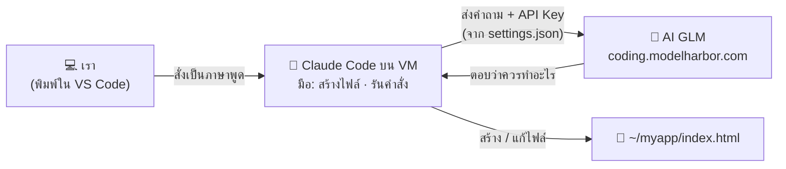
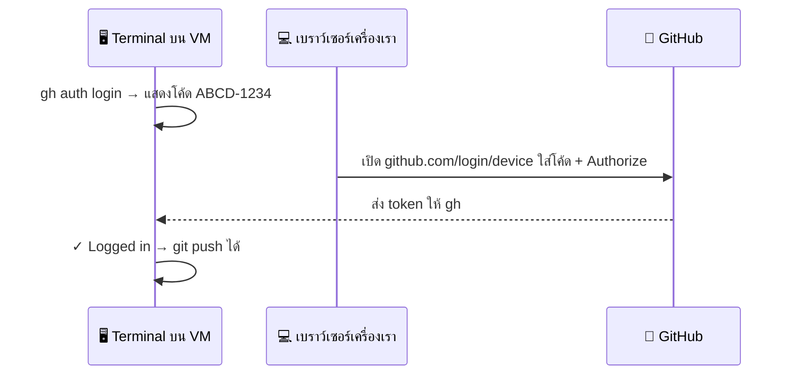
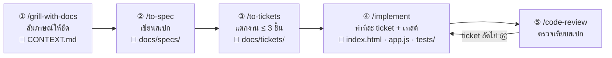

# 03 — Module 2: ใช้ AI สร้างเครื่องมือโดยไม่ต้องเขียนโปรแกรม (Workshop 2)

**เวลา:** 10.30–11.20 น. (50 นาที) · **Workshop 2:** 34 นาที · **ใช้:** VM ของตัวเอง + Claude Code (AI CLI)

## สิ่งที่ต้องรู้ก่อน


| เรื่อง | จำสั้น ๆ |
|---|---|
| **Vibe Coding** | สั่งงาน AI เป็น **ภาษาพูด** → AI เขียนโปรแกรมให้ทั้งหมด → เราแค่ **ทดสอบและบอกว่าต้องแก้อะไร** |
| **AI CLI (Claude Code)** | ตัวช่วยที่ทำงานใน Terminal สร้างไฟล์ รันคำสั่ง ทดสอบผลได้เอง (เหมือนมีโปรแกรมเมอร์นั่งข้าง ๆ) |
| **AI GLM** | "สมอง" ที่ Claude Code ส่งงานไปให้คิด — ทีมงานเตรียมไว้ให้ ใช้ API Key ในซอง |
| **ทักษะที่ต้องใช้** | ทักษะเดียวกับ Module 1 — **อธิบายสิ่งที่ต้องการให้ชัด** (prompt 5 องค์ประกอบ) |
| **Engineer Skills** | "วิธีทำงานแบบวิศวกร" ที่ติดตั้งให้ AI — วันนี้สร้างแอปด้วย flow `/grill-with-docs` → `/to-spec` → `/to-tickets` → `/implement` → `/code-review` |
| **เราเป็นคนตัดสินใจ** | AI จะ **ขออนุญาต** ก่อนสร้างไฟล์/รันคำสั่งทุกครั้ง อ่านแล้วค่อยกดอนุญาต |

### งานไหนทำเองได้ / งานไหนควรส่งต่อ IT


| ✅ ทำเองได้ด้วย Vibe Coding | ⛔ ควรส่งต่อ IT / ผู้เชี่ยวชาญ |
|---|---|
| สูตร Excel, จัดระเบียบข้อมูลตาราง | ระบบที่เชื่อมฐานข้อมูลจริงของหน่วยงาน |
| เครื่องคำนวณ, แบบฟอร์มส่วนตัว | ระบบที่เกี่ยวกับสิทธิ์การเข้าถึงข้อมูล / ความปลอดภัย |
| หน้าเว็บแนะนำหน่วยงานอย่างง่าย | ระบบที่เปิดให้ประชาชนใช้ในวงกว้าง |
| เครื่องมือต้นแบบ (prototype) ไว้คุยกับทีม IT | ระบบที่เก็บข้อมูลส่วนบุคคล |

---

## Part A — ให้ AI สร้างสูตร Excel (ทำบนเว็บ AI ไม่ต้องใช้ VM)

ใช้เว็บ ChatGPT / Claude / Copilot เหมือน Module 1

ไฟล์ตัวอย่าง (ข้อมูลสมมติ): [samples/04_visitors_sep2569.csv](samples/04_visitors_sep2569.csv) — เปิดใน Excel หรือ Google Sheets ได้

| คอลัมน์ | A | B | C | D | E |
|---|---|---|---|---|---|
| หัวตาราง | วันที่ | สถานะ | ประเภทบริการ | จังหวัด | จำนวนตำแหน่งที่สมัคร |

### Prompt ตัวอย่าง (คัดลอกได้เลย)

**นับตามเงื่อนไข:**

```text
ฉันมีตาราง Excel คอลัมน์ A = วันที่ (รูปแบบ dd/mm/yyyy ปี ค.ศ.), B = สถานะ, C = ประเภทบริการ, D = จังหวัด, E = จำนวนตำแหน่งที่สมัคร
ข้อมูลอยู่แถว 2 ถึง 200
ช่วยเขียนสูตรนับจำนวนผู้มาติดต่อในเดือนกันยายน 2026 ที่มีสถานะ "Active" ในคอลัมน์ B
อธิบายสั้น ๆ ว่าสูตรทำงานอย่างไร
```

✅ AI ควรตอบสูตรประมาณ `=COUNTIFS(B2:B200,"Active",A2:A200,">="&DATE(2026,9,1),A2:A200,"<="&DATE(2026,9,30))`

**สรุปเป็นตาราง:**

```text
จากตารางเดิม ช่วยเขียนสูตรหา "ผลรวมจำนวนตำแหน่งที่สมัคร" แยกตามจังหวัด
โดยให้ฉันพิมพ์ชื่อจังหวัดไว้ที่คอลัมน์ G แล้วสูตรอยู่คอลัมน์ H
```

**จัดระเบียบข้อมูล:**

```text
คอลัมน์ D (จังหวัด) มีการพิมพ์ไม่เหมือนกัน เช่น "กทม", "กรุงเทพ", "กรุงเทพฯ", "Bangkok"
ช่วยเขียนสูตรในคอลัมน์ใหม่ที่แปลงทุกแบบให้เป็น "กรุงเทพมหานคร" และคงจังหวัดอื่นไว้เหมือนเดิม
```

> 💡 **เทคนิค:** คัดลอกข้อมูล 5–10 แถวแรก (ที่ไม่มีข้อมูลส่วนบุคคล) แปะให้ AI ดูด้วย จะได้สูตรที่ตรงกว่าการอธิบายอย่างเดียว

---

## Part B — 🛠️ Workshop 2: SSH + ติดตั้ง AI CLI + สร้างแอปด้วย Engineer Skills (34 นาที)

**เป้าหมาย:** ได้แอป 1 ชิ้นบน VM ของตัวเอง ที่มี **สเปก · ticket · เทสต์อัตโนมัติ · ผลตรวจงาน** ครบแบบทีมพัฒนาจริง โดย **ไม่ได้เขียนโค้ดเองเลยสักบรรทัด** (ช่วงบ่ายจะนำขึ้นเว็บจริง)

### ขั้นที่ 1 — เข้า VM และเตรียมโฟลเดอร์ (5 นาที)

เปิด **VS Code** แล้วเชื่อม VM ด้วย Remote - SSH (ดู [02_SSH_VM](02_SSH_VM.md) หัวข้อ 1.3–1.5):

1. กด `><` มุมซ้ายล่าง → **Connect to Host...** → เลือก IP ของตัวเอง → ใส่รหัสผ่าน
2. รอจนมุมซ้ายล่างขึ้น `SSH: 203.0.113.10`
3. เปิด Terminal: เมนู **Terminal → New Terminal**
4. แท็บ **PORTS** → **Forward a Port** → `8080` (ไว้เปิดดูเว็บที่ AI สร้าง — ดู [02_SSH_VM](02_SSH_VM.md) หัวข้อ 1.6)

เมื่อ Terminal ขึ้น `admins@...:~$` แล้ว วางคำสั่งนี้:

```bash
# สร้างโฟลเดอร์ myapp สำหรับเก็บเครื่องมือของเรา แล้วเข้าไปในโฟลเดอร์
mkdir -p ~/myapp && cd ~/myapp && pwd
```

✅ **ผลที่ควรเห็น:** `/home/admins/myapp`

### ขั้นที่ 2 — ติดตั้ง Claude Code + Engineer Skills + GitHub และเชื่อมกับ AI GLM (13 นาที)

**2.0 เตรียมเครื่องมือพื้นฐาน** (VM ใหม่ยังไม่มีอะไรเลย วางครั้งเดียว)

```bash
# อัปเดตรายการโปรแกรม แล้วติดตั้งเครื่องมือพื้นฐานที่ตัวติดตั้ง Claude Code ต้องใช้
sudo apt-get update -y
sudo apt-get install -y curl git ca-certificates nano python3

# ติดตั้ง Node.js 22 (ใช้ติดตั้ง Engineer Skills ในขั้นที่ 2.4 และ HyperFrames ใน Module 3) — ถ้ามีแล้วจะข้าม
node -v 2>/dev/null | grep -qE '^v(2[2-9]|[3-9][0-9])' || { curl -fsSL https://deb.nodesource.com/setup_22.x | sudo -E bash - && sudo apt-get install -y nodejs; }

# ดาวน์โหลดคู่มือและไฟล์ตัวอย่างไว้ที่ ~/training (ถ้ามีอยู่แล้วจะอัปเดตให้)
[ -d ~/training/.git ] && git -C ~/training pull --ff-only || git clone --depth 1 https://github.com/Krit03W/ai-vibe-training.git ~/training

# ตรวจว่า sudo ใช้ได้โดยไม่ต้องใส่รหัส (AI ต้องใช้ตอนติดตั้งโปรแกรม)
sudo -n true && echo "sudo: OK ✅" || echo "sudo: ต้องใส่รหัสผ่าน ❌ (ทำคู่มือ 02 หัวข้อ 4.1)"
```

✅ **ผลที่ควรเห็น:** ไม่มีข้อความ `E:` (error) · มีโฟลเดอร์ `~/training` · `node -v` ขึ้น `v22.x` · บรรทัดสุดท้ายขึ้น `sudo: OK ✅`

> ❗ ถ้าขึ้น `sudo: ต้องใส่รหัสผ่าน` — AI จะติดตั้งโปรแกรมให้ไม่ได้ ให้ทำ [02_SSH_VM หัวข้อ 4.1](02_SSH_VM.md#sudo-nopasswd) ก่อน

**2.1 ติดตั้ง Claude Code**

```bash
# ดาวน์โหลดและติดตั้ง Claude Code (AI CLI) — ใช้เวลาประมาณ 30 วินาที
curl -fsSL https://claude.ai/install.sh | bash
```

```bash
# ให้ Terminal รู้จักคำสั่ง claude (เพิ่ม ~/.local/bin เข้า PATH) แล้วโหลดค่าใหม่
grep -q '.local/bin' ~/.bashrc || echo 'export PATH="$HOME/.local/bin:$PATH"' >> ~/.bashrc
source ~/.bashrc
```

```bash
# ตรวจว่าติดตั้งสำเร็จ
claude --version
```

✅ **ผลที่ควรเห็น:** เลขเวอร์ชัน เช่น `2.x.x (Claude Code)`

❌ ขึ้น `claude: command not found` → ดู [09_TROUBLESHOOTING](09_TROUBLESHOOTING.md#claude-command-not-found)

**2.2 สร้างคำสั่งลัด `ccc`**


ปกติ Claude Code จะถามขออนุญาตก่อนสร้างไฟล์หรือรันคำสั่งทุกครั้ง คำสั่งลัด `ccc` จะเปิด Claude Code แบบ **ไม่ต้องถาม** (`bypassPermissions`) ทำงานได้เร็วขึ้นมากใน Workshop

```bash
# เพิ่มคำสั่งลัด ccc ลงใน ~/.bashrc (ถ้ามีอยู่แล้วจะไม่เพิ่มซ้ำ) แล้วโหลดค่าใหม่
grep -q 'alias ccc=' ~/.bashrc || echo 'alias ccc="claude --permission-mode bypassPermissions"' >> ~/.bashrc
source ~/.bashrc
```

```bash
# ตรวจว่ามีคำสั่งลัดแล้ว
type ccc
```

✅ **ผลที่ควรเห็น:** `ccc is aliased to 'claude --permission-mode bypassPermissions'`

| พิมพ์ | ต่างกันอย่างไร | ใช้เมื่อ |
|---|---|---|
| `claude` | AI **ถามก่อนทุกครั้ง** ให้เรากด Yes / No | อยากเห็นว่า AI จะทำอะไรทีละขั้น |
| `ccc` | AI **ทำเลยไม่ถาม** | ทำงานในโฟลเดอร์ฝึก (`~/myapp`, `~/myvideo`) ให้เสร็จเร็ว |

> ⚠️ **`ccc` ให้ AI รันคำสั่งได้ทุกอย่างโดยไม่ถาม** รวมถึงคำสั่ง `sudo` บน VM นี้ — ใช้ได้เพราะเป็นเครื่องฝึกที่สร้างใหม่ได้ **ห้ามใช้ `ccc` บนเครื่องทำงานจริงหรือเครื่องที่มีข้อมูลสำคัญ** และถ้าเห็น AI กำลังทำสิ่งที่ไม่ได้สั่ง ให้กด `Esc` หยุดทันที

### ขั้นที่ 2.3 — เชื่อม Claude Code เข้ากับ AI GLM ของเรา



> 📌 ไฟล์ `settings.json` คือ "ที่อยู่ + กุญแจ" ที่บอก Claude Code ว่าต้องไปคุยกับ AI ตัวไหน — ไม่มีไฟล์นี้ Claude Code จะไม่รู้ว่าต้องส่งงานไปที่ไหน

Claude Code เป็นแค่ "ตัวช่วยทำงาน" ใน Terminal ส่วน "สมอง" ที่คิดและเขียนโค้ดจะเป็น **AI GLM** ที่ทีมงานเตรียมไว้ ขั้นนี้คือการบอก Claude Code ว่าให้ไปคุยกับ GLM ที่ไหน

คุณจะได้ **API Key** ในซองจากทีมงาน ทำใน **VS Code (Remote - SSH)** ที่เชื่อมกับ VM อยู่:

**1) เปิดไฟล์ตั้งค่าของ Claude Code** — พิมพ์ใน Terminal ของ VS Code (เมนู **Terminal → New Terminal**)

```bash
code ~/.claude/settings.json
```

ไฟล์ `settings.json` จะเปิดขึ้นในแท็บของ VS Code (ถ้ายังไม่มีไฟล์ VS Code จะสร้างให้ใหม่เป็นไฟล์ว่าง)

> 🛟 ถ้า `code` ใช้ไม่ได้: เมนู **File → Open File...** แล้วพิมพ์ `~/.claude/settings.json` → **OK**

**2) คัดลอกข้อความนี้ไปวางในไฟล์** — ถ้าในไฟล์มีข้อความเดิมอยู่ ให้กด `Ctrl + A` (Mac: `⌘ + A`) เลือกทั้งหมดแล้ววางทับ

```json
{
  "env": {
    "ANTHROPIC_AUTH_TOKEN": "your-api-key",
    "ANTHROPIC_BASE_URL": "https://coding.modelharbor.com",
    "ANTHROPIC_DEFAULT_OPUS_MODEL": "glm-latest",
    "ANTHROPIC_DEFAULT_SONNET_MODEL": "glm-latest",
    "ANTHROPIC_DEFAULT_HAIKU_MODEL": "deepseek-flash-latest",
    "CLAUDE_CODE_SUBAGENT_MODEL": "deepseek-flash-latest"
  }
}
```

**3) แก้ `your-api-key` เป็น API Key จากซอง** (ให้อยู่ในเครื่องหมาย `" "` เหมือนเดิม) แล้วกด `Ctrl + S` (Mac: `⌘ + S`) บันทึก

บรรทัดที่ 3 ควรหน้าตาแบบนี้ (key ของจริงยาวกว่านี้):

```text
    "ANTHROPIC_AUTH_TOKEN": "sk-xxxxxxxxxxxxxxxx",
```

**4) ตรวจว่าใส่ key แล้ว** — พิมพ์ใน Terminal ของ VS Code

```bash
chmod 600 ~/.claude/settings.json
grep -q '"your-api''-key"' ~/.claude/settings.json && echo "❌ ยังไม่ได้ใส่ key — แก้ในไฟล์แล้วบันทึกใหม่" || echo "ตั้งค่าเสร็จแล้ว ✅"
```

> 💡 ถ้า VS Code ขีดเส้นแดงใต้ข้อความในไฟล์ แปลว่ารูปแบบผิด — มักเกิดจากลบเครื่องหมาย `"` หรือ `,` ไป ให้วางข้อความชุดเดิมทับใหม่แล้วใส่ key อีกครั้ง

| บรรทัดในไฟล์ตั้งค่า | ความหมาย |
|---|---|
| `ANTHROPIC_AUTH_TOKEN` | API Key ของเรา (แทน `your-api-key`) — **เหมือนรหัสผ่าน** |
| `ANTHROPIC_BASE_URL` | ที่อยู่ของ AI (ModelHarbor) — ทีมงานกำหนดไว้แล้ว |
| `ANTHROPIC_DEFAULT_OPUS_MODEL` / `SONNET_MODEL` | โมเดลหลักที่คิดและเขียนโค้ด: `glm-latest` |
| `ANTHROPIC_DEFAULT_HAIKU_MODEL` / `CLAUDE_CODE_SUBAGENT_MODEL` | โมเดลเล็กสำหรับงานย่อยให้เร็วขึ้น: `deepseek-flash-latest` |

✅ **ผลที่ควรเห็น:** `ตั้งค่าเสร็จแล้ว ✅`

> ⚠️ **API Key = รหัสผ่าน** ไฟล์ `~/.claude/settings.json` อยู่ในเครื่องเราเท่านั้น — ห้ามคัดลอกไฟล์นี้ไปที่อื่น, ห้ามส่ง key ในแชทกลุ่ม, ห้ามถ่ายภาพหน้าจอที่เห็น key (เชื่อมกับ Module 4)

### ขั้นที่ 2.4 — ติดตั้ง Engineer Skills (krit-skills)


**Skill** คือ "คู่มือการทำงาน" ที่ติดตั้งให้ Claude Code เช่น ให้ AI **สัมภาษณ์เราก่อนสร้าง** (`/grill-with-docs`) หรือ **ทำหน้าตาหลายแบบให้เลือก** (`/prototype`) — ติดตั้งครั้งเดียว ใช้ได้ทุกโฟลเดอร์

```bash
# ติดตั้ง Engineer Skills ทั้งชุดให้ Claude Code (ใช้เวลาประมาณ 30 วินาที)
npx -y skills@latest add Krit03W/krit-engineer-skills -g -a claude-code -s '*' -y
```

```bash
# ตรวจว่าติดตั้งแล้ว
ls ~/.claude/skills
```

✅ **ผลที่ควรเห็น:** รายชื่อ skill 16 ตัว เช่น `grill-with-docs`, `prototype`, `to-spec`, `to-tickets`, `implement`, `code-review`

| Skill ที่ใช้ในวันนี้ | ทำอะไร |
|---|---|
| ① `/grill-with-docs` | AI **สัมภาษณ์เราทีละคำถาม** จนชัดว่าจะสร้างอะไร ก่อนเริ่มเขียนโค้ด |
| ② `/to-spec` | เขียน **สเปก** จากที่ตกลงกัน มีเกณฑ์ตรวจรับ (acceptance criteria) ที่ตรวจได้จริง |
| ③ `/to-tickets` | แตกสเปกเป็น **งานย่อย (ticket)** ที่ทำเสร็จแล้วใช้งานได้ทีละเรื่อง |
| ④ `/implement` | ทำ **ทีละ ticket** เขียนเทสต์ก่อน แล้วเขียนโค้ดจนเทสต์ผ่าน แล้ว commit + push ขึ้น GitHub |
| ⑤ `/code-review` | **ตรวจงาน** เทียบกับสเปกทีละข้อ แยกสิ่งที่ต้องแก้กับข้อเสนอแนะ |
| ⑥ `/work-on-issues` | ทำ ticket ที่เหลือต่อกันเอง (implement → review ทีละงาน) |
| `/prototype` (ไม่บังคับ) | ทำ **หน้าตาหลายแบบ** ในหน้าเดียว ให้เราสลับดูแล้วเลือก |

> 📘 รายละเอียดทุก skill: <https://github.com/Krit03W/krit-engineer-skills>

<a id="gh-login"></a>

### ขั้นที่ 2.5 — ติดตั้ง GitHub CLI และ Login GitHub (บังคับ · 3 นาที)

งานที่ AI สร้างวันนี้จะถูก **push ขึ้น GitHub ของเราเอง** ทุกครั้งที่จบ ticket กลับบ้านไปก็ยังมีโค้ด สเปก และประวัติงานครบ ส่งต่อทีม IT ได้ทันที

> 📌 ต้องมี **บัญชี GitHub** (สมัครฟรีที่ <https://github.com/signup>) และล็อกอิน github.com ไว้ในเบราว์เซอร์บนเครื่องตัวเองก่อน

**1) ติดตั้ง `gh`** (GitHub CLI = โปรแกรมคุยกับ GitHub ผ่าน Terminal)

```bash
# ติดตั้ง GitHub CLI จากแหล่งทางการของ GitHub — ถ้ามีแล้วจะข้าม
command -v gh >/dev/null || {
  sudo mkdir -p -m 755 /etc/apt/keyrings
  curl -fsSL https://cli.github.com/packages/githubcli-archive-keyring.gpg | sudo tee /etc/apt/keyrings/githubcli-archive-keyring.gpg >/dev/null
  sudo chmod go+r /etc/apt/keyrings/githubcli-archive-keyring.gpg
  echo "deb [arch=$(dpkg --print-architecture) signed-by=/etc/apt/keyrings/githubcli-archive-keyring.gpg] https://cli.github.com/packages stable main" | sudo tee /etc/apt/sources.list.d/github-cli.list >/dev/null
  sudo apt-get update -y && sudo apt-get install -y gh
}
gh --version | head -n 1
```

✅ **ผลที่ควรเห็น:** `gh version 2.x.x ...`

**2) Login GitHub**

```bash
gh auth login --hostname github.com --git-protocol https --web
```

ตอบคำถามตามนี้:

| หน้าจอถาม / แสดง | ทำอะไร |
|---|---|
| `Authenticate Git with your GitHub credentials? (Y/n)` | พิมพ์ `Y` แล้ว `Enter` |
| `! First copy your one-time code: ABCD-1234` | **จดโค้ด 8 ตัว** นี้ไว้ |
| `Press Enter to open https://github.com/login/device in your browser...` | กด `Enter` (VM ไม่มีเบราว์เซอร์ ถ้าขึ้นข้อความว่าเปิดไม่ได้ ถือว่าปกติ) |
| — | เปิด <https://github.com/login/device> **บนเครื่องตัวเอง** → ใส่โค้ด → **Continue** → **Authorize github** |
| `✓ Logged in as ชื่อบัญชีของคุณ` | สำเร็จ 🎉 |



**3) ตั้งให้ git ใช้บัญชีนี้ตอน push และตั้งชื่อผู้เขียน commit**

```bash
# ให้ git ใช้สิทธิ์จาก gh ตอน push
gh auth setup-git
# ชื่อผู้เขียน commit = บัญชี GitHub ของเรา (ใช้อีเมลแบบซ่อนของ GitHub ไม่เปิดเผยอีเมลจริง)
GH_USER=$(gh api user -q .login); GH_ID=$(gh api user -q .id)
git config --global user.name "$GH_USER"
git config --global user.email "${GH_ID}+${GH_USER}@users.noreply.github.com"
git config --global init.defaultBranch main
gh auth status 2>&1 | grep -E "Logged in|account" ; echo "commit ในชื่อ: $(git config --global user.name)"
```

✅ **ผลที่ควรเห็น:** `✓ Logged in to github.com account ชื่อบัญชีของคุณ` และ `commit ในชื่อ: ชื่อบัญชีของคุณ`

> ⚠️ **token ของ GitHub เก็บอยู่บน VM** ใครเข้า VM ได้ก็ใช้บัญชี GitHub ของเราได้ — **หลังจบอบรมต้อง `gh auth logout`** (ขั้นที่ 4) · ถ้าเปิด Claude Code ด้วย `ccc` AI จะสั่ง `gh` ได้โดยไม่ถาม ให้อ่านสิ่งที่ AI ทำกับ GitHub ทุกครั้ง

<a id="step-2-6"></a>

### ขั้นที่ 2.6 — เตรียมโปรเจกต์ให้ Skill อ่าน + สร้าง repo บน GitHub (บังคับ · 1 นาที)

Skill ทุกตัว **อ่านไฟล์ `CONTEXT.md` ก่อนเริ่มทำงาน** ไฟล์นี้บอก AI ว่าโปรเจกต์นี้ใช้กติกาอะไร เก็บสเปกและ ticket ไว้ที่ไหน ถ้าไม่มีไฟล์นี้ skill จะพยายามตั้งค่า issue tracker ให้เองและเสียเวลา บล็อกนี้ยังสร้าง repo ส่วนตัว (private) ชื่อ `myapp` บน GitHub ของเราแล้ว push ครั้งแรกให้ด้วย

วางบล็อกนี้ใน Terminal (ยังไม่ต้องเปิด Claude Code):

```bash
# สร้างโครงโปรเจกต์: โฟลเดอร์สเปก / ticket / เทสต์ + git ไว้ย้อนกลับได้
cd ~/myapp && mkdir -p docs/specs docs/adr docs/tickets tests
[ -d .git ] || git init -q -b main

# สร้าง CONTEXT.md = กติกาของโปรเจกต์ที่ skill ทุกตัวอ่านก่อนทำงาน
[ -f CONTEXT.md ] || cat > CONTEXT.md <<'EOF'
# แอปของฉัน

(ส่วนคำศัพท์ของงาน /grill-with-docs จะเติมให้เอง)

## Engineering Setup

- Tracker: local — repo: n/a (tickets อยู่ใน docs/tickets/)
- Labels: spec, ready, in-progress, needs-review, done
- Specs: docs/specs/  |  ADRs: docs/adr/
- Agent stack: n/a — not an agent project
- Branching: commit ตรงบน main แล้ว git push origin main ทุกครั้งที่จบ ticket · ไม่ต้องแตก branch ไม่ต้องเปิด PR ไม่ต้องสร้าง GitHub Issue (tracker เป็น local)

## Project Rules

- หน้าเว็บคือ index.html ในโฟลเดอร์นี้ · ตรรกะการคำนวณ/ตรวจข้อมูลแยกไว้ใน app.js (ไม่มี backend ไม่ต้อง build ไม่ใช้ framework)
- app.js ต้องใช้ได้ทั้งในเบราว์เซอร์ (<script src="app.js">) และ require() จาก Node เพื่อทดสอบ
- ทดสอบด้วยคำสั่ง node --test (ไฟล์ทดสอบอยู่ที่ tests/*.test.js ไม่ต้องติดตั้ง package เพิ่ม)
- ห้ามเก็บหรือส่งข้อมูลที่ผู้ใช้กรอกออกไปที่ไหน ห้ามมีช่องข้อมูลส่วนบุคคล (เลขบัตรประชาชน เบอร์โทร ที่อยู่)
- ข้อความบนหน้าเว็บเป็นภาษาไทย ใช้บนมือถือได้ ส่วนท้ายหน้าเขียนว่า "เครื่องมือนี้สร้างด้วย AI เพื่อการอบรม — ผลใช้ประกอบเท่านั้น"
- ถามผู้ใช้เป็นภาษาไทย ทีละคำถาม และสรุปงานเป็นภาษาไทยสั้น ๆ
- เซิร์ฟเวอร์ทดสอบ: python3 -m http.server 8080 แบบ background (ถ้ายังไม่ได้รัน)
- prototype: ทำเป็นไฟล์ prototype.html ไฟล์เดียว ลบทิ้งเมื่อเลือกแบบแล้ว ไม่ต้องแตก branch
EOF
git add -A && git commit -qm "เริ่มโปรเจกต์" >/dev/null 2>&1; ls

# สร้าง repo ส่วนตัวชื่อ myapp บน GitHub แล้ว push ครั้งแรก (ถ้าเชื่อมไว้แล้วจะข้าม)
git remote get-url origin >/dev/null 2>&1 || gh repo create myapp --private --source=. --remote=origin --push
gh repo view --json url -q .url
```

✅ **ผลที่ควรเห็น:** `CONTEXT.md  docs  tests` และลิงก์ `https://github.com/ชื่อบัญชีของคุณ/myapp` → เปิดลิงก์บนเครื่องตัวเอง จะเห็นไฟล์ `CONTEXT.md` อยู่บน GitHub แล้ว

> ❌ ขึ้น `Name already exists on this account` (มี repo ชื่อ myapp อยู่แล้ว) → เปลี่ยนชื่อ: `gh repo create myapp-ai-training --private --source=. --remote=origin --push`
>
> 🔒 repo เป็น **private** เห็นเฉพาะเรา · อยากให้คนอื่นดูได้: `gh repo edit --visibility public --accept-visibility-change-consequences`

> 💡 **ส่วน Project Rules คือ "ข้อกำหนดทางเทคนิค" ที่เขียนครั้งเดียว** ไม่ต้องพิมพ์ซ้ำในทุก prompt ช่วงบ่ายการ Deploy อาศัยกติกานี้ (มี `index.html` ในโฟลเดอร์ `~/myapp`)

### ขั้นที่ 2.7 — เปิด Claude Code

**ต้องอยู่ในโฟลเดอร์ `~/myapp` ก่อนเปิดเสมอ** (AI จะทำงานในโฟลเดอร์ที่เปิด)

```bash
cd ~/myapp && claude
```

> 💡 จะใช้ `cd ~/myapp && ccc` แทนก็ได้ (ไม่ต้องกด Yes ทุกครั้ง — ดูขั้นที่ 2.2) แนะนำให้ครั้งแรกใช้ `claude` ก่อน จะได้เห็นว่า AI ขออนุญาตทำอะไรบ้าง

ครั้งแรกจะมีคำถามทีละหน้า ใช้ปุ่ม `↑` `↓` เลือก แล้วกด `Enter`:

| หน้าจอถาม | เลือก |
|---|---|
| เลือกธีมสี (Choose the text style) | กด `Enter` (ค่าเริ่มต้น) |
| ถามว่าจะใช้ API Key / ตั้งค่าที่พบหรือไม่ (ถ้ามี) | เลือก **Yes** |
| Do you trust the files in this folder? | เลือก **Yes, proceed** |

ทดสอบว่าเชื่อม GLM สำเร็จ และ AI เห็น skill — พิมพ์ในช่อง `>`:

```text
สวัสดี ช่วยแนะนำตัวสั้น ๆ เป็นภาษาไทย 1 ประโยค แล้วบอกว่าเห็น skill grill-with-docs, prototype, to-spec, to-tickets, implement, code-review ครบไหม
```

✅ **ผลที่ควรเห็น:** AI ตอบเป็นภาษาไทย และบอกว่าเห็น skill ครบ = **พร้อมสร้างแอป** 🎉

❌ ขึ้น `API Error`, `401`, `Invalid API key` หรือค้างนาน → ดู [09_TROUBLESHOOTING](09_TROUBLESHOOTING.md#claude-glm) · AI บอกว่าไม่เห็น skill → `/exit` แล้วทำขั้นที่ 2.4 ใหม่

<a id="step-3"></a>

### ขั้นที่ 3 — สร้างแอปจริงแบบวิศวกรด้วย Engineer Skills (20 นาที · บังคับทำตามลำดับ)

ใน Module นี้ **ห้ามสั่ง "สร้างแอปให้หน่อย" ในประโยคเดียว** ให้ทำตาม flow **`/grill-with-docs` → `/to-spec` → `/to-tickets` → `/implement` → `/code-review`** ด้วย skill ทุกขั้น เพราะนี่คือวิธีที่ทีมพัฒนาซอฟต์แวร์จริงใช้สร้างแอป เพียงแต่ AI เป็นคนลงมือ

| สั่งครั้งเดียวจบ | ทำตาม flow ของ skill |
|---|---|
| AI เดาเองว่าเราต้องการอะไร | AI **ถามเราก่อน** จนเข้าใจตรงกัน |
| ไม่มีเอกสาร เปลี่ยนคนดูแลแล้วงง | มี **สเปก + ticket** เป็นไฟล์ ส่งต่อทีม IT ได้ |
| "ดูเหมือนจะใช้ได้" | มี **เทสต์อัตโนมัติ** พิสูจน์ว่าคำนวณถูก |
| แก้ทีหนึ่งพังทั้งหน้า | ทำ **ทีละ ticket** มี commit ย้อนกลับได้ทุกขั้น |
| โค้ดอยู่ในเครื่องเดียว เครื่องหายงานหาย | **push ขึ้น GitHub** ทุก ticket เก็บไว้ใช้ต่อ / ส่งต่อทีมได้ |
| ไม่มีใครตรวจ | AI **ตรวจงานเทียบกับสเปก** ก่อนถือว่าเสร็จ |



| ขั้น | พิมพ์ | ได้อะไร | เวลา |
|:---:|---|---|:---:|
| ① | `/grill-with-docs` | AI ถามทีละข้อ แล้วสรุปสิ่งที่จะสร้าง · คำศัพท์ของงานใน `CONTEXT.md` | 5 |
| ② | `/to-spec` | สเปก `docs/specs/<ชื่อ>.md` มี Goal · Scope · **Acceptance criteria** | 3 |
| ③ | `/to-tickets` | งานย่อย `docs/tickets/<ชื่อ>.md` (T1, T2, T3) | 3 |
| ④ | `/implement` | โค้ดของ T1 + เทสต์ที่ผ่าน + commit + **push ขึ้น GitHub** | 7 |
| ⑤ | `/code-review` | ผลตรวจทีละข้อ: ผ่าน / ไม่ผ่าน / ข้อเสนอแนะ | 2 |
| ⑥ | `/work-on-issues` | ทำ T2, T3 ต่อจนครบ (ช่วงกันชนหรือหลังอบรม) | — |

> 🎨 `/prototype` (ทำหน้าตาหลายแบบให้เลือก) **ไม่อยู่ใน flow บังคับ** ใช้แทรกระหว่าง ① กับ ② ได้ถ้าเวลาเหลือ ดูกล่องในหัวข้อ 3.3

> 📂 **ดูตัวอย่างผลลัพธ์จริงของทุกขั้น** ใน [`examples/leave-calculator/`](examples/leave-calculator/) — แอปคำนวณวันลาที่สร้างด้วย flow นี้ มี `CONTEXT.md` · สเปก · ticket · โค้ด · เทสต์ 9 ข้อ ครบ บน VM เปิดดูได้ที่ `~/training/manual/examples/leave-calculator/`

#### 3.1 วิธีคุยกับ Claude Code

- **วาง prompt** ในช่อง `>` แล้วกด `Enter` (วางข้อความหลายบรรทัดได้เลย)
- พิมพ์ `/` แล้วจะเห็นรายชื่อ skill ขึ้นมาให้เลือก — **ขึ้นต้น prompt ด้วยชื่อ skill** เพื่อบอก AI ว่าจะทำงานแบบไหน
- AI จะคิดแล้ว **ขออนุญาต** ก่อนสร้างไฟล์หรือรันคำสั่ง เช่น:

```text
 Do you want to create index.html?
 ❯ 1. Yes
   2. Yes, allow all edits during this session (shift+tab)
   3. No, and tell Claude what to do differently (esc)
```

| ตัวเลือก | ความหมาย | ใช้เมื่อ |
|---|---|---|
| **1. Yes** | อนุญาตครั้งนี้ | ค่าเริ่มต้น — อ่านแล้วโอเค |
| **2. Yes, allow all...** | อนุญาตแบบนี้ทั้งหมดจนจบเซสชัน | เมื่อไว้ใจงานที่ทำอยู่ ไม่อยากกดบ่อย |
| **3. No** | ไม่อนุญาต แล้วบอกให้ทำแบบอื่น | เห็นว่า AI จะทำอะไรที่ไม่ได้สั่ง |

> ⚠️ **อ่านก่อนกด** — ถ้า AI ขอรันคำสั่งที่ลบไฟล์ (`rm`) หรือทำสิ่งที่ไม่ได้สั่ง ให้เลือก **No** แล้วถาม TA

#### 3.2 เลือกโจทย์ 1 ข้อ

| โจทย์ | แอป | เหมาะกับ |
|:---:|---|---|
| **A** | เครื่องคำนวณวันลาพักผ่อนคงเหลือ | คนที่ยังไม่มีไอเดีย (มีตัวอย่างเฉลยใน `examples/`) |
| **B** | แบบฟอร์มลงทะเบียนงานนัดพบแรงงาน แสดงบัตรคิวบนจอ | งานบริการประชาชน |
| **C** | หน้าเว็บแนะนำหน่วยงาน + ขั้นตอนขอรับบริการ | งานประชาสัมพันธ์ |
| **D** | เครื่องคำนวณวันครบกำหนดงานเอกสาร (ไม่นับเสาร์-อาทิตย์ และวันหยุดที่กรอกเอง) | งานธุรการ |
| **E** | โจทย์ของตัวเอง | คนที่มีงานจริงอยากลอง |

#### 3.3 ① `/grill-with-docs` — ให้ AI สัมภาษณ์ก่อนสร้าง (5 นาที)

คัดลอกบรรทัดของโจทย์ที่เลือก **1 บรรทัด** ไปวาง:

```text
/grill-with-docs ฉันอยากสร้างเครื่องคำนวณวันลาพักผ่อนคงเหลือสำหรับข้าราชการ อ่าน CONTEXT.md ก่อน แล้วสัมภาษณ์ฉันทีละคำถาม ไม่เกิน 6 คำถาม ยังไม่ต้องเขียนโค้ด ได้คำตอบครบแล้วบันทึกคำศัพท์ลง CONTEXT.md สรุปสิ่งที่จะสร้างเป็นข้อ ๆ แล้วรอฉันยืนยัน
```

```text
/grill-with-docs ฉันอยากสร้างแบบฟอร์มลงทะเบียนงานนัดพบแรงงาน (ระบบสาธิต) ที่แสดงบัตรคิวบนจอหลังลงทะเบียน อ่าน CONTEXT.md ก่อน แล้วสัมภาษณ์ฉันทีละคำถาม ไม่เกิน 6 คำถาม ยังไม่ต้องเขียนโค้ด ได้คำตอบครบแล้วบันทึกคำศัพท์ลง CONTEXT.md สรุปสิ่งที่จะสร้างเป็นข้อ ๆ แล้วรอฉันยืนยัน
```

```text
/grill-with-docs ฉันอยากสร้างหน้าเว็บแนะนำหน่วยงานของฉัน พร้อมขั้นตอนการขอรับบริการ อ่าน CONTEXT.md ก่อน แล้วสัมภาษณ์ฉันทีละคำถาม ไม่เกิน 6 คำถาม ยังไม่ต้องเขียนโค้ด ได้คำตอบครบแล้วบันทึกคำศัพท์ลง CONTEXT.md สรุปสิ่งที่จะสร้างเป็นข้อ ๆ แล้วรอฉันยืนยัน
```

```text
/grill-with-docs ฉันอยากสร้างเครื่องคำนวณวันครบกำหนดของงานเอกสาร โดยไม่นับเสาร์-อาทิตย์และวันหยุดที่ผู้ใช้กรอกเอง อ่าน CONTEXT.md ก่อน แล้วสัมภาษณ์ฉันทีละคำถาม ไม่เกิน 6 คำถาม ยังไม่ต้องเขียนโค้ด ได้คำตอบครบแล้วบันทึกคำศัพท์ลง CONTEXT.md สรุปสิ่งที่จะสร้างเป็นข้อ ๆ แล้วรอฉันยืนยัน
```

```text
/grill-with-docs ฉันอยากสร้าง[เครื่องมืออะไร] สำหรับ[ใครใช้] เพื่อ[แก้ปัญหาอะไร] อ่าน CONTEXT.md ก่อน แล้วสัมภาษณ์ฉันทีละคำถาม ไม่เกิน 6 คำถาม ยังไม่ต้องเขียนโค้ด ได้คำตอบครบแล้วบันทึกคำศัพท์ลง CONTEXT.md สรุปสิ่งที่จะสร้างเป็นข้อ ๆ แล้วรอฉันยืนยัน
```

**ตัวอย่างการตอบ (โจทย์ A)** — คำถามของ AI จะต่างไปบ้าง ตอบสั้น ๆ ได้ แต่ **ให้ตัวอย่างตัวเลขทุกครั้งที่ทำได้** เพราะตัวอย่างจะกลายเป็นเทสต์ในขั้น ④

| AI ถาม | ตัวอย่างคำตอบ |
|---|---|
| "เสร็จ" หน้าตาเป็นอย่างไร | กรอก 3 ช่องแล้วกดคำนวณ เห็นวันคงเหลือเป็นตัวเลขใหญ่ |
| ต้องกรอกอะไรบ้าง | อายุราชการ (ปี) · วันลาสะสมยกมา · วันลาพักผ่อนที่ใช้ไปแล้ว |
| กติกาคำนวณ | ได้ปีละ 10 วัน สะสมรวมไม่เกิน 20 วัน ถ้าอายุราชการ 10 ปีขึ้นไปไม่เกิน 30 วัน ไม่ถึง 6 เดือนยังไม่มีสิทธิ์ |
| มีตัวอย่างจริงไหม | อายุราชการ 3 ปี สะสม 5 ใช้ไป 4 → คงเหลือ 11 |
| อะไรที่ยังไม่ทำรอบนี้ | ลากิจ ลาป่วย การบันทึกข้อมูล |
| ข้อจำกัดอื่น | เตือนสีส้มถ้าเหลือน้อยกว่า 3 วัน ใช้บนมือถือได้ |

AI สรุปแล้ว ถ้าตรงใจพิมพ์:

```text
ยืนยัน
```

✅ **ตรวจ:** AI ถาม **ทีละข้อ** (ไม่ถามรวดเดียว) · สรุปก่อนลงมือ · เปิด `CONTEXT.md` ในแถบซ้ายจะเห็นหัวข้อคำศัพท์ใหม่ (Glossary)

> 💡 ถ้า AI ถามเกิน 6 ข้อ พิมพ์ `พอแล้ว สรุปเลย` · ถ้า AI เริ่มเขียนโค้ดเอง กด `Esc` แล้วพิมพ์ `ยังไม่ต้องเขียนโค้ด สรุปก่อน`

<details>
<summary>🎨 <b>ไม่บังคับ: <code>/prototype</code></b> — อยากเห็นหน้าตาหลายแบบก่อนเขียนสเปก (3 นาที)</summary>

```text
/prototype ทำหน้าตา 2 แบบที่ต่างกันชัดเจนของสิ่งที่เราเพิ่งตกลงกัน (แบบที่ 1 ทางการราชการ โทนน้ำเงินเข้ม · แบบที่ 2 การ์ดสดใส อ่านง่ายบนมือถือ) เป็นไฟล์ prototype.html ไฟล์เดียว สลับแบบด้วยปุ่มด้านล่าง ใส่ข้อมูลตัวอย่างไว้เลย ยังไม่ต้องคำนวณจริง แล้วรันเซิร์ฟเวอร์ทดสอบให้
```

เปิดเบราว์เซอร์บนเครื่องตัวเองไปที่ `http://localhost:8080/prototype.html` → กดสลับดูทั้ง 2 แบบ → เลือก:

```text
เลือกแบบที่ 1 จดไว้ใช้ในสเปก แล้วลบ prototype.html ทิ้ง
```

✅ **ตรวจ:** เห็นหน้าตา 2 แบบในหน้าเดียว · หลังเลือกแล้ว `prototype.html` หายไปจากแถบซ้าย

> 💡 ยังไม่ต้องสนใจว่าปุ่มกดได้หรือไม่ prototype มีไว้ **ตัดสินใจเรื่องหน้าตาให้จบก่อนเขียนโค้ดจริง** ถูกกว่าแก้ทีหลังมาก

</details>

#### 3.4 ② `/to-spec` — เขียนสเปก (3 นาที)

```text
/to-spec เขียนสเปกจากที่ตกลงกัน เขียนเป็นภาษาไทย (ถ้าทำ prototype ให้ใส่แบบหน้าตาที่เลือกด้วย) acceptance criteria ทุกข้อต้องเป็นตัวอย่างที่ตรวจได้ เช่น "กรอก X ได้ผล Y"
```

เปิดไฟล์ใน `docs/specs/` จากแถบซ้ายของ VS Code แล้วอ่านส่วน **Acceptance criteria**:

| ❌ เกณฑ์ที่ตรวจไม่ได้ | ✅ เกณฑ์ที่ตรวจได้ |
|---|---|
| คำนวณถูกต้อง | อายุราชการ 3 ปี · สะสม 5 · ใช้ไป 4 → คงเหลือ 11 |
| ใช้งานง่าย | กรอกค่าติดลบ → ไม่คำนวณ และแสดงข้อความภาษาไทยบอกช่องที่ผิด |
| เตือนเมื่อเหลือน้อย | คงเหลือ 2 วัน → เตือนสีส้ม · คงเหลือ 3 วัน → ไม่เตือน |

ถ้าเกณฑ์ข้อไหนกว้างไป สั่งแก้ได้ เช่น `ข้อ "คำนวณถูกต้อง" ให้เปลี่ยนเป็นตัวอย่างตัวเลข 2 ตัวอย่าง` แล้วพิมพ์ `สเปกถูกต้อง ยืนยัน`

✅ **ตรวจ:** มีไฟล์ `docs/specs/<ชื่อ>.md` มีหัวข้อ Goal · Scope · Approach · Acceptance criteria · Open questions (เทียบกับ [ตัวอย่างสเปก](examples/leave-calculator/docs/specs/leave-calculator.md))

#### 3.5 ③ `/to-tickets` — แตกงานเป็นชิ้นเล็ก (3 นาที)

```text
/to-tickets แตกเป็นไม่เกิน 3 ticket แบบ vertical slice ใช้ tracker แบบ local ตาม CONTEXT.md ตั้งรหัส T1 T2 T3 ticket แรกต้องได้หน้าเว็บที่ใช้งานได้ครบเส้นทาง ตั้งแต่กรอกข้อมูลจนเห็นผล
```

✅ **ตรวจ:** มีไฟล์ใน `docs/tickets/` · แต่ละ ticket บอกว่าครอบคลุม acceptance criteria ข้อไหน · ท้ายสเปกมีหัวข้อ `## Tickets` (เทียบกับ [ตัวอย่าง ticket](examples/leave-calculator/docs/tickets/leave-calculator.md))

> 💡 **Vertical slice** = ทุก ticket ทำเสร็จแล้ว "ใช้งานได้จริงหนึ่งเรื่อง" ไม่ใช่แบ่งเป็น "ทำหน้าตา" กับ "ทำสูตร" แยกกัน T1 เสร็จเมื่อไหร่ก็ Deploy ได้ทันที

#### 3.6 ④ `/implement` — ให้ AI ทำ T1 พร้อมเทสต์ (7 นาที)

```text
/implement T1 ทำตาม CONTEXT.md เขียนเทสต์ใน tests/ ให้ไม่ผ่านก่อน แล้วค่อยเขียนโค้ดจนผ่าน รัน node --test ให้ดูทั้งตอนไม่ผ่านและตอนผ่าน รันเซิร์ฟเวอร์ทดสอบ แล้ว commit และ git push
```

**สังเกตสิ่งที่ AI ทำ** (นี่คือวิธี Test-Driven Development ที่นักพัฒนาใช้จริง):

1. 🔴 เขียนเทสต์จากตัวอย่างใน acceptance criteria แล้วรัน → **ไม่ผ่าน** (เพราะยังไม่มีโค้ด)
2. 🟢 เขียน `app.js` + `index.html` แล้วรันเทสต์ใหม่ → **ผ่าน**
3. 🧹 จัดโค้ดให้เรียบร้อย รันเทสต์อีกรอบ → ยังผ่าน
4. 💾 commit งาน แล้ว push ขึ้น GitHub

ตรวจด้วยตัวเอง (พิมพ์ `!` นำหน้า = รันคำสั่งเองโดยไม่ผ่าน AI):

```bash
!node --test
```

✅ **ผลที่ควรเห็น:** `ℹ pass` เท่ากับจำนวนเทสต์ และ `ℹ fail 0`

แล้วเปิดเบราว์เซอร์บนเครื่องตัวเองไปที่ `http://localhost:8080` ลองกรอกตัวอย่างจากสเปก ผลต้องตรงกับที่เขียนไว้ 🎉

#### 3.7 ⑤ `/code-review` — ตรวจงานเทียบกับสเปก (2 นาที)

```text
/code-review ตรวจงานของ T1 เทียบกับ acceptance criteria ในสเปก บอกทีละข้อว่าผ่านหรือไม่ผ่าน ชี้บรรทัดที่เกี่ยวข้อง แยก "ต้องแก้" กับ "ข้อเสนอแนะ" สรุปเป็นภาษาไทย
```

- ถ้ามีข้อ **ต้องแก้** → พิมพ์ `แก้ข้อที่ต้องแก้ทั้งหมด รัน node --test ใหม่ แล้ว commit และ git push`
- ถ้าผ่านหมด → **T1 เสร็จ** แอปนี้พร้อม Deploy ช่วงบ่ายแล้ว ✅

#### 3.8 ⑥ ทำ ticket ที่เหลือ (ถ้ามีเวลา · ช่วงกันชน 13.40 หรือหลังอบรม)

```text
/work-on-issues ทำ ticket ที่เหลือใน docs/tickets/ ทีละงาน แบบหยุดให้ฉันดูหลังจบแต่ละงาน ทุกงานต้อง implement → node --test ผ่าน → code-review → commit → git push ตาม CONTEXT.md
```

ดูประวัติงานทั้งหมดที่ AI ทำ:

```bash
!git log --oneline
```

✅ **ผลที่ควรเห็น:** commit เรียงกัน เช่น `feat: ... (T1)` · `feat: ... (T2)` · `เริ่มโปรเจกต์` — ย้อนกลับไปจุดไหนก็ได้

ดูงานบน GitHub (เปิดลิงก์ที่ได้บนเครื่องตัวเอง → แท็บ **Commits** จะเห็นประวัติเดียวกัน):

```bash
!git status -sb | head -n 1 && gh repo view --json url -q .url
```

✅ **ผลที่ควรเห็น:** `## main...origin/main` (ไม่มีคำว่า `ahead` = push ครบแล้ว) และลิงก์ repo ของเรา

#### 3.9 อยากแก้/เพิ่มอะไรหลังจากนี้ — ใช้ skill ตามขนาดงาน

| ขนาดงาน | ตัวอย่าง | สั่งแบบนี้ |
|---|---|---|
| เล็กมาก (แก้หน้าตา) | เปลี่ยนสีปุ่ม | `เปลี่ยนสีปุ่มเป็นสีเขียวเข้ม แล้ว commit` |
| เล็ก (เพิ่มพฤติกรรม) | ปุ่มล้างข้อมูล | `/implement เพิ่มปุ่ม "ล้างข้อมูล" ข้างปุ่มคำนวณ พร้อมเทสต์ แล้ว commit` |
| กลาง–ใหญ่ | เพิ่มวันลากิจ / ลาป่วย | เริ่มใหม่ที่ ① `/grill-with-docs` → ② → ③ → ④ → ⑤ |
| ไม่แน่ใจว่าผิดตรงไหน | ผลคำนวณแปลก | `/code-review ตรวจว่าทำไมกรอก X แล้วได้ Y ทั้งที่ควรได้ Z ยังไม่ต้องแก้` |

อยากเข้าใจโค้ดที่ได้:

```text
อธิบายให้คนไม่เคยเขียนโปรแกรมฟังว่า index.html, app.js และ tests ทำหน้าที่อะไร และทำงานร่วมกันอย่างไร
```

#### 3.10 ติดตรงไหน แก้แบบนี้

| อาการ | แก้ |
|---|---|
| พิมพ์ `/grill` แล้วไม่มีรายชื่อ skill ขึ้น / `Unknown skill` | `/exit` → `ls ~/.claude/skills` → ถ้าไม่มีให้ทำขั้นที่ 2.4 ใหม่ → เปิด `claude` ใหม่ |
| AI ขอให้รัน `/setup-krit-skills` หรือจะตั้งค่า GitHub | ตอบ `ไม่ต้อง ใช้ CONTEXT.md ที่มีอยู่ tracker แบบ local` |
| AI จะสร้าง branch / เปิด PR / สร้าง GitHub Issue | ตอบ `ไม่ต้อง ทำตาม Branching ใน CONTEXT.md commit บน main แล้ว push` |
| `gh: command not found` | `/exit` แล้วทำขั้นที่ 2.5 ข้อ 1 ใหม่ |
| โค้ด login หมดอายุ / ใส่โค้ดไม่ทัน | รัน `gh auth login --hostname github.com --git-protocol https --web` ใหม่ ได้โค้ดใหม่ |
| push ขึ้น `Authentication failed` / `could not read Username` | `gh auth setup-git` แล้ว `git push` ใหม่ |
| push ขึ้น `! [rejected] ... (fetch first)` | `git pull --rebase origin main && git push` (มีคนแก้บน GitHub ก่อน) |
| องค์กรบล็อก GitHub / ไม่มีบัญชี | ข้ามส่วน push ได้ ทำ flow ต่อตามปกติ (commit ในเครื่อง) แจ้ง TA |
| `node --test` ขึ้น `node: command not found` | `/exit` แล้วทำขั้นที่ 2.0 ใหม่ (ติดตั้ง Node.js) |
| เทสต์ไม่ผ่านวนหลายรอบ | กด `Esc` → `หยุดก่อน อธิบายว่าเทสต์ข้อไหนไม่ผ่านเพราะอะไร` |
| `localhost:8080` ขึ้น `Connection refused` | `รันเซิร์ฟเวอร์ทดสอบ python3 -m http.server 8080 แบบ background ใหม่` |
| เปิด `localhost:8080` ไม่ขึ้นเลย | แท็บ **PORTS** ต้องมี `8080` ถ้าไม่มี กด **Forward a Port** → `8080` |
| GLM ตอบช้ามาก เวลาไม่พอ | ทำถึง ④ แล้วหยุดก่อน — ขอแค่ T1 ผ่านเทสต์และเปิดดูได้ |

<details>
<summary>🛟 <b>ทางสำรองสุดท้าย</b> — เวลาหมดแล้วยังไม่มีแอป: คัดลอกแอปตัวอย่างมาใช้ Deploy ช่วงบ่าย</summary>

```bash
# คัดลอกแอปตัวอย่าง (โจทย์ A) ที่สร้างด้วย flow เดียวกันมาไว้ใน ~/myapp แล้วรันเทสต์
cp -rn ~/training/manual/examples/leave-calculator/. ~/myapp/ && cd ~/myapp && node --test
```

แล้วเปิด Claude Code ถาม AI ให้อธิบายสเปกและ ticket ในโฟลเดอร์ เพื่อเรียนรู้ว่าแต่ละขั้นได้อะไร

</details>

### ขั้นที่ 4 — ออกจาก Claude Code (เมื่อจบ Workshop)

พิมพ์ในช่อง `>`:

```text
/exit
```

แล้วตรวจว่ามีไฟล์ครบ:

```bash
cd ~/myapp && ls && node --test 2>&1 | grep -E "^. (pass|fail)"; git push -q origin main; git status -sb | head -n 1
```

✅ **ผลที่ควรเห็น:** `CONTEXT.md  app.js  docs  index.html  tests` · `pass` มากกว่า 0 · `fail 0` · `## main...origin/main` (push ครบ)

> 🔐 **หลังจบอบรมทั้งวัน (ก่อนคืน VM)** ให้ออกจาก GitHub บน VM เพื่อลบ token ออกจากเครื่อง — โค้ดบน GitHub ยังอยู่ครบ:
>
> ```bash
> gh auth logout --hostname github.com
> ```

> 📌 **ไม่ต้องลบอะไร** — ช่วงบ่ายจะกลับมาที่โฟลเดอร์นี้ เปิด Claude Code ใหม่ด้วย `cd ~/myapp && claude --continue` เพื่อคุยต่อจากเดิม

---

## คำสั่งที่ใช้ใน Claude Code (สรุป)

| พิมพ์ | ทำอะไร |
|---|---|
| ข้อความภาษาไทยธรรมดา | สั่งงาน AI |
| `!คำสั่ง` | รันคำสั่ง Terminal เองโดยตรง เช่น `!ls` |
| `/exit` | ออกจาก Claude Code |
| `/clear` | เริ่มบทสนทนาใหม่ (ลืมที่คุยมา) |
| `Esc` | หยุด AI ระหว่างที่กำลังทำงาน |
| `Ctrl + C` สองครั้ง | ออกจาก Claude Code (ฉุกเฉิน) |
| `claude --continue` | เปิดใหม่และคุยต่อจากครั้งล่าสุด (พิมพ์ใน Terminal) |
| `/grill-with-docs` → `/to-spec` → `/to-tickets` → `/implement` → `/code-review` | flow สร้างแอปแบบวิศวกร (ขั้นที่ 3) |
| `!node --test` | รันเทสต์อัตโนมัติของแอปเอง |
| `!git log --oneline` | ดูประวัติงานที่ AI commit ไว้ |
| `!gh repo view --json url -q .url` | ดูลิงก์ repo ของเราบน GitHub |

---

## ⚠️ ข้อจำกัดและข้อควรระวัง


1. **ต้องทดสอบเสมอ** — ลองกรอกค่าแปลก ๆ (ช่องว่าง, ตัวเลขติดลบ, ตัวเลขมาก ๆ) ดูว่าเครื่องมือยังทำงานถูกไหม
2. **AI อาจมีข้อผิดพลาดที่มองไม่เห็นทันที** — เช่น สูตรคำนวณวันทำการผิดในบางกรณี
3. **ต้องให้ผู้ดูแลระบบ / IT ตรวจก่อน** นำไปใช้กับข้อมูลจริง หรือเผยแพร่ต่อสาธารณะ
4. **ห้ามให้เครื่องมือเก็บข้อมูลส่วนบุคคล** โดยไม่ผ่านการตรวจตามระเบียบของหน่วยงาน

➡️ ต่อไป: [04_MEDIA_WORKSHOP.md](04_MEDIA_WORKSHOP.md) · ช่วงบ่ายกลับมาต่อที่ [07_DEPLOY_CLOUDFLARE.md](07_DEPLOY_CLOUDFLARE.md)
