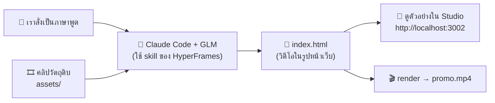
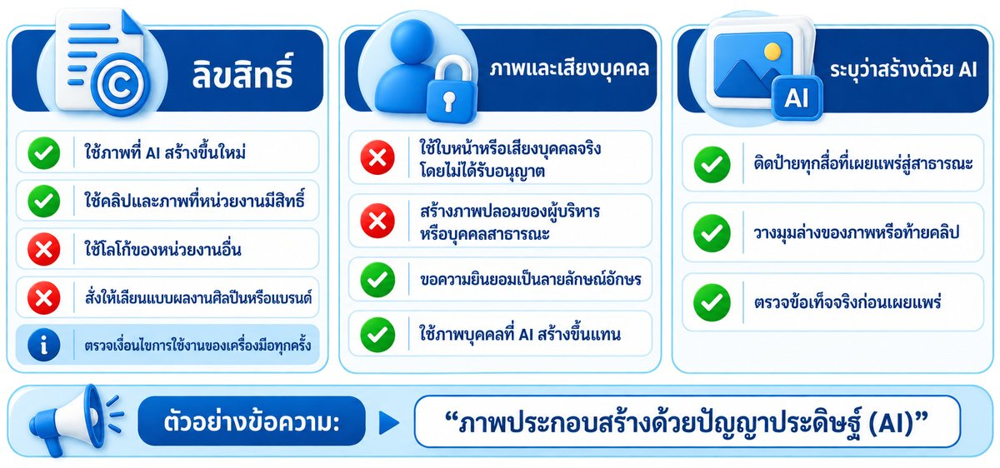

# 04 — Module 3: การใช้ AI ในการผลิตสื่อ (Workshop 3)

**เวลา:** 11.20–12.00 น. (40 นาที) · **Workshop 3A โปสเตอร์:** 10 นาที (เว็บ AI) · **Workshop 3B วิดีโอ:** 20 นาที (VM + Claude Code + HyperFrames — ติดตั้งเอง)

## สิ่งที่ต้องรู้ก่อน

| เรื่อง | จำสั้น ๆ |
|---|---|
| โครง prompt ภาพ | **Subject / Style / Composition / Mood / Negative** |
| ตัวอักษรภาษาไทยในภาพ | AI ส่วนใหญ่ยังเขียนภาษาไทยในภาพ **ผิด** → สั่ง "ไม่ต้องมีตัวอักษร" แล้วไปใส่ข้อความเองใน Canva |
| หลักทำงาน | **"แก้ ไม่ใช่สร้างใหม่"** — ได้ภาพใกล้เคียงแล้วให้แก้เฉพาะจุด |
| ลิขสิทธิ์ | ห้ามใช้ภาพบุคคลจริง / โลโก้หน่วยงานอื่นโดยไม่ได้รับอนุญาต + ระบุว่า "สร้างด้วย AI" |
| ตัดต่อวิดีโอด้วย AI | **HyperFrames** — AI เขียนวิดีโอเป็นหน้าเว็บ แล้วแปลงเป็นไฟล์ MP4 ให้ เราแค่สั่งเป็นภาษาพูด |

---

## 1. ภาพรวมเครื่องมือ

| ประเภทงาน | เครื่องมือ | ลิงก์ | จุดเด่น |
|---|---|---|---|
| สร้างภาพจากข้อความ | ChatGPT (สร้างภาพ) | <https://chatgpt.com> | สั่งเป็นภาษาไทยได้ แก้ต่อในแชทได้ |
| สร้างภาพจากข้อความ | Ideogram | <https://ideogram.ai> | เด่นเรื่องตัวอักษรในภาพ (ภาษาอังกฤษ) เหมาะกับโปสเตอร์ |
| สร้าง + แก้ภาพ + ใส่ข้อความ | Canva (Magic Media, Magic Edit, Background Remover) | <https://www.canva.com> | ใช้ง่าย มีเทมเพลต ใส่ฟอนต์ไทยได้ |
| สร้างวิดีโอ | Runway, Kling, Sora | — | คลิปสั้นจากข้อความหรือภาพนิ่ง |
| ตัดต่อวิดีโอ / motion graphic | **HyperFrames** + Claude Code | <https://hyperframes.heygen.com> | ตัดต่อคลิป ใส่ข้อความ ใส่คำบรรยาย ด้วยการสั่งเป็นภาษาพูด (ใช้ใน Workshop 3B) |
| งานนำเสนอ | Canva AI, Gamma | <https://gamma.app> | สร้างสไลด์จาก outline อัตโนมัติ |
| เสียงบรรยาย | AI Text-to-Speech (เช่น ใน Canva, ElevenLabs) | — | เสียงบรรยายภาษาไทยสำหรับสื่อการเรียนรู้ |

> ⚠️ ชื่อเมนูและฟีเจอร์ของแต่ละเว็บเปลี่ยนบ่อย ถ้าหาไม่เจอให้ถาม TA หรือดูบนจอวิทยากร

---

## 2. โครงสร้าง Prompt ภาพ 5 ส่วน

| ส่วน | ตอบคำถาม | ตัวอย่าง |
|---|---|---|
| **Subject** (สิ่งที่ปรากฏ) | ในภาพมีอะไร / ใคร กำลังทำอะไร | "คนหนุ่มสาววัยทำงานหลายคน กำลังพูดคุยกับเจ้าหน้าที่ที่บูธรับสมัครงาน" |
| **Style** (สไตล์) | ภาพแบบไหน | "flat design illustration", "ภาพถ่ายสมจริง", "3D การ์ตูน" |
| **Composition** (การจัดวาง) | แนวตั้ง/นอน วางตรงไหน เว้นที่ตรงไหน | "แนวตั้ง 4:5 เว้นพื้นที่ว่างด้านบน 30% สำหรับหัวข้อ" |
| **Mood** (โทน/อารมณ์) | สีและความรู้สึก | "โทนสีน้ำเงิน-ส้ม สดใส มีความหวัง" |
| **Negative** (สิ่งที่ไม่ต้องการ) | ห้ามมีอะไร | "ไม่มีตัวอักษร ไม่มีโลโก้ ไม่มีใบหน้าบุคคลจริง" |

### ❌ ก่อน vs ✅ หลัง

❌ ก่อน:

```text
สร้างโปสเตอร์งานจัดหางาน
```

✅ หลัง:

```text
ภาพประกอบโปสเตอร์แนวตั้ง สัดส่วน 4:5 สไตล์ flat design illustration
เนื้อหา: คนหนุ่มสาววัยทำงานหลากหลายอาชีพ (ช่าง, พนักงานออฟฟิศ, พ่อครัว) ยืนยิ้มอยู่หน้าบูธรับสมัครงาน
การจัดวาง: ตัวละครอยู่ครึ่งล่างของภาพ เว้นพื้นที่ว่างสีพื้นเรียบด้านบน 35% สำหรับใส่หัวข้อภายหลัง
โทนสี: น้ำเงินเข้มและส้ม สดใส ดูมีความหวัง
ห้ามมี: ตัวอักษรใด ๆ ในภาพ โลโก้ ลายน้ำ ใบหน้าที่เหมือนบุคคลจริง
```

---

## 3. 🛠️ Workshop 3A: ผลิตโปสเตอร์ประชาสัมพันธ์ 1 ชิ้น (10 นาที)

**โจทย์:** โปสเตอร์ประชาสัมพันธ์ **"งานนัดพบแรงงาน"** ของหน่วยงาน 1 ชิ้น พร้อมใช้โพสต์ Facebook

**ข้อมูลสำหรับใส่ในโปสเตอร์ (สมมติ):**

```text
งานนัดพบแรงงาน ประจำปี 2569
ตำแหน่งงานว่างกว่า 1,000 อัตรา จาก 50 บริษัท
วันเสาร์ที่ 17 ตุลาคม 2569 เวลา 09.00–15.00 น.
ณ ห้องประชุมใหญ่ ศาลากลางจังหวัด
ฟรี! ไม่มีค่าใช้จ่าย
สอบถาม: สำนักงานจัดหางานจังหวัด โทร 0-0000-0000
```

### ขั้นที่ 1 — เขียน prompt (2 นาที)

คัดลอก template แล้วแก้ `[...]`:

```text
ภาพประกอบโปสเตอร์[แนวตั้ง 4:5 / แนวนอน 16:9] สไตล์[flat design illustration / ภาพถ่ายสมจริง / 3D การ์ตูน]
เนื้อหา: [อธิบายสิ่งที่อยากให้ปรากฏในภาพ]
การจัดวาง: [ตัวละครอยู่ตรงไหน] เว้นพื้นที่ว่างสีพื้นเรียบ[ด้านบน/ด้านซ้าย] ประมาณ 35% สำหรับใส่ข้อความภายหลัง
โทนสี: [สีหลัก] ให้ความรู้สึก[อารมณ์]
ห้ามมี: ตัวอักษรใด ๆ ในภาพ โลโก้ ลายน้ำ ใบหน้าที่เหมือนบุคคลจริง
```

### ขั้นที่ 2 — สร้างภาพจริง (5 นาที) — เลือก 1 เครื่องมือ

#### ทางเลือก A: Canva (แนะนำ — ใส่ข้อความไทยต่อได้เลย)

1. เข้า <https://www.canva.com> → ล็อกอิน
2. กด **Create a design** → เลือก **Instagram Post (4:5)** หรือ **Facebook Post**
3. เมนูซ้าย → **Apps** → ค้นหา **Magic Media** (หรือ **Text to Image**)
4. วาง prompt จากขั้นที่ 1 → กด **Generate** → เลือกภาพที่ชอบ 1 ภาพ ลากลงหน้ากระดาษ
5. เมนูซ้าย → **Text** → ใส่ข้อความจากกล่อง "ข้อมูลสำหรับใส่ในโปสเตอร์" ด้านบน ใช้ฟอนต์ไทย เช่น **Kanit**, **Prompt**, **Sarabun**

#### ทางเลือก B: ChatGPT / Ideogram (เอาภาพไปใส่ข้อความใน Canva ต่อ)

1. วาง prompt → รอภาพ → ดาวน์โหลด
2. อัปโหลดภาพเข้า Canva (**Uploads** → **Upload files**) แล้วใส่ข้อความตามทางเลือก A ข้อ 5

### ขั้นที่ 3 — แก้เฉพาะจุด ไม่สร้างใหม่ (3 นาที)

| อยากแก้ | ทำใน Canva | ทำใน ChatGPT (พิมพ์ต่อในแชทเดิม) |
|---|---|---|
| ลบวัตถุที่ไม่ต้องการ | คลิกภาพ → **Edit** → **Magic Eraser** ระบายจุดที่จะลบ | "ลบ[วัตถุ]ออก ส่วนอื่นคงเดิม" |
| เปลี่ยนสีบางส่วน | **Edit** → **Magic Edit** ระบายจุด แล้วพิมพ์สิ่งที่ต้องการ | "เปลี่ยนสีเสื้อคนตรงกลางเป็นสีฟ้า ส่วนอื่นคงเดิม" |
| ลบพื้นหลัง | **Edit** → **BG Remover** | — |
| ขยายภาพให้เต็มกรอบ | **Edit** → **Magic Expand** | "ขยายภาพออกด้านข้างให้เป็นแนวนอน 16:9" |

### ขั้นที่ 4 — ติดป้าย "สร้างด้วย AI"

ใส่ข้อความเล็ก ๆ มุมล่างของโปสเตอร์:

```text
ภาพประกอบสร้างด้วยปัญญาประดิษฐ์ (AI)
```

✅ **ผลที่ควรเห็น:** โปสเตอร์ 1 ชิ้น มีภาพประกอบจาก AI + ข้อความภาษาไทยถูกต้องครบ + ป้าย "สร้างด้วย AI" → กด **Share → Download (PNG)** เก็บไว้

---

## 4. 🛠️ Workshop 3B: ให้ AI ตัดต่อวิดีโอด้วย HyperFrames (20 นาที)

**เป้าหมาย:** ได้คลิปประชาสัมพันธ์ 20 วินาที (ไฟล์ MP4) ที่ AI ตัดต่อให้ทั้งหมด — เราแค่สั่งเป็นภาษาพูด เหมือน Workshop 2

### HyperFrames คืออะไร

[HyperFrames](https://hyperframes.heygen.com) เป็นเครื่องมือโอเพนซอร์สของ HeyGen ที่ให้ AI "เขียนวิดีโอเป็นหน้าเว็บ" (ข้อความ ภาพ คลิป การเคลื่อนไหว) แล้วแปลงเป็นไฟล์วิดีโอ MP4 ให้ — ใช้ทักษะเดียวกับ Workshop 2 คือ **สั่งให้ชัด**



| คำ | ความหมายแบบง่าย |
|---|---|
| **Skill** | "คู่มือ" ที่สอน AI ว่าต้องทำวิดีโอด้วย HyperFrames อย่างไร — ติดตั้งครั้งเดียว AI เปิดอ่านเองเมื่อต้องใช้ |
| **Studio / Preview** | หน้าเว็บดูตัวอย่างวิดีโอ รันอยู่บน VM ที่ port 3002 |
| **Port Forwarding (แท็บ PORTS ใน VS Code)** | ทำให้เปิดหน้า Studio บน VM ผ่านเบราว์เซอร์บนเครื่องเราได้ ที่ `http://localhost:3002` |
| **Render** | แปลงหน้าเว็บวิดีโอให้เป็นไฟล์ MP4 จริง |

### ขั้นที่ 1 — เชื่อม VM ด้วย VS Code และส่งต่อ port 3002 (2 นาที)

1. ใช้ VS Code ที่เชื่อม VM จาก Workshop 2 ได้เลย (มุมซ้ายล่างขึ้น `SSH: …`) — ถ้าหลุด ให้กด `><` → **Connect to Host...** ใหม่
2. แท็บ **PORTS** → **Forward a Port** → พิมพ์ `3002` → `Enter`

✅ แท็บ PORTS มี `3002` อยู่ในรายการ — ไว้เปิดดูวิดีโอในขั้นที่ 5

### ขั้นที่ 2 — ติดตั้ง HyperFrames ด้วยตัวเอง (5 นาที)

HyperFrames ต้องใช้โปรแกรมเบื้องหลัง 3 ตัว ติดตั้งครั้งเดียวด้วยการวาง **3 บล็อก** นี้ทีละบล็อก

| โปรแกรม | ใช้ทำอะไร |
|---|---|
| **FFmpeg** | ต่อภาพแต่ละเฟรมให้เป็นไฟล์วิดีโอ MP4 |
| **Chrome** | "วาด" หน้าเว็บวิดีโอออกมาเป็นภาพทีละเฟรม |
| **Node.js** | ใช้รันโปรแกรม HyperFrames |

**บล็อก 1 — ติดตั้งโปรแกรมเบื้องหลัง** (ใช้เวลา 2–4 นาที ระหว่างรอจะมีข้อความวิ่งเยอะ เป็นเรื่องปกติ)

```bash
# ติดตั้ง FFmpeg + ฟอนต์ไทย + Node.js 22 + Chrome (ถ้ามีอยู่แล้วจะข้ามให้เอง)
sudo apt-get update -y
sudo apt-get install -y ffmpeg fonts-thai-tlwg fonts-noto-core
node -v 2>/dev/null | grep -qE '^v(2[2-9]|[3-9][0-9])' || { curl -fsSL https://deb.nodesource.com/setup_22.x | sudo -E bash - && sudo apt-get install -y nodejs; }
command -v google-chrome >/dev/null || { curl -fsSL -o /tmp/chrome.deb https://dl.google.com/linux/direct/google-chrome-stable_current_amd64.deb && sudo apt-get install -y /tmp/chrome.deb; }
echo "ติดตั้งเสร็จแล้ว ✅"
```

✅ **ผลที่ควรเห็น:** บรรทัดสุดท้ายขึ้น `ติดตั้งเสร็จแล้ว ✅`

**บล็อก 2 — ตรวจว่าเครื่องพร้อม** (ครั้งแรกจะดาวน์โหลด HyperFrames ประมาณ 30 วินาที)

```bash
# ใช้ npx เรียก HyperFrames ได้เลย ไม่ต้องติดตั้งแยก
npx -y hyperframes@latest doctor
```

✅ **ผลที่ควรเห็น:** เครื่องหมาย `✓` ที่แถว **Node.js**, **FFmpeg**, **FFprobe** และ **Chrome** (แถว Docker / Whisper / TTS เป็น `✗` ได้ ไม่ต้องใช้)

**บล็อก 3 — ติดตั้ง Skill ให้ Claude Code รู้วิธีทำวิดีโอ**

```bash
# ติดตั้ง skill ชุดหลักของ HyperFrames แล้วตรวจรายชื่อ
cd ~ && npx hyperframes skills update && npx hyperframes skills check
```

✅ **ผลที่ควรเห็น:** รายชื่อ skill มี `hyperframes` และ `hyperframes-core`

**บล็อก 4 (ไม่บังคับ) — ทดสอบ render คลิปภาษาไทย 2 วินาที**

```bash
# สร้างโปรเจกต์ทดสอบ ใส่ข้อความไทย แล้ว render เป็น MP4
mkdir -p ~/hf-test && cd ~/hf-test
npx hyperframes init t --non-interactive && cd t
sed -i 's|>Title</h1>|>งานนัดพบแรงงาน 2569</h1>|; s|data-duration="10"|data-duration="2"|g' index.html
npx hyperframes render --quality draft -o renders/test.mp4 && ls -lh renders/
```

✅ **ผลที่ควรเห็น:** มีไฟล์ `renders/test.mp4` — ดาวน์โหลดลงเครื่องตัวเองด้วย `scp` (ดูขั้นที่ 7) แล้วเปิดดูว่าตัวหนังสือไทยไม่เป็น □□□

> ⚠️ **ข้อควรรู้**
> - VM ต้องเป็นเครื่อง **amd64** (Chrome แบบ `.deb` มีเฉพาะ amd64) มีสิทธิ์ `sudo` และออกอินเทอร์เน็ตได้
> - ใช้พื้นที่ดิสก์ประมาณ 1.5 GB
> - ขึ้น `Could not get lock /var/lib/dpkg/lock` = เครื่องกำลังอัปเดตตัวเอง → รอ 1–2 นาที แล้ววางบล็อกเดิมใหม่

> 💡 **อยากลองแบบ Vibe Coding?** เปิด `claude` แล้วสั่งว่า `ติดตั้ง HyperFrames ให้พร้อมใช้ตามเอกสาร https://hyperframes.heygen.com แล้วรัน doctor ให้ดูว่าครบไหม` AI จะติดตั้งให้เอง — แต่ถ้าเวลาน้อย ใช้ 3 บล็อกด้านบนจะเร็วและแน่นอนกว่า

### ขั้นที่ 3 — เตรียมโฟลเดอร์และคลิปวัตถุดิบ (1 นาที)

```bash
# สร้างโฟลเดอร์งานวิดีโอ แล้วคัดลอกคลิปตัวอย่างที่ทีมงานเตรียมไว้ (ถ้ามี)
mkdir -p ~/myvideo/assets && cd ~/myvideo
cp /opt/training/media/* assets/ 2>/dev/null && ls -lh assets || echo "ไม่พบคลิปตัวอย่าง → ใช้ prompt แบบ B ในขั้นที่ 4 (ไม่ต้องใช้คลิป)"
```

✅ **ผลที่ควรเห็น:** รายชื่อคลิปตัวอย่าง เช่น `clip1.mp4`, `clip2.mp4`, `clip3.mp4`

ถ้าขึ้น `ไม่พบคลิปตัวอย่าง` เลือกทางใดทางหนึ่ง:

- **ทางที่ 1:** ข้ามไปใช้ **prompt แบบ B** ในขั้นที่ 4 (AI สร้างภาพเคลื่อนไหวจากข้อความล้วน ไม่ต้องใช้คลิป)
- **ทางที่ 2:** อัปโหลดคลิปของตัวเอง (ดูกล่องด้านล่าง)
- **ทางที่ 3 (สำหรับทดสอบระบบ):** สร้างคลิปทดสอบ 3 คลิปด้วย FFmpeg แล้วใช้ prompt แบบ A ได้

```bash
# สร้างคลิปทดสอบแนวตั้ง 3 คลิป คลิปละ 5 วินาที (ภาพแถบสีและภาพเคลื่อนไหวของ FFmpeg)
cd ~/myvideo
ffmpeg -v error -f lavfi -i testsrc2=size=1080x1920:rate=30 -t 5 -pix_fmt yuv420p -y assets/clip1.mp4
ffmpeg -v error -f lavfi -i mandelbrot=size=1080x1920:rate=30 -t 5 -pix_fmt yuv420p -y assets/clip2.mp4
ffmpeg -v error -f lavfi -i "gradients=size=1080x1920:rate=30:c0=0x0B2E6B:c1=0x7CC4F2" -t 5 -pix_fmt yuv420p -y assets/clip3.mp4
ls -lh assets
```

> 💡 **อยากใช้คลิปของตัวเอง?** ใน VS Code ลากไฟล์คลิปจากเครื่องตัวเอง (File Explorer / Finder) ไปวางในโฟลเดอร์ `myvideo/assets` ที่แถบซ้ายของ VS Code — ไฟล์จะถูกอัปโหลดขึ้น VM ให้เอง
>
> (ทางสำรองด้วย Terminal บนเครื่องตัวเอง: `scp myclip.mp4 admins@203.0.113.10:~/myvideo/assets/`)
>
> ⚠️ ห้ามใช้คลิปที่มีใบหน้า / เสียงของบุคคลที่ยังไม่ได้ให้อนุญาต และห้ามใช้คลิปที่มีข้อมูลส่วนบุคคล

### ขั้นที่ 4 — สั่ง AI ตัดต่อวิดีโอ (8 นาที)

เปิด Claude Code ในโฟลเดอร์ `~/myvideo`:

```bash
cd ~/myvideo && claude
```

เลือก prompt 1 แบบ คัดลอกไปวางในช่อง `>` (ขึ้นต้นด้วย `/hyperframes` เพื่อเรียกใช้ skill)

**แบบ A — ตัดต่อคลิปจริงในโฟลเดอร์ `assets/`** (แนะนำ)

```text
/hyperframes ตัดต่อวิดีโอประชาสัมพันธ์ "งานนัดพบแรงงาน ประจำปี 2569" ความยาว 20 วินาที แนวตั้ง 1080x1920 สำหรับโพสต์ Facebook
วัตถุดิบ: คลิปทั้งหมดในโฟลเดอร์ assets/ เลือกช่วงที่ดีที่สุดของแต่ละคลิปมาต่อกัน
ลำดับเรื่อง:
- 0–3 วินาที: ชื่องาน "งานนัดพบแรงงาน 2569" ตัวใหญ่ เคลื่อนเข้ามากลางจอ
- 3–15 วินาที: คลิปจาก assets/ ต่อกัน เปลี่ยนภาพแบบนุ่มนวล มีข้อความแถบล่างเปลี่ยนไปตามคลิป: "ตำแหน่งงานว่างกว่า 1,000 อัตรา" → "50 บริษัทชั้นนำ" → "สมัครและสัมภาษณ์ได้ในวันงาน"
- 15–20 วินาที: สรุป "เสาร์ 17 ต.ค. 2569 · 09.00–15.00 น. · ศาลากลางจังหวัด" และ "ฟรี ไม่มีค่าใช้จ่าย"
สไตล์: โทนน้ำเงินเข้มกับส้ม ดูเป็นทางการแต่สดใส ข้อความภาษาไทยใช้ฟอนต์ Noto Sans Thai ตัวหนา ตัวใหญ่อ่านง่ายบนมือถือ
มุมล่างขวาตลอดคลิปมีข้อความเล็ก ๆ "สร้างด้วย AI"
ไม่ต้องมีเสียงพากย์และไม่ต้องมีเพลง
ข้อกำหนด: ใช้ค่าตามที่บอกนี้ได้เลย ไม่ต้องถามเพิ่ม ทำเสร็จให้ตรวจด้วย npx hyperframes lint แล้วเปิด preview แบบ background ที่ port 3002 จากนั้น render คุณภาพ draft เป็นไฟล์ renders/promo.mp4 สรุปเป็นภาษาไทยสั้น ๆ ว่าทำอะไรไปบ้าง
```

**แบบ B — ไม่มีคลิป ให้ AI สร้างภาพเคลื่อนไหวจากข้อความล้วน** (ใช้ถ้าโฟลเดอร์ `assets/` ว่าง)

```text
/hyperframes สร้างวิดีโอ motion graphic ประชาสัมพันธ์ "งานนัดพบแรงงาน ประจำปี 2569" ความยาว 15 วินาที แนวตั้ง 1080x1920 ไม่ใช้คลิปหรือรูปภาพจากภายนอก
ลำดับเรื่อง:
- 0–3 วินาที: ชื่องานตัวใหญ่ เคลื่อนเข้ามากลางจอ
- 3–10 วินาที: ตัวเลขนับขึ้น "1,000+ ตำแหน่งงาน" และ "50 บริษัท" พร้อมไอคอนรูปทรงเรียบง่าย
- 10–15 วินาที: "เสาร์ 17 ต.ค. 2569 · 09.00–15.00 น. · ศาลากลางจังหวัด" และ "ฟรี ไม่มีค่าใช้จ่าย"
สไตล์: โทนน้ำเงินเข้มกับส้ม ฟอนต์ Noto Sans Thai ตัวหนา มุมล่างขวามีข้อความ "สร้างด้วย AI"
ไม่ต้องมีเสียง
ข้อกำหนด: ใช้ค่าตามที่บอกนี้ได้เลย ไม่ต้องถามเพิ่ม ทำเสร็จให้ตรวจด้วย npx hyperframes lint แล้วเปิด preview แบบ background ที่ port 3002 จากนั้น render คุณภาพ draft เป็นไฟล์ renders/promo.mp4 สรุปเป็นภาษาไทยสั้น ๆ ว่าทำอะไรไปบ้าง
```

> ⏱️ AI จะใช้เวลาเขียนประมาณ 3–5 นาที และ render อีก 1–3 นาที — ระหว่างรอ อ่านสิ่งที่ AI ขออนุญาตแล้วกด **Yes** ตามปกติ
>
> 💡 ถ้า AI ถามคำถามกลับ (เช่น ยืนยันสไตล์ ความยาว) ตอบสั้น ๆ ได้เลย เช่น `ใช้ตามที่บอกไว้ได้เลย`

### ขั้นที่ 5 — ดูตัวอย่างใน Studio (2 นาที)

เปิดเบราว์เซอร์ **บนเครื่องตัวเอง** ไปที่:

```text
http://localhost:3002
```

✅ **ผลที่ควรเห็น:** หน้า HyperFrames Studio มีวิดีโอของเรา กด ▶️ ดูได้ และมีไทม์ไลน์ด้านล่าง

❌ เปิดไม่ขึ้น → ตรวจว่าแท็บ PORTS มี `3002` (ขั้นที่ 1) และ VS Code ยังเชื่อม VM อยู่ แล้วพิมพ์บอก AI: `เปิด preview ที่ port 3002 แบบ background ให้ใหม่`

### ขั้นที่ 6 — สั่งแก้เฉพาะจุด แล้ว render ใหม่ (3 นาที)

หลัก **"แก้ ไม่ใช่สร้างใหม่"** เหมือนตอนทำโปสเตอร์ — พิมพ์ต่อในหน้าต่างเดิม เช่น:

```text
ช่วงชื่องานตอนต้นให้ค้างนานขึ้นเป็น 4 วินาที และทำตัวอักษรให้ใหญ่ขึ้นอีก
```

```text
ตัดคลิปที่สองให้สั้นลงเหลือ 3 วินาที แล้วเปลี่ยนการเปลี่ยนภาพเป็นแบบเลื่อนจากขวาไปซ้าย
```

```text
เปลี่ยนข้อความแถบล่างเป็นพื้นหลังสีส้ม ตัวหนังสือสีขาว
```

```text
แก้เสร็จแล้ว render ใหม่แบบ draft ทับไฟล์ renders/promo.mp4
```

รีเฟรชหน้า Studio เพื่อดูผลที่แก้

### ขั้นที่ 7 — ดาวน์โหลดคลิปมาไว้ที่เครื่องตัวเอง (1 นาที)

> 📘 วิธีรับส่งไฟล์แบบอื่น (SFTP, FileZilla, rsync) ดู [linux/03_SSH_FILESYSTEM.md](linux/03_SSH_FILESYSTEM.md)

ตรวจว่ามีไฟล์แล้ว (พิมพ์ใน Claude Code):

```bash
!ls -lh renders/
```

✅ มีไฟล์ `promo.mp4`

ดาวน์โหลดด้วย VS Code:

1. แถบซ้าย (Explorer) เปิดโฟลเดอร์ `myvideo` → `renders`
2. **คลิกขวา** ที่ `promo.mp4` → **Download...**
3. เลือกที่เก็บบนเครื่องตัวเอง (เช่น Desktop) → **Save / Download**

✅ ได้ไฟล์ `promo.mp4` บนเครื่องตัวเอง — ดับเบิลคลิกเปิดดูได้เลย 🎉

> 🛟 ถ้าไม่เห็นโฟลเดอร์ `myvideo` ในแถบซ้าย: เมนู **File → Open Folder...** → `/home/admins/` → **OK**
>
> ทางสำรองด้วย Terminal บนเครื่องตัวเอง: `scp admins@203.0.113.10:~/myvideo/renders/promo.mp4 .`

> 💡 **ช่วงบ่าย (Deploy):** นำคลิปนี้ไปใส่ในเว็บของตัวเองได้ — บอก AI ว่า `คัดลอก ~/myvideo/renders/promo.mp4 ไปไว้ใน /var/www/myapp แล้วเพิ่มวิดีโอนี้ในหน้า index.html`

### คำสั่ง HyperFrames ที่ AI ใช้ (ไว้ดูเป็นความรู้)

| คำสั่ง | ทำอะไร |
|---|---|
| `npx hyperframes doctor` | ตรวจว่าเครื่องพร้อม (Node.js, FFmpeg, Chrome) |
| `npx hyperframes lint` | ตรวจหาข้อผิดพลาดในวิดีโอ |
| `npx hyperframes preview --background --port 3002` | เปิด Studio ดูตัวอย่าง |
| `npx hyperframes render --quality draft -o renders/promo.mp4` | แปลงเป็นไฟล์ MP4 (draft = เร็ว, `high` = คมชัด) |
| `npx hyperframes snapshot --at 0,5,10` | ถ่ายภาพนิ่งที่วินาทีต่าง ๆ ไว้ตรวจ |

---

## 5. งานนำเสนอและเสียงบรรยาย (ทำต่อเองหลังอบรมได้)

### สร้างสไลด์จาก outline ด้วย Gamma / Canva

```text
สร้างงานนำเสนอ 6 สไลด์ หัวข้อ "[ชื่อเรื่อง]" สำหรับ[กลุ่มผู้ฟัง]
สไลด์ 1: หน้าปก
สไลด์ 2: [หัวข้อ]
สไลด์ 3: [หัวข้อ]
สไลด์ 4: [หัวข้อ]
สไลด์ 5: [หัวข้อ]
สไลด์ 6: สรุปและช่องทางติดต่อ
ใช้ภาษาไทย ข้อความไม่เกิน 5 บรรทัดต่อสไลด์ โทนสีน้ำเงิน ดูเป็นทางการ
```

### ให้ AI เขียนบทบรรยายก่อนแปลงเป็นเสียง

```text
เขียนบทบรรยายภาษาไทยความยาวประมาณ 1 นาที (ราว 150 คำ) สำหรับคลิปแนะนำ "[เรื่อง]"
กลุ่มผู้ฟัง: [ประชาชนทั่วไป / ผู้หางาน]
โทน: เป็นกันเอง สุภาพ เข้าใจง่าย ประโยคสั้น เหมาะกับการอ่านออกเสียง
ห้ามใช้ศัพท์เทคนิค และห้ามใส่ตัวเลขที่ไม่ได้ให้ไว้
```

จากนั้นนำบทไปวางในเครื่องมือ Text-to-Speech ที่รองรับภาษาไทย

---

## 6. ⚠️ ลิขสิทธิ์และข้อควรระวัง



| ✅ ทำได้ | ⛔ ห้ามทำ |
|---|---|
| ใช้ภาพที่ AI สร้างใหม่ทั้งหมดเป็นภาพประกอบ | ใช้ภาพ / ใบหน้าบุคคลจริงโดยไม่ได้รับอนุญาต |
| ใช้โลโก้หน่วยงานตัวเองตามระเบียบ | ใช้โลโก้ / เครื่องหมายของหน่วยงานอื่น |
| ระบุ "สร้างด้วย AI" ในสื่อที่เผยแพร่ | สร้าง deepfake ของบุคคลสาธารณะ / ผู้บริหาร |
| ตรวจข้อเท็จจริงในสื่อก่อนเผยแพร่ | สั่ง "ทำให้เหมือนผลงานของ [ศิลปิน/แบรนด์]" |

> 📌 ตรวจเงื่อนไขการใช้งาน (Terms of Use) ของแต่ละเครื่องมือเรื่องสิทธิ์การใช้ภาพเชิงพาณิชย์ / การใช้ในนามหน่วยงาน ก่อนนำไปเผยแพร่จริง

➡️ ต่อไป (ช่วงบ่าย): [05_AI_SAFETY_WORKSHOP.md](05_AI_SAFETY_WORKSHOP.md)
