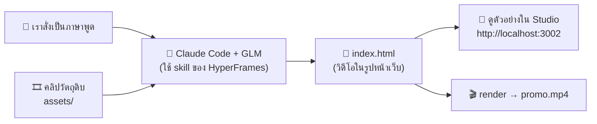

# 04 — Module 3: การใช้ AI ในการผลิตสื่อ (Workshop 3)

**เวลา:** 11.20–12.00 น. (40 นาที) · **Workshop 3A โปสเตอร์:** 10 นาที (เว็บ AI) · **Workshop 3B วิดีโอ:** 20 นาที (VM + Claude Code + HyperFrames)

## สิ่งที่ต้องรู้ก่อน

| เรื่อง | จำสั้น ๆ |
|---|---|
| โครง prompt ภาพ | **Subject / Style / Composition / Mood / Negative** |
| ตัวอักษรภาษาไทยในภาพ | AI ส่วนใหญ่ยังเขียนภาษาไทยในภาพ **ผิด** → สั่ง "ไม่ต้องมีตัวอักษร" แล้วไปใส่ข้อความเองใน Canva |
| หลักทำงาน | **"แก้ ไม่ใช่สร้างใหม่"** — ได้ภาพใกล้เคียงแล้วให้แก้เฉพาะจุด |
| ลิขสิทธิ์ | ห้ามใช้ภาพบุคคลจริง / โลโก้หน่วยงานอื่นโดยไม่ได้รับอนุญาต + ระบุว่า "สร้างด้วย AI" |
| ตัดต่อวิดีโอด้วย AI | **HyperFrames** — AI เขียนวิดีโอเป็นหน้าเว็บ แล้วแปลงเป็นไฟล์ MP4 ให้ เราแค่สั่งเป็นภาษาพูด |

---

## 1. ภาพรวมเครื่องมือ

| ประเภทงาน | เครื่องมือ | ลิงก์ | จุดเด่น |
|---|---|---|---|
| สร้างภาพจากข้อความ | ChatGPT (สร้างภาพ) | <https://chatgpt.com> | สั่งเป็นภาษาไทยได้ แก้ต่อในแชทได้ |
| สร้างภาพจากข้อความ | Ideogram | <https://ideogram.ai> | เด่นเรื่องตัวอักษรในภาพ (ภาษาอังกฤษ) เหมาะกับโปสเตอร์ |
| สร้าง + แก้ภาพ + ใส่ข้อความ | Canva (Magic Media, Magic Edit, Background Remover) | <https://www.canva.com> | ใช้ง่าย มีเทมเพลต ใส่ฟอนต์ไทยได้ |
| สร้างวิดีโอ | Runway, Kling, Sora | — | คลิปสั้นจากข้อความหรือภาพนิ่ง |
| ตัดต่อวิดีโอ / motion graphic | **HyperFrames** + Claude Code | <https://hyperframes.heygen.com> | ตัดต่อคลิป ใส่ข้อความ ใส่คำบรรยาย ด้วยการสั่งเป็นภาษาพูด (ใช้ใน Workshop 3B) |
| งานนำเสนอ | Canva AI, Gamma | <https://gamma.app> | สร้างสไลด์จาก outline อัตโนมัติ |
| เสียงบรรยาย | AI Text-to-Speech (เช่น ใน Canva, ElevenLabs) | — | เสียงบรรยายภาษาไทยสำหรับสื่อการเรียนรู้ |

> ⚠️ ชื่อเมนูและฟีเจอร์ของแต่ละเว็บเปลี่ยนบ่อย ถ้าหาไม่เจอให้ถาม TA หรือดูบนจอวิทยากร

---

## 2. โครงสร้าง Prompt ภาพ 5 ส่วน

| ส่วน | ตอบคำถาม | ตัวอย่าง |
|---|---|---|
| **Subject** (สิ่งที่ปรากฏ) | ในภาพมีอะไร / ใคร กำลังทำอะไร | "คนหนุ่มสาววัยทำงานหลายคน กำลังพูดคุยกับเจ้าหน้าที่ที่บูธรับสมัครงาน" |
| **Style** (สไตล์) | ภาพแบบไหน | "flat design illustration", "ภาพถ่ายสมจริง", "3D การ์ตูน" |
| **Composition** (การจัดวาง) | แนวตั้ง/นอน วางตรงไหน เว้นที่ตรงไหน | "แนวตั้ง 4:5 เว้นพื้นที่ว่างด้านบน 30% สำหรับหัวข้อ" |
| **Mood** (โทน/อารมณ์) | สีและความรู้สึก | "โทนสีน้ำเงิน-ส้ม สดใส มีความหวัง" |
| **Negative** (สิ่งที่ไม่ต้องการ) | ห้ามมีอะไร | "ไม่มีตัวอักษร ไม่มีโลโก้ ไม่มีใบหน้าบุคคลจริง" |

### ❌ ก่อน vs ✅ หลัง

❌ ก่อน:

```text
สร้างโปสเตอร์งานจัดหางาน
```

✅ หลัง:

```text
ภาพประกอบโปสเตอร์แนวตั้ง สัดส่วน 4:5 สไตล์ flat design illustration
เนื้อหา: คนหนุ่มสาววัยทำงานหลากหลายอาชีพ (ช่าง, พนักงานออฟฟิศ, พ่อครัว) ยืนยิ้มอยู่หน้าบูธรับสมัครงาน
การจัดวาง: ตัวละครอยู่ครึ่งล่างของภาพ เว้นพื้นที่ว่างสีพื้นเรียบด้านบน 35% สำหรับใส่หัวข้อภายหลัง
โทนสี: น้ำเงินเข้มและส้ม สดใส ดูมีความหวัง
ห้ามมี: ตัวอักษรใด ๆ ในภาพ โลโก้ ลายน้ำ ใบหน้าที่เหมือนบุคคลจริง
```

---

## 3. 🛠️ Workshop 3A: ผลิตโปสเตอร์ประชาสัมพันธ์ 1 ชิ้น (10 นาที)

**โจทย์:** โปสเตอร์ประชาสัมพันธ์ **"งานนัดพบแรงงาน"** ของหน่วยงาน 1 ชิ้น พร้อมใช้โพสต์ Facebook

**ข้อมูลสำหรับใส่ในโปสเตอร์ (สมมติ):**

```text
งานนัดพบแรงงาน ประจำปี 2569
ตำแหน่งงานว่างกว่า 1,000 อัตรา จาก 50 บริษัท
วันเสาร์ที่ 17 ตุลาคม 2569 เวลา 09.00–15.00 น.
ณ ห้องประชุมใหญ่ ศาลากลางจังหวัด
ฟรี! ไม่มีค่าใช้จ่าย
สอบถาม: สำนักงานจัดหางานจังหวัด โทร 0-0000-0000
```

### ขั้นที่ 1 — เขียน prompt (2 นาที)

คัดลอก template แล้วแก้ `[...]`:

```text
ภาพประกอบโปสเตอร์[แนวตั้ง 4:5 / แนวนอน 16:9] สไตล์[flat design illustration / ภาพถ่ายสมจริง / 3D การ์ตูน]
เนื้อหา: [อธิบายสิ่งที่อยากให้ปรากฏในภาพ]
การจัดวาง: [ตัวละครอยู่ตรงไหน] เว้นพื้นที่ว่างสีพื้นเรียบ[ด้านบน/ด้านซ้าย] ประมาณ 35% สำหรับใส่ข้อความภายหลัง
โทนสี: [สีหลัก] ให้ความรู้สึก[อารมณ์]
ห้ามมี: ตัวอักษรใด ๆ ในภาพ โลโก้ ลายน้ำ ใบหน้าที่เหมือนบุคคลจริง
```

### ขั้นที่ 2 — สร้างภาพจริง (5 นาที) — เลือก 1 เครื่องมือ

#### ทางเลือก A: Canva (แนะนำ — ใส่ข้อความไทยต่อได้เลย)

1. เข้า <https://www.canva.com> → ล็อกอิน
2. กด **Create a design** → เลือก **Instagram Post (4:5)** หรือ **Facebook Post**
3. เมนูซ้าย → **Apps** → ค้นหา **Magic Media** (หรือ **Text to Image**)
4. วาง prompt จากขั้นที่ 1 → กด **Generate** → เลือกภาพที่ชอบ 1 ภาพ ลากลงหน้ากระดาษ
5. เมนูซ้าย → **Text** → ใส่ข้อความจากกล่อง "ข้อมูลสำหรับใส่ในโปสเตอร์" ด้านบน ใช้ฟอนต์ไทย เช่น **Kanit**, **Prompt**, **Sarabun**

#### ทางเลือก B: ChatGPT / Ideogram (เอาภาพไปใส่ข้อความใน Canva ต่อ)

1. วาง prompt → รอภาพ → ดาวน์โหลด
2. อัปโหลดภาพเข้า Canva (**Uploads** → **Upload files**) แล้วใส่ข้อความตามทางเลือก A ข้อ 5

### ขั้นที่ 3 — แก้เฉพาะจุด ไม่สร้างใหม่ (3 นาที)

| อยากแก้ | ทำใน Canva | ทำใน ChatGPT (พิมพ์ต่อในแชทเดิม) |
|---|---|---|
| ลบวัตถุที่ไม่ต้องการ | คลิกภาพ → **Edit** → **Magic Eraser** ระบายจุดที่จะลบ | "ลบ[วัตถุ]ออก ส่วนอื่นคงเดิม" |
| เปลี่ยนสีบางส่วน | **Edit** → **Magic Edit** ระบายจุด แล้วพิมพ์สิ่งที่ต้องการ | "เปลี่ยนสีเสื้อคนตรงกลางเป็นสีฟ้า ส่วนอื่นคงเดิม" |
| ลบพื้นหลัง | **Edit** → **BG Remover** | — |
| ขยายภาพให้เต็มกรอบ | **Edit** → **Magic Expand** | "ขยายภาพออกด้านข้างให้เป็นแนวนอน 16:9" |

### ขั้นที่ 4 — ติดป้าย "สร้างด้วย AI"

ใส่ข้อความเล็ก ๆ มุมล่างของโปสเตอร์:

```text
ภาพประกอบสร้างด้วยปัญญาประดิษฐ์ (AI)
```

✅ **ผลที่ควรเห็น:** โปสเตอร์ 1 ชิ้น มีภาพประกอบจาก AI + ข้อความภาษาไทยถูกต้องครบ + ป้าย "สร้างด้วย AI" → กด **Share → Download (PNG)** เก็บไว้

---

## 4. 🛠️ Workshop 3B: ให้ AI ตัดต่อวิดีโอด้วย HyperFrames (20 นาที)

**เป้าหมาย:** ได้คลิปประชาสัมพันธ์ 20 วินาที (ไฟล์ MP4) ที่ AI ตัดต่อให้ทั้งหมด — เราแค่สั่งเป็นภาษาพูด เหมือน Workshop 2

### HyperFrames คืออะไร

[HyperFrames](https://hyperframes.heygen.com) เป็นเครื่องมือโอเพนซอร์สของ HeyGen ที่ให้ AI "เขียนวิดีโอเป็นหน้าเว็บ" (ข้อความ ภาพ คลิป การเคลื่อนไหว) แล้วแปลงเป็นไฟล์วิดีโอ MP4 ให้ — ใช้ทักษะเดียวกับ Workshop 2 คือ **สั่งให้ชัด**



| คำ | ความหมายแบบง่าย |
|---|---|
| **Skill** | "คู่มือ" ที่สอน AI ว่าต้องทำวิดีโอด้วย HyperFrames อย่างไร — ติดตั้งครั้งเดียว AI เปิดอ่านเองเมื่อต้องใช้ |
| **Studio / Preview** | หน้าเว็บดูตัวอย่างวิดีโอ รันอยู่บน VM ที่ port 3002 |
| **SSH Tunnel** | "ท่อ" ที่ทำให้เปิดหน้า Studio บน VM ผ่านเบราว์เซอร์บนเครื่องเราได้ ที่ `http://localhost:3002` |
| **Render** | แปลงหน้าเว็บวิดีโอให้เป็นไฟล์ MP4 จริง |

### ขั้นที่ 1 — SSH เข้า VM แบบเปิดท่อ (Tunnel) ไว้ดูตัวอย่างวิดีโอ (2 นาที)

ถ้ายังเปิด SSH จาก Workshop 2 (คำสั่งที่มี `-L 3002:localhost:3002`) ค้างอยู่ ใช้หน้าต่างเดิมได้เลย ถ้าปิดไปแล้ว SSH ใหม่ด้วย:

```bash
# -L 3002:localhost:3002 = เปิด http://localhost:3002 บนเครื่องเรา แล้วให้วิ่งไปที่ port 3002 บน VM
ssh -L 8080:localhost:8080 -L 3002:localhost:3002 trainee01@203.0.113.10
```

✅ เข้า VM ได้ตามปกติ (`trainee01@...:~$`) — **เปิดหน้าต่างนี้ค้างไว้ตลอด Workshop** ถ้าปิด ท่อจะหายไปด้วย

### ขั้นที่ 2 — ตรวจเครื่องมือ + ติดตั้ง Skill ของ HyperFrames (3 นาที)

ทีมงานติดตั้ง HyperFrames, FFmpeg, Chrome และฟอนต์ไทยไว้ให้แล้ว ตรวจด้วย:

```bash
# ตรวจว่าเครื่องพร้อมตัดต่อวิดีโอ
hyperframes doctor
```

✅ **ผลที่ควรเห็น:** มีเครื่องหมาย `✓` ที่แถว **Node.js**, **FFmpeg**, **FFprobe** และ **Chrome** (แถว Docker เป็น `✗` ได้ ไม่ต้องใช้)

ติดตั้ง Skill ให้ Claude Code รู้จักวิธีทำวิดีโอด้วย HyperFrames:

```bash
# ติดตั้ง skill ชุดหลักของ HyperFrames (ใช้เวลาประมาณ 30 วินาที)
cd ~ && hyperframes skills update
```

```bash
# ตรวจว่ามี skill อะไรบ้าง
hyperframes skills check
```

✅ **ผลที่ควรเห็น:** รายชื่อ skill มี `hyperframes` และ `hyperframes-core`

### ขั้นที่ 3 — เตรียมโฟลเดอร์และคลิปวัตถุดิบ (1 นาที)

```bash
# สร้างโฟลเดอร์งานวิดีโอ และคัดลอกคลิปตัวอย่างที่ทีมงานเตรียมไว้มาใช้
mkdir -p ~/myvideo/assets && cp /opt/training/media/* ~/myvideo/assets/ && cd ~/myvideo && ls -lh assets
```

✅ **ผลที่ควรเห็น:** รายชื่อคลิปตัวอย่าง เช่น `clip1.mp4`, `clip2.mp4`, `clip3.mp4`

> 💡 **อยากใช้คลิปของตัวเอง?** เปิด Terminal **อีกหน้าต่างบนเครื่องตัวเอง** (ไม่ต้อง SSH) แล้วอัปโหลดขึ้น VM (แทนชื่อไฟล์และ IP):
>
> ```bash
> scp myclip.mp4 trainee01@203.0.113.10:~/myvideo/assets/
> ```
>
> ⚠️ ห้ามใช้คลิปที่มีใบหน้า / เสียงของบุคคลที่ยังไม่ได้ให้อนุญาต และห้ามใช้คลิปที่มีข้อมูลส่วนบุคคล

### ขั้นที่ 4 — สั่ง AI ตัดต่อวิดีโอ (8 นาที)

เปิด Claude Code ในโฟลเดอร์ `~/myvideo`:

```bash
cd ~/myvideo && claude
```

เลือก prompt 1 แบบ คัดลอกไปวางในช่อง `>` (ขึ้นต้นด้วย `/hyperframes` เพื่อเรียกใช้ skill)

**แบบ A — ตัดต่อคลิปจริงในโฟลเดอร์ `assets/`** (แนะนำ)

```text
/hyperframes ตัดต่อวิดีโอประชาสัมพันธ์ "งานนัดพบแรงงาน ประจำปี 2569" ความยาว 20 วินาที แนวตั้ง 1080x1920 สำหรับโพสต์ Facebook
วัตถุดิบ: คลิปทั้งหมดในโฟลเดอร์ assets/ เลือกช่วงที่ดีที่สุดของแต่ละคลิปมาต่อกัน
ลำดับเรื่อง:
- 0–3 วินาที: ชื่องาน "งานนัดพบแรงงาน 2569" ตัวใหญ่ เคลื่อนเข้ามากลางจอ
- 3–15 วินาที: คลิปจาก assets/ ต่อกัน เปลี่ยนภาพแบบนุ่มนวล มีข้อความแถบล่างเปลี่ยนไปตามคลิป: "ตำแหน่งงานว่างกว่า 1,000 อัตรา" → "50 บริษัทชั้นนำ" → "สมัครและสัมภาษณ์ได้ในวันงาน"
- 15–20 วินาที: สรุป "เสาร์ 17 ต.ค. 2569 · 09.00–15.00 น. · ศาลากลางจังหวัด" และ "ฟรี ไม่มีค่าใช้จ่าย"
สไตล์: โทนน้ำเงินเข้มกับส้ม ดูเป็นทางการแต่สดใส ข้อความภาษาไทยใช้ฟอนต์ Noto Sans Thai ตัวหนา ตัวใหญ่อ่านง่ายบนมือถือ
มุมล่างขวาตลอดคลิปมีข้อความเล็ก ๆ "สร้างด้วย AI"
ไม่ต้องมีเสียงพากย์และไม่ต้องมีเพลง
ข้อกำหนด: ใช้ค่าตามที่บอกนี้ได้เลย ไม่ต้องถามเพิ่ม ทำเสร็จให้ตรวจด้วย hyperframes lint แล้วเปิด preview แบบ background ที่ port 3002 จากนั้น render คุณภาพ draft เป็นไฟล์ renders/promo.mp4 สรุปเป็นภาษาไทยสั้น ๆ ว่าทำอะไรไปบ้าง
```

**แบบ B — ไม่มีคลิป ให้ AI สร้างภาพเคลื่อนไหวจากข้อความล้วน** (ใช้ถ้าโฟลเดอร์ `assets/` ว่าง)

```text
/hyperframes สร้างวิดีโอ motion graphic ประชาสัมพันธ์ "งานนัดพบแรงงาน ประจำปี 2569" ความยาว 15 วินาที แนวตั้ง 1080x1920 ไม่ใช้คลิปหรือรูปภาพจากภายนอก
ลำดับเรื่อง:
- 0–3 วินาที: ชื่องานตัวใหญ่ เคลื่อนเข้ามากลางจอ
- 3–10 วินาที: ตัวเลขนับขึ้น "1,000+ ตำแหน่งงาน" และ "50 บริษัท" พร้อมไอคอนรูปทรงเรียบง่าย
- 10–15 วินาที: "เสาร์ 17 ต.ค. 2569 · 09.00–15.00 น. · ศาลากลางจังหวัด" และ "ฟรี ไม่มีค่าใช้จ่าย"
สไตล์: โทนน้ำเงินเข้มกับส้ม ฟอนต์ Noto Sans Thai ตัวหนา มุมล่างขวามีข้อความ "สร้างด้วย AI"
ไม่ต้องมีเสียง
ข้อกำหนด: ใช้ค่าตามที่บอกนี้ได้เลย ไม่ต้องถามเพิ่ม ทำเสร็จให้ตรวจด้วย hyperframes lint แล้วเปิด preview แบบ background ที่ port 3002 จากนั้น render คุณภาพ draft เป็นไฟล์ renders/promo.mp4 สรุปเป็นภาษาไทยสั้น ๆ ว่าทำอะไรไปบ้าง
```

> ⏱️ AI จะใช้เวลาเขียนประมาณ 3–5 นาที และ render อีก 1–3 นาที — ระหว่างรอ อ่านสิ่งที่ AI ขออนุญาตแล้วกด **Yes** ตามปกติ
>
> 💡 ถ้า AI ถามคำถามกลับ (เช่น ยืนยันสไตล์ ความยาว) ตอบสั้น ๆ ได้เลย เช่น `ใช้ตามที่บอกไว้ได้เลย`

### ขั้นที่ 5 — ดูตัวอย่างใน Studio (2 นาที)

เปิดเบราว์เซอร์ **บนเครื่องตัวเอง** ไปที่:

```text
http://localhost:3002
```

✅ **ผลที่ควรเห็น:** หน้า HyperFrames Studio มีวิดีโอของเรา กด ▶️ ดูได้ และมีไทม์ไลน์ด้านล่าง

❌ เปิดไม่ขึ้น → ตรวจว่า SSH ในขั้นที่ 1 ยังเปิดอยู่ แล้วพิมพ์บอก AI: `เปิด preview ที่ port 3002 แบบ background ให้ใหม่`

### ขั้นที่ 6 — สั่งแก้เฉพาะจุด แล้ว render ใหม่ (3 นาที)

หลัก **"แก้ ไม่ใช่สร้างใหม่"** เหมือนตอนทำโปสเตอร์ — พิมพ์ต่อในหน้าต่างเดิม เช่น:

```text
ช่วงชื่องานตอนต้นให้ค้างนานขึ้นเป็น 4 วินาที และทำตัวอักษรให้ใหญ่ขึ้นอีก
```

```text
ตัดคลิปที่สองให้สั้นลงเหลือ 3 วินาที แล้วเปลี่ยนการเปลี่ยนภาพเป็นแบบเลื่อนจากขวาไปซ้าย
```

```text
เปลี่ยนข้อความแถบล่างเป็นพื้นหลังสีส้ม ตัวหนังสือสีขาว
```

```text
แก้เสร็จแล้ว render ใหม่แบบ draft ทับไฟล์ renders/promo.mp4
```

รีเฟรชหน้า Studio เพื่อดูผลที่แก้

### ขั้นที่ 7 — ดาวน์โหลดคลิปมาไว้ที่เครื่องตัวเอง (1 นาที)

> 📘 วิธีรับส่งไฟล์แบบอื่น (SFTP, FileZilla, rsync) ดู [linux/03_SSH_FILESYSTEM.md](linux/03_SSH_FILESYSTEM.md)

ตรวจว่ามีไฟล์แล้ว (พิมพ์ใน Claude Code):

```bash
!ls -lh renders/
```

✅ มีไฟล์ `promo.mp4`

เปิด Terminal **อีกหน้าต่างบนเครื่องตัวเอง** (ไม่ต้อง SSH) แล้ววาง (แทน IP):

```bash
# ดาวน์โหลดคลิปจาก VM มาไว้ที่โฟลเดอร์ปัจจุบันของเครื่องเรา
scp trainee01@203.0.113.10:~/myvideo/renders/promo.mp4 .
```

✅ ได้ไฟล์ `promo.mp4` บนเครื่อง (Windows: อยู่ที่ `C:\Users\ชื่อคุณ\` · Mac: อยู่ที่โฟลเดอร์ Home) — ดับเบิลคลิกเปิดดูได้เลย 🎉

> 💡 **ช่วงบ่าย (Deploy):** นำคลิปนี้ไปใส่ในเว็บของตัวเองได้ — บอก AI ว่า `คัดลอก ~/myvideo/renders/promo.mp4 ไปไว้ใน /var/www/myapp แล้วเพิ่มวิดีโอนี้ในหน้า index.html`

### คำสั่ง HyperFrames ที่ AI ใช้ (ไว้ดูเป็นความรู้)

| คำสั่ง | ทำอะไร |
|---|---|
| `hyperframes doctor` | ตรวจว่าเครื่องพร้อม (Node.js, FFmpeg, Chrome) |
| `hyperframes lint` | ตรวจหาข้อผิดพลาดในวิดีโอ |
| `hyperframes preview --background --port 3002` | เปิด Studio ดูตัวอย่าง |
| `hyperframes render --quality draft -o renders/promo.mp4` | แปลงเป็นไฟล์ MP4 (draft = เร็ว, `high` = คมชัด) |
| `hyperframes snapshot --at 0,5,10` | ถ่ายภาพนิ่งที่วินาทีต่าง ๆ ไว้ตรวจ |

---

## 5. งานนำเสนอและเสียงบรรยาย (ทำต่อเองหลังอบรมได้)

### สร้างสไลด์จาก outline ด้วย Gamma / Canva

```text
สร้างงานนำเสนอ 6 สไลด์ หัวข้อ "[ชื่อเรื่อง]" สำหรับ[กลุ่มผู้ฟัง]
สไลด์ 1: หน้าปก
สไลด์ 2: [หัวข้อ]
สไลด์ 3: [หัวข้อ]
สไลด์ 4: [หัวข้อ]
สไลด์ 5: [หัวข้อ]
สไลด์ 6: สรุปและช่องทางติดต่อ
ใช้ภาษาไทย ข้อความไม่เกิน 5 บรรทัดต่อสไลด์ โทนสีน้ำเงิน ดูเป็นทางการ
```

### ให้ AI เขียนบทบรรยายก่อนแปลงเป็นเสียง

```text
เขียนบทบรรยายภาษาไทยความยาวประมาณ 1 นาที (ราว 150 คำ) สำหรับคลิปแนะนำ "[เรื่อง]"
กลุ่มผู้ฟัง: [ประชาชนทั่วไป / ผู้หางาน]
โทน: เป็นกันเอง สุภาพ เข้าใจง่าย ประโยคสั้น เหมาะกับการอ่านออกเสียง
ห้ามใช้ศัพท์เทคนิค และห้ามใส่ตัวเลขที่ไม่ได้ให้ไว้
```

จากนั้นนำบทไปวางในเครื่องมือ Text-to-Speech ที่รองรับภาษาไทย

---

## 6. ⚠️ ลิขสิทธิ์และข้อควรระวัง

| ✅ ทำได้ | ⛔ ห้ามทำ |
|---|---|
| ใช้ภาพที่ AI สร้างใหม่ทั้งหมดเป็นภาพประกอบ | ใช้ภาพ / ใบหน้าบุคคลจริงโดยไม่ได้รับอนุญาต |
| ใช้โลโก้หน่วยงานตัวเองตามระเบียบ | ใช้โลโก้ / เครื่องหมายของหน่วยงานอื่น |
| ระบุ "สร้างด้วย AI" ในสื่อที่เผยแพร่ | สร้าง deepfake ของบุคคลสาธารณะ / ผู้บริหาร |
| ตรวจข้อเท็จจริงในสื่อก่อนเผยแพร่ | สั่ง "ทำให้เหมือนผลงานของ [ศิลปิน/แบรนด์]" |

> 📌 ตรวจเงื่อนไขการใช้งาน (Terms of Use) ของแต่ละเครื่องมือเรื่องสิทธิ์การใช้ภาพเชิงพาณิชย์ / การใช้ในนามหน่วยงาน ก่อนนำไปเผยแพร่จริง

➡️ ต่อไป (ช่วงบ่าย): [05_AI_SAFETY_WORKSHOP.md](05_AI_SAFETY_WORKSHOP.md)
