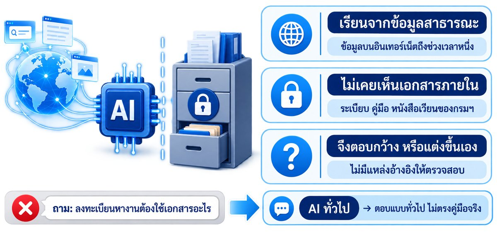
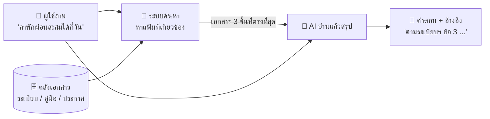
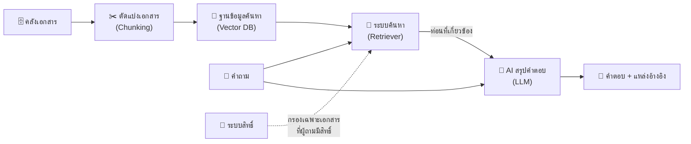
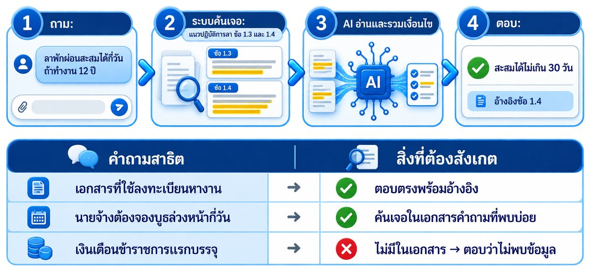
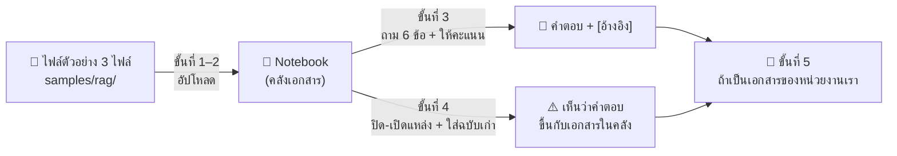
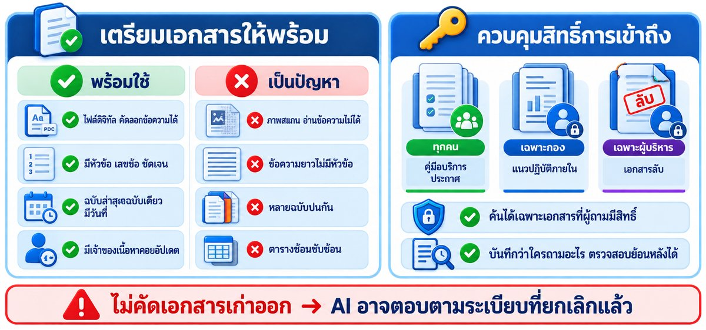

# 06 — Module 5: ระบบ AI ค้นหา-ตอบคำถามจากเอกสารหน่วยงาน (RAG)

**เวลา:** 13.40–14.20 น. (40 นาที) · **Workshop 5:** 20 นาที · **รูปแบบ:** แนวคิด + วิทยากรสาธิต + **ผู้อบรมลองใช้ระบบ RAG สำเร็จรูป (NotebookLM)** กับเอกสารสมมติ (ไม่ได้สร้างระบบเอง) · **ใช้:** เบราว์เซอร์ + บัญชี Google ไม่ต้องใช้ VM

## สิ่งที่ต้องรู้ก่อน

| เรื่อง | จำสั้น ๆ |
|---|---|
| ปัญหา | AI ทั่วไป **ไม่เคยเห็นเอกสารภายในกรมฯ** จึงตอบเรื่องเฉพาะของหน่วยงานไม่ได้ (หรือแต่งคำตอบ) |
| RAG คืออะไร | **R**etrieval-**A**ugmented **G**eneration = "ค้นเอกสารก่อน แล้วค่อยให้ AI เขียนคำตอบจากเอกสารนั้น" |
| เปรียบเทียบ | **บรรณารักษ์** ที่ไปค้นแฟ้มที่เกี่ยวข้องมาก่อน แล้วอ่านสรุปให้ฟัง พร้อมบอกว่ามาจากแฟ้มไหน |
| ข้อดี | ตอบตามเอกสารจริง อ้างอิงแหล่งได้ อัปเดตเอกสารได้โดยไม่ต้องฝึก AI ใหม่ |
| สิ่งสำคัญที่สุด | **คุณภาพเอกสาร** และ **การควบคุมสิทธิ์** ว่าใครเห็นเอกสารอะไร |

---

## 1. ทำไม AI ทั่วไปตอบเรื่องภายในหน่วยงานไม่ได้



ลองถาม ChatGPT / Claude ว่า:

```text
ตามคู่มือการให้บริการของสำนักงานจัดหางานจังหวัดทดสอบ ผู้หางานต้องใช้เอกสารอะไรบ้างในการลงทะเบียน
```

ผลที่มักได้: AI **ตอบแบบกว้าง ๆ** หรือ **แต่งรายการเอกสารขึ้นมาเอง** เพราะไม่เคยเห็นคู่มือนั้นจริง

| AI ทั่วไป | AI + RAG |
|---|---|
| ตอบจากความรู้ที่เรียนมา (ข้อมูลสาธารณะถึงช่วงหนึ่ง) | ตอบจาก **เอกสารของหน่วยงาน** ที่ค้นเจอ |
| ไม่รู้ระเบียบ / คู่มือภายใน | รู้ตามเอกสารที่อยู่ในคลัง |
| บอกแหล่งอ้างอิงไม่ได้ | บอกได้ว่ามาจากเอกสารไหน หน้าไหน |
| เสี่ยงแต่งคำตอบ | ถ้าไม่พบในเอกสาร สั่งให้ตอบว่า "ไม่พบข้อมูล" ได้ |

---

## 2. แนวคิดของ RAG — แบบ "บรรณารักษ์ค้นแฟ้ม"



| ขั้น | เทียบกับบรรณารักษ์ | ระบบทำอะไร |
|---|---|---|
| 1. รับคำถาม | ผู้มาติดต่อถามที่เคาน์เตอร์ | รับคำถามภาษาธรรมดา |
| 2. ค้นหา (Retrieval) | เดินไปหยิบแฟ้มที่เกี่ยวข้อง 2–3 แฟ้ม | ค้นส่วนของเอกสารที่ **ความหมาย** ใกล้คำถามที่สุด |
| 3. สรุปคำตอบ (Generation) | อ่านแฟ้มแล้วอธิบายให้ฟัง | AI อ่านเฉพาะส่วนที่ค้นเจอ แล้วเรียบเรียงคำตอบ |
| 4. อ้างอิง | "อยู่ในแฟ้มระเบียบการลา หน้า 3 นะครับ" | แสดงชื่อเอกสาร / ข้อ / หน้า ที่ใช้ตอบ |

---

## 3. องค์ประกอบของระบบโดยสังเขป



| องค์ประกอบ | หน้าที่ | ตัวอย่างเทคโนโลยี (ให้รู้จักชื่อ ไว้คุยกับทีม IT) |
|---|---|---|
| **คลังเอกสาร** | เก็บเอกสารดิจิทัลของหน่วยงาน | ไฟล์ PDF / Word บนไดรฟ์กลาง, SharePoint |
| **ตัวแบ่งเอกสาร** (Chunking) | ตัดเอกสารยาวเป็นท่อนสั้น ๆ ให้ค้นได้แม่น | ตัดตามหัวข้อ / ย่อหน้า |
| **ฐานข้อมูลสำหรับค้นหา** (Vector DB) | เก็บ "ความหมาย" ของแต่ละท่อนไว้ค้นหา | pgvector, Qdrant, ChromaDB |
| **ระบบค้นหา** (Retriever) | หาท่อนเอกสารที่เกี่ยวกับคำถามที่สุด | Semantic search + keyword search |
| **AI สรุปคำตอบ** (LLM) | อ่านท่อนที่ค้นเจอ แล้วเขียนคำตอบ | Claude, GPT, โมเดลที่ติดตั้งในหน่วยงานเอง |
| **ระบบสิทธิ์** | กำหนดว่าใครค้นเอกสารอะไรได้ | ผูกกับบัญชีผู้ใช้ของหน่วยงาน |

---

## 4. สาธิต + 🛠️ Workshop 5: ลองใช้ระบบ RAG ด้วย NotebookLM (20 นาที)



**NotebookLM** (<https://notebooklm.google.com>) ของ Google คือระบบ RAG สำเร็จรูป: เราใส่เอกสาร → ถามคำถาม → AI ค้นเอกสารก่อนตอบ และแสดง **ตัวเลขอ้างอิง** ที่กดดูท่อนเอกสารต้นทางได้ เหมาะใช้ "เห็นภาพ" ว่า RAG ทำงานอย่างไร

> 📌 ตามขอบเขตหลักสูตร (TOR 5.4) ผู้อบรม **ใช้และสังเกต** ระบบสำเร็จรูป ไม่ได้สร้างระบบ RAG เอง

| ส่วนของ NotebookLM | เทียบกับองค์ประกอบ RAG (หัวข้อ 3) |
|---|---|
| แผง **แหล่งข้อมูล (Sources)** ด้านซ้าย | 🗄️ **คลังเอกสาร** |
| ช่องติ๊ก ☑️ หน้าชื่อแต่ละแหล่ง | 🔑 **ขอบเขต / สิทธิ์** ว่าจะให้ค้นจากเอกสารไหน |
| ตัวเลข **[1] [2]** ในคำตอบ → ชี้แล้วเห็นท่อนเอกสาร | 🔎 **ขั้นค้นหา (Retrieval)** — ท่อนที่ระบบค้นเจอ |
| ข้อความคำตอบในช่องแชต | 🤖 **ขั้นสรุปคำตอบ (Generation)** |



**ก่อนเริ่ม:** ใช้ **บัญชี Google** (Gmail ส่วนตัวได้) ล็อกอินไว้ในเบราว์เซอร์ · ไม่มีบัญชี / เครือข่ายบล็อก → ทำ [ทางสำรอง](#rag-fallback) ท้ายหัวข้อนี้

> ⚠️ NotebookLM เป็น **บริการภายนอกหน่วยงาน** — วันนี้ใช้เฉพาะ **เอกสารสมมติ** ใน `samples/rag/` เท่านั้น ห้ามอัปโหลดเอกสารจริงของหน่วยงานโดยไม่ได้รับอนุญาต (ทบทวน [Module 4](05_AI_SAFETY_WORKSHOP.md))

### ขั้นที่ 0 — วิทยากรสาธิต (3 นาที)

วิทยากรสร้าง notebook บนจอให้ดู 1 รอบ (ขั้นที่ 1–2) แล้วถามข้อ 1 ให้ดูว่า **ชี้ที่ตัวเลขอ้างอิงแล้วเห็นอะไร** จากนั้นทุกคนทำตาม

### ขั้นที่ 1 — ดาวน์โหลดเอกสารตัวอย่าง 3 ไฟล์ (2 นาที)

เปิดลิงก์ทีละไฟล์ แล้วกดปุ่ม **Download raw file** (ไอคอน ⬇ มุมขวาบนของกล่องเนื้อหาไฟล์):

| # | ไฟล์ (ข้อมูลสมมติ) | เนื้อหา |
|:---:|---|---|
| 1 | [rag_01_service_manual.md](samples/rag/rag_01_service_manual.md) | คู่มือการให้บริการผู้หางาน สำนักงานจัดหางานจังหวัดทดสอบ |
| 2 | [rag_02_leave_rules.md](samples/rag/rag_02_leave_rules.md) | แนวปฏิบัติการลาของบุคลากร (ฉบับปัจจุบัน 2568) |
| 3 | [rag_03_job_fair_faq.md](samples/rag/rag_03_job_fair_faq.md) | คำถามที่พบบ่อย งานนัดพบแรงงาน |
| 4 | [rag_04_leave_rules_old_2560.md](samples/rag/rag_04_leave_rules_old_2560.md) | ระเบียบการลา **ฉบับเก่าที่ยกเลิกแล้ว** — ดาวน์โหลดไว้ **ยังไม่ต้องอัปโหลด** (ใช้ในขั้นที่ 4) |

> 💡 ทางลัดสำหรับคนที่เชื่อม VS Code กับ VM อยู่: แถบซ้าย → `training/manual/samples/rag/` → เลือกไฟล์ → คลิกขวา → **Download...**

### ขั้นที่ 2 — สร้าง Notebook และใส่เอกสาร (2 นาที)

1. เปิด <https://notebooklm.google.com> → กด **+ สร้างใหม่ (Create new)**
2. หน้าต่างเพิ่มแหล่งข้อมูล → **อัปโหลดไฟล์ (Upload files)** → เลือกไฟล์ **1–3** (ยังไม่ใส่ไฟล์ 4)
3. ตั้งชื่อ notebook (คลิกที่ชื่อมุมซ้ายบน): `ทดลอง RAG`

✅ **ผลที่ควรเห็น:** แผงซ้ายมี 3 แหล่งข้อมูล ติ๊ก ☑️ ครบ · ตรงกลางมีสรุปภาพรวมเอกสารที่ AI อ่านแล้ว

> ❌ อัปโหลดไฟล์ `.md` ไม่ได้ → เปิดไฟล์บน GitHub คัดลอกข้อความทั้งหมด แล้วเลือกแหล่งข้อมูลแบบ **ข้อความที่คัดลอก (Copied text)** แทน · AI ตอบเป็นภาษาอังกฤษ → พิมพ์ต่อท้ายคำถามว่า `ตอบเป็นภาษาไทย`

### ขั้นที่ 3 — ถาม 6 ข้อ แล้วให้คะแนนระบบ (6 นาที)

คัดลอกคำถามทีละข้อไปวางในช่องแชต หลังได้คำตอบให้ **ชี้เมาส์ที่ตัวเลข [1]** ดูว่าท่อนเอกสารที่ค้นเจอตรงกับคำตอบไหม แล้วติ๊กในตาราง (จดลงกระดาษหรือโน้ตก็ได้)

| # | คำถาม | ทดสอบอะไร | ตอบถูก | มี [อ้างอิง] | อ้างอิงตรง |
|:---:|---|---|:---:|:---:|:---:|
| 1 | `ผู้หางานต้องใช้เอกสารอะไรบ้างในการลงทะเบียน` | ถามตรง ๆ | ☐ | ☐ | ☐ |
| 2 | `ลาพักผ่อนสะสมได้สูงสุดกี่วัน ถ้ารับราชการมาแล้ว 12 ปี` | ต้องเลือกข้อที่ใช่จากหลายข้อ | ☐ | ☐ | ☐ |
| 3 | `นายจ้างต้องจองบูธงานนัดพบแรงงานล่วงหน้ากี่วัน มีค่าใช้จ่ายไหม` | อยู่ในเอกสารคนละฉบับกับข้อ 1 | ☐ | ☐ | ☐ |
| 4 | `เงินเดือนข้าราชการแรกบรรจุเท่าไร` | **ไม่มีในเอกสาร** | ☐ | — | — |
| 5 | `ถ้าจะลาพักผ่อน 5 วัน ต้องยื่นใบลาล่วงหน้ากี่วัน ยื่นช่องทางไหน และใครเป็นผู้อนุญาต` | ต้อง **รวม 3 ข้อ** ในเอกสารเดียว | ☐ | ☐ | ☐ |
| 6 | `ไปงานนัดพบแรงงานต้องเตรียมเอกสารอะไร ต่างจากการลงทะเบียนที่สำนักงานอย่างไร` | ต้อง **รวม 2 เอกสาร** | ☐ | ☐ | ☐ |

<details>
<summary>🔑 <b>เฉลย</b> (เปิดหลังถามครบแล้ว)</summary>

| # | คำตอบที่ถูก | อยู่ที่ |
|:---:|---|---|
| 1 | บัตรประชาชนตัวจริง · สำเนาวุฒิการศึกษาสูงสุด 1 ฉบับ · Resume 1 ฉบับ (ถ้ามี) · ใบผ่านงาน / หนังสือรับรองการทำงาน (ถ้ามี) | rag_01 ข้อ 2 |
| 2 | ไม่เกิน **30 วันทำการ** (ทำงานติดต่อกันไม่น้อยกว่า 10 ปี) — ถ้าตอบ 20 วัน = ใช้ข้อผิด | rag_02 ข้อ 1.4 |
| 3 | อย่างน้อย **14 วัน** ก่อนวันงาน ผ่านกลุ่มงานส่งเสริมการมีงานทำ · **ไม่มีค่าใช้จ่าย** (มีโต๊ะ เก้าอี้ 3 ตัว ปลั๊กไฟ) | rag_03 สำหรับนายจ้าง |
| 4 | ต้องตอบว่า **ไม่พบข้อมูลในเอกสาร** — ถ้าตอบเป็นตัวเลข = ระบบแต่งหรือใช้ความรู้นอกเอกสาร | — |
| 5 | ล่วงหน้าอย่างน้อย **3 วันทำการ** · ผ่าน **ระบบลาออนไลน์** · ลาเกิน 3 วัน → **หัวหน้าสำนักงาน** อนุญาต | rag_02 ข้อ 1.5, 4.2, 5 |
| 6 | งานนัดพบแรงงาน: **สำเนา**บัตรประชาชน + Resume อย่างน้อย 5 ชุด · ที่สำนักงาน: บัตร**ตัวจริง** + สำเนาวุฒิ + Resume (ถ้ามี) + ใบผ่านงาน (ถ้ามี) | rag_03 + rag_01 ข้อ 2 |

</details>

✅ **สังเกต:** ทุกคำตอบมี **ตัวเลขอ้างอิง** กดดูต้นทางได้ = ตรวจสอบได้ ต่างจาก AI ทั่วไป · ข้อ 4 ระบบที่ดีต้อง **ยอมรับว่าไม่รู้**

### ขั้นที่ 4 — ทดลอง: คำตอบขึ้นกับเอกสารในคลัง (5 นาที)

**4.1 ปิดเอกสาร 1 ฉบับ** — เอาติ๊ก ☑️ หน้า `rag_02_leave_rules` ออก แล้วถามซ้ำ:

```text
ลาพักผ่อนสะสมได้สูงสุดกี่วัน ถ้ารับราชการมาแล้ว 12 ปี
```

✅ **สังเกต:** ระบบตอบไม่ได้ / บอกว่าไม่พบ — เพราะ **ค้นได้เฉพาะเอกสารที่เปิดให้ค้น** นี่คือหลักเดียวกับ **ระบบสิทธิ์** ในหัวข้อ 3 (คนที่ไม่มีสิทธิ์ เอกสารนั้นต้อง "ไม่ถูกค้น" ตั้งแต่แรก)

**4.2 ใส่ฉบับเก่าเข้าไป** — กด **+ เพิ่ม (Add)** อัปโหลด `rag_04_leave_rules_old_2560.md` แล้ว **ติ๊กเฉพาะ rag_04** (เอาติ๊กฉบับอื่นออก) ถาม:

```text
ลาพักผ่อนสะสมได้สูงสุดกี่วัน และต้องยื่นใบลาล่วงหน้ากี่วัน ด้วยวิธีไหน
```

✅ **สังเกต:** ได้ **15 วัน / 7 วัน / แบบฟอร์มกระดาษ** = ข้อมูลที่ **ยกเลิกไปแล้ว** ระบบตอบ "ถูกตามเอกสาร" แต่ **ผิดตามความจริง**

**4.3 เปิดทุกฉบับพร้อมกัน** — ติ๊ก ☑️ ทุกแหล่ง แล้วถามคำถามเดิมอีกครั้ง

✅ **สังเกต:** ระบบเลือกฉบับไหน? บอกไหมว่ามี 2 ฉบับขัดกัน? — ที่ตอบถูกได้เพราะไฟล์เก่า **เขียนสถานะ "ยกเลิกแล้ว" และวันที่ไว้ชัด** ถ้าไม่มี ระบบอาจหยิบฉบับเก่ามาตอบโดยไม่เตือน

> 🎯 **บทเรียน:** คุณภาพคำตอบของ RAG = คุณภาพของคลังเอกสาร → ต้อง **คัดเฉพาะฉบับที่ใช้อยู่** ระบุ **วันที่ + สถานะ** และ **กำหนดว่าใครค้นเอกสารไหนได้** (ต่อในหัวข้อ 5)

### ขั้นที่ 5 — ถ้าเป็นเอกสารของหน่วยงานเรา (2 นาที)

จดคำตอบสั้น ๆ 3 ข้อ (ใช้คุยกับทีม IT ในหัวข้อ 6):

```text
1. เอกสารที่อยากให้ AI ช่วยตอบคำถามได้ คือ ..............................
2. คำถามที่คนมาถามบ่อยที่สุด 3 ข้อ คือ ..............................
3. เอกสารนี้ใครเห็นได้บ้าง (ทุกคน / เฉพาะกอง / ลับ) และมีฉบับเก่าปนอยู่ไหม ..............................
```

> ⚠️ ข้อ 3 ตอบว่า "ลับ" หรือมีข้อมูลส่วนบุคคล → **ห้ามใส่บริการภายนอกอย่าง NotebookLM** ต้องใช้ระบบที่หน่วยงานควบคุมเอง (หัวข้อ 6)

<details>
<summary>➕ <b>มีเวลาเหลือ</b> — ลองเครื่องมือในแผง Studio ด้านขวา</summary>

- **แผนผังความคิด (Mind Map)** — ดูว่า AI จัดกลุ่มเนื้อหาในเอกสารอย่างไร
- ถามในแชต: `สร้างคำถามทดสอบ 5 ข้อจากเอกสารเหล่านี้ พร้อมเฉลยและเลขข้อที่อ้างอิง มีข้อที่ไม่มีคำตอบในเอกสาร 1 ข้อ` → นี่คือจุดเริ่มต้นของ "ชุดคำถามทดสอบ" ก่อนเปิดใช้ระบบจริง (ต่อยอดใน Workshop สำรอง [5E](10_WORKSHOP_BANK.md))
- **ภาพรวมเสียง (Audio Overview)** — AI สรุปเอกสารเป็นรายการเสียงคุยกัน ตั้งภาษาไทยได้ในการตั้งค่าภาษาเอาต์พุต

ทุกอย่างที่ AI สร้าง **ต้องตรวจกับเอกสารต้นทางก่อนนำไปใช้**

</details>

<a id="rag-fallback"></a>

<details>
<summary>🛟 <b>ทางสำรอง</b> — ไม่มีบัญชี Google / เครือข่ายบล็อก NotebookLM: ใช้ Claude Code บน VM ค้นเอกสารให้ดูแทน</summary>

```bash
cd ~/training/manual/samples/rag && claude
```

```text
ตอบคำถามต่อไปนี้จากเอกสารในโฟลเดอร์นี้เท่านั้น ยกเว้นไฟล์ rag_04_leave_rules_old_2560.md
ทุกคำตอบต้องบอกชื่อไฟล์และเลขข้อที่ใช้อ้างอิง ถ้าไม่พบให้ตอบว่า "ไม่พบข้อมูลในเอกสาร"
1. ผู้หางานต้องใช้เอกสารอะไรบ้างในการลงทะเบียน
2. ลาพักผ่อนสะสมได้สูงสุดกี่วัน ถ้ารับราชการมาแล้ว 12 ปี
3. นายจ้างต้องจองบูธงานนัดพบแรงงานล่วงหน้ากี่วัน มีค่าใช้จ่ายไหม
4. เงินเดือนข้าราชการแรกบรรจุเท่าไร
5. ถ้าจะลาพักผ่อน 5 วัน ต้องยื่นใบลาล่วงหน้ากี่วัน ยื่นช่องทางไหน และใครเป็นผู้อนุญาต
6. ไปงานนัดพบแรงงานต้องเตรียมเอกสารอะไร ต่างจากการลงทะเบียนที่สำนักงานอย่างไร
```

**สังเกตบนจอ:** ก่อนตอบ AI จะ **ค้น / อ่านไฟล์ (Search / Read)** = ขั้นค้นแฟ้ม แล้วเทียบคำตอบกับเฉลยในขั้นที่ 3 · ทำขั้นที่ 4 ด้วยการสั่ง `คราวนี้ใช้เฉพาะไฟล์ rag_04 แล้วตอบใหม่` (รายละเอียด: Workshop สำรอง 5B, 5D ใน [10_WORKSHOP_BANK](10_WORKSHOP_BANK.md))

</details>

---

## 5. การเตรียมเอกสารและควบคุมสิทธิ์



### เอกสารแบบไหนที่ระบบ RAG ใช้ได้ดี

| ✅ ดี | ❌ ปัญหา |
|---|---|
| ไฟล์ดิจิทัลที่คัดลอกข้อความได้ (Word, PDF จากโปรแกรม) | PDF สแกนเป็นภาพ (ต้อง OCR ก่อน ภาษาไทยมักผิด) |
| มีหัวข้อ / เลขข้อ ชัดเจน | ข้อความยาวติดกันไม่มีหัวข้อ |
| ฉบับล่าสุดฉบับเดียว มีวันที่ประกาศ | หลายฉบับปนกัน ไม่รู้ฉบับไหนใช้อยู่ |
| ตารางเรียบง่าย | ตารางซ้อน / ผสานเซลล์ซับซ้อน |

### การควบคุมสิทธิ์

- เอกสารแต่ละชุดต้องระบุ **ใครเห็นได้** (ทุกคน / เฉพาะกอง / เฉพาะผู้บริหาร)
- ระบบต้องค้นเฉพาะเอกสารที่ **ผู้ถามมีสิทธิ์เห็น** — ไม่อย่างนั้น AI อาจเผลอสรุปเอกสารลับให้คนที่ไม่มีสิทธิ์
- มี **บันทึกการใช้งาน (log)** ว่าใครถามอะไร เพื่อตรวจสอบย้อนหลัง

---

## 6. ☑️ สิ่งที่ต้องเตรียม หากหน่วยงานจะพัฒนาระบบเอง

| ด้าน | สิ่งที่ต้องตัดสินใจ / เตรียม |
|---|---|
| **ขอบเขต** | ใช้ตอบคำถามเรื่องอะไร ใครใช้ (เจ้าหน้าที่ภายใน / ประชาชน) |
| **เอกสาร** | รวบรวม คัดฉบับล่าสุด แปลงเป็นดิจิทัล กำหนดเจ้าของเนื้อหาที่คอยอัปเดต |
| **บุคลากร** | ทีม IT (พัฒนา/ดูแลระบบ) + **เจ้าของเนื้อหา** (ตรวจความถูกต้องของคำตอบ) + ผู้ดูแลข้อมูลส่วนบุคคล (DPO) |
| **โครงสร้างพื้นฐาน** | ใช้ AI บนคลาวด์ (เร็ว ถูกกว่าในระยะแรก) หรือติดตั้งในหน่วยงาน (คุมข้อมูลได้มากกว่า) |
| **งบประมาณ** | ค่า AI ต่อการใช้งาน, เซิร์ฟเวอร์, ค่าพัฒนา, ค่าดูแลรายปี |
| **ระยะเวลา** | ต้นแบบ (PoC) ไม่กี่สัปดาห์ → ทดลองใช้กลุ่มเล็ก → ขยายผล |
| **การวัดผล** | ชุดคำถาม-คำตอบมาตรฐานไว้ทดสอบว่าระบบตอบถูกกี่ % ก่อนเปิดใช้ |

### คำถามที่ควรถามทีม IT / ผู้พัฒนา

```text
1. เอกสารของเราจะถูกเก็บที่ไหน ถูกส่งออกนอกหน่วยงานหรือไม่
2. AI ที่ใช้ นำข้อมูลของเราไปฝึกโมเดลหรือไม่
3. ระบบจำกัดสิทธิ์การเห็นเอกสารตามผู้ใช้ได้หรือไม่
4. ถ้าไม่พบคำตอบในเอกสาร ระบบตอบว่าอย่างไร
5. คำตอบแสดงแหล่งอ้างอิงหรือไม่
6. เมื่อเอกสารเปลี่ยน ระบบอัปเดตอย่างไร ใช้เวลานานเท่าไร
7. วัดความถูกต้องของคำตอบอย่างไร ก่อนเปิดใช้จริง
```

➡️ ต่อไป: [07_DEPLOY_CLOUDFLARE.md](07_DEPLOY_CLOUDFLARE.md)
