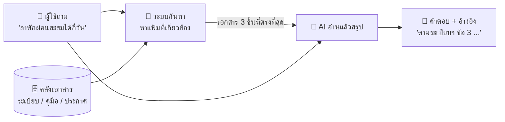
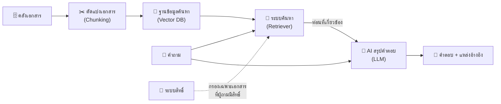

# 06 — Module 5: ระบบ AI ค้นหา-ตอบคำถามจากเอกสารหน่วยงาน (RAG)

**เวลา:** 13.40–14.20 น. (40 นาที) · **รูปแบบ:** ระดับแนวคิด + **วิทยากรสาธิตหน้าห้อง** (ผู้เข้าอบรมไม่ต้องสร้างระบบเอง)

## สิ่งที่ต้องรู้ก่อน

| เรื่อง | จำสั้น ๆ |
|---|---|
| ปัญหา | AI ทั่วไป **ไม่เคยเห็นเอกสารภายในกรมฯ** จึงตอบเรื่องเฉพาะของหน่วยงานไม่ได้ (หรือแต่งคำตอบ) |
| RAG คืออะไร | **R**etrieval-**A**ugmented **G**eneration = "ค้นเอกสารก่อน แล้วค่อยให้ AI เขียนคำตอบจากเอกสารนั้น" |
| เปรียบเทียบ | **บรรณารักษ์** ที่ไปค้นแฟ้มที่เกี่ยวข้องมาก่อน แล้วอ่านสรุปให้ฟัง พร้อมบอกว่ามาจากแฟ้มไหน |
| ข้อดี | ตอบตามเอกสารจริง อ้างอิงแหล่งได้ อัปเดตเอกสารได้โดยไม่ต้องฝึก AI ใหม่ |
| สิ่งสำคัญที่สุด | **คุณภาพเอกสาร** และ **การควบคุมสิทธิ์** ว่าใครเห็นเอกสารอะไร |

---

## 1. ทำไม AI ทั่วไปตอบเรื่องภายในหน่วยงานไม่ได้


ลองถาม ChatGPT / Claude ว่า:

```text
ตามคู่มือการให้บริการของสำนักงานจัดหางานจังหวัดทดสอบ ผู้หางานต้องใช้เอกสารอะไรบ้างในการลงทะเบียน
```

ผลที่มักได้: AI **ตอบแบบกว้าง ๆ** หรือ **แต่งรายการเอกสารขึ้นมาเอง** เพราะไม่เคยเห็นคู่มือนั้นจริง

| AI ทั่วไป | AI + RAG |
|---|---|
| ตอบจากความรู้ที่เรียนมา (ข้อมูลสาธารณะถึงช่วงหนึ่ง) | ตอบจาก **เอกสารของหน่วยงาน** ที่ค้นเจอ |
| ไม่รู้ระเบียบ / คู่มือภายใน | รู้ตามเอกสารที่อยู่ในคลัง |
| บอกแหล่งอ้างอิงไม่ได้ | บอกได้ว่ามาจากเอกสารไหน หน้าไหน |
| เสี่ยงแต่งคำตอบ | ถ้าไม่พบในเอกสาร สั่งให้ตอบว่า "ไม่พบข้อมูล" ได้ |

---

## 2. แนวคิดของ RAG — แบบ "บรรณารักษ์ค้นแฟ้ม"



| ขั้น | เทียบกับบรรณารักษ์ | ระบบทำอะไร |
|---|---|---|
| 1. รับคำถาม | ผู้มาติดต่อถามที่เคาน์เตอร์ | รับคำถามภาษาธรรมดา |
| 2. ค้นหา (Retrieval) | เดินไปหยิบแฟ้มที่เกี่ยวข้อง 2–3 แฟ้ม | ค้นส่วนของเอกสารที่ **ความหมาย** ใกล้คำถามที่สุด |
| 3. สรุปคำตอบ (Generation) | อ่านแฟ้มแล้วอธิบายให้ฟัง | AI อ่านเฉพาะส่วนที่ค้นเจอ แล้วเรียบเรียงคำตอบ |
| 4. อ้างอิง | "อยู่ในแฟ้มระเบียบการลา หน้า 3 นะครับ" | แสดงชื่อเอกสาร / ข้อ / หน้า ที่ใช้ตอบ |

---

## 3. องค์ประกอบของระบบโดยสังเขป



| องค์ประกอบ | หน้าที่ | ตัวอย่างเทคโนโลยี (ให้รู้จักชื่อ ไว้คุยกับทีม IT) |
|---|---|---|
| **คลังเอกสาร** | เก็บเอกสารดิจิทัลของหน่วยงาน | ไฟล์ PDF / Word บนไดรฟ์กลาง, SharePoint |
| **ตัวแบ่งเอกสาร** (Chunking) | ตัดเอกสารยาวเป็นท่อนสั้น ๆ ให้ค้นได้แม่น | ตัดตามหัวข้อ / ย่อหน้า |
| **ฐานข้อมูลสำหรับค้นหา** (Vector DB) | เก็บ "ความหมาย" ของแต่ละท่อนไว้ค้นหา | pgvector, Qdrant, ChromaDB |
| **ระบบค้นหา** (Retriever) | หาท่อนเอกสารที่เกี่ยวกับคำถามที่สุด | Semantic search + keyword search |
| **AI สรุปคำตอบ** (LLM) | อ่านท่อนที่ค้นเจอ แล้วเขียนคำตอบ | Claude, GPT, โมเดลที่ติดตั้งในหน่วยงานเอง |
| **ระบบสิทธิ์** | กำหนดว่าใครค้นเอกสารอะไรได้ | ผูกกับบัญชีผู้ใช้ของหน่วยงาน |

---

## 4. การสาธิต (วิทยากรทำหน้าห้อง)


วิทยากรจะอัปโหลด **เอกสารสมมติ** 3 ชิ้นใน [`samples/rag/`](samples/rag/) เข้าเครื่องมือ RAG แบบสำเร็จรูป แล้วถามคำถามให้ดูทีละขั้น

| เอกสาร (ข้อมูลสมมติ) | เนื้อหา |
|---|---|
| [rag_01_service_manual.md](samples/rag/rag_01_service_manual.md) | คู่มือการให้บริการผู้หางาน สำนักงานจัดหางานจังหวัดทดสอบ |
| [rag_02_leave_rules.md](samples/rag/rag_02_leave_rules.md) | แนวปฏิบัติการลาของบุคลากร (ฉบับสาธิต) |
| [rag_03_job_fair_faq.md](samples/rag/rag_03_job_fair_faq.md) | คำถามที่พบบ่อย งานนัดพบแรงงาน |

### คำถามที่ใช้สาธิต — สังเกตอะไรในแต่ละข้อ

| # | คำถาม | สังเกต |
|---|---|---|
| 1 | ผู้หางานต้องใช้เอกสารอะไรบ้างในการลงทะเบียน | ตอบตรงรายการในคู่มือ + อ้างอิงเอกสาร |
| 2 | ลาพักผ่อนสะสมได้สูงสุดกี่วัน ถ้ารับราชการมาแล้ว 12 ปี | AI ต้อง **รวมเงื่อนไข** หลายข้อจากเอกสาร |
| 3 | งานนัดพบแรงงานต้องจองล่วงหน้าไหม ถ้าเป็นนายจ้าง | ค้นเจอในเอกสาร FAQ ไม่ใช่คู่มือ |
| 4 | เงินเดือนขั้นต่ำของข้าราชการแรกบรรจุเท่าไร | **ไม่มีในเอกสาร** → ระบบที่ดีต้องตอบว่า "ไม่พบข้อมูล" |
| 5 | ถามข้อ 1 ใน AI ทั่วไป (ไม่มีเอกสาร) | เทียบกับข้อ 1 — เห็นความต่างชัดเจน |

> 💡 **อยากลองเองหลังอบรม?** ใช้เครื่องมือที่ "อัปโหลดเอกสารแล้วถามได้" เช่น NotebookLM, Claude Projects หรือ ChatGPT (แนบไฟล์) กับไฟล์ใน `samples/rag/` — **ห้ามใช้เอกสารจริงที่มีข้อมูลส่วนบุคคลหรือชั้นความลับ** กับบริการภายนอก

---

## 5. การเตรียมเอกสารและควบคุมสิทธิ์


### เอกสารแบบไหนที่ระบบ RAG ใช้ได้ดี

| ✅ ดี | ❌ ปัญหา |
|---|---|
| ไฟล์ดิจิทัลที่คัดลอกข้อความได้ (Word, PDF จากโปรแกรม) | PDF สแกนเป็นภาพ (ต้อง OCR ก่อน ภาษาไทยมักผิด) |
| มีหัวข้อ / เลขข้อ ชัดเจน | ข้อความยาวติดกันไม่มีหัวข้อ |
| ฉบับล่าสุดฉบับเดียว มีวันที่ประกาศ | หลายฉบับปนกัน ไม่รู้ฉบับไหนใช้อยู่ |
| ตารางเรียบง่าย | ตารางซ้อน / ผสานเซลล์ซับซ้อน |

### การควบคุมสิทธิ์

- เอกสารแต่ละชุดต้องระบุ **ใครเห็นได้** (ทุกคน / เฉพาะกอง / เฉพาะผู้บริหาร)
- ระบบต้องค้นเฉพาะเอกสารที่ **ผู้ถามมีสิทธิ์เห็น** — ไม่อย่างนั้น AI อาจเผลอสรุปเอกสารลับให้คนที่ไม่มีสิทธิ์
- มี **บันทึกการใช้งาน (log)** ว่าใครถามอะไร เพื่อตรวจสอบย้อนหลัง

---

## 6. ☑️ สิ่งที่ต้องเตรียม หากหน่วยงานจะพัฒนาระบบเอง

| ด้าน | สิ่งที่ต้องตัดสินใจ / เตรียม |
|---|---|
| **ขอบเขต** | ใช้ตอบคำถามเรื่องอะไร ใครใช้ (เจ้าหน้าที่ภายใน / ประชาชน) |
| **เอกสาร** | รวบรวม คัดฉบับล่าสุด แปลงเป็นดิจิทัล กำหนดเจ้าของเนื้อหาที่คอยอัปเดต |
| **บุคลากร** | ทีม IT (พัฒนา/ดูแลระบบ) + **เจ้าของเนื้อหา** (ตรวจความถูกต้องของคำตอบ) + ผู้ดูแลข้อมูลส่วนบุคคล (DPO) |
| **โครงสร้างพื้นฐาน** | ใช้ AI บนคลาวด์ (เร็ว ถูกกว่าในระยะแรก) หรือติดตั้งในหน่วยงาน (คุมข้อมูลได้มากกว่า) |
| **งบประมาณ** | ค่า AI ต่อการใช้งาน, เซิร์ฟเวอร์, ค่าพัฒนา, ค่าดูแลรายปี |
| **ระยะเวลา** | ต้นแบบ (PoC) ไม่กี่สัปดาห์ → ทดลองใช้กลุ่มเล็ก → ขยายผล |
| **การวัดผล** | ชุดคำถาม-คำตอบมาตรฐานไว้ทดสอบว่าระบบตอบถูกกี่ % ก่อนเปิดใช้ |

### คำถามที่ควรถามทีม IT / ผู้พัฒนา

```text
1. เอกสารของเราจะถูกเก็บที่ไหน ถูกส่งออกนอกหน่วยงานหรือไม่
2. AI ที่ใช้ นำข้อมูลของเราไปฝึกโมเดลหรือไม่
3. ระบบจำกัดสิทธิ์การเห็นเอกสารตามผู้ใช้ได้หรือไม่
4. ถ้าไม่พบคำตอบในเอกสาร ระบบตอบว่าอย่างไร
5. คำตอบแสดงแหล่งอ้างอิงหรือไม่
6. เมื่อเอกสารเปลี่ยน ระบบอัปเดตอย่างไร ใช้เวลานานเท่าไร
7. วัดความถูกต้องของคำตอบอย่างไร ก่อนเปิดใช้จริง
```

➡️ ต่อไป: [07_DEPLOY_CLOUDFLARE.md](07_DEPLOY_CLOUDFLARE.md)
