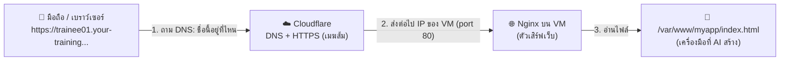

# 07 — Deploy จริง: ขึ้นเว็บด้วย Nginx + Subdomain + Cloudflare DNS

**เวลา:** 14.20–14.50 น. (30 นาที) · **ใช้:** VM ของตัวเอง + Claude Code + Cloudflare Dashboard

**เป้าหมาย:** นำเครื่องมือที่สร้างใน Workshop 2 ขึ้นอินเทอร์เน็ตจริง เปิดได้จากมือถือที่ `https://trainee01.your-training-domain.com`

## สิ่งที่ต้องรู้ก่อน



| คำ | ความหมายแบบง่าย |
|---|---|
| **Nginx** (อ่านว่า "เอ็นจิ้น-เอ็กซ์") | โปรแกรม "พนักงานเสิร์ฟเว็บ" — รอรับคนเข้าเว็บที่ port 80 แล้วส่งไฟล์ให้ |
| **Port 80** | "ประตูมาตรฐาน" ของเว็บ (http) ไม่ต้องพิมพ์เลข port ต่อท้าย |
| **DNS** | "สมุดโทรศัพท์ของอินเทอร์เน็ต" แปลงชื่อเว็บ → IP |
| **A record** | บรรทัดในสมุด DNS: "ชื่อนี้ → IP นี้" |
| **Proxied (เมฆส้ม)** | ให้ Cloudflare เป็นด่านหน้า → ได้ **HTTPS (กุญแจล็อก 🔒) อัตโนมัติ** ไม่ต้องติดตั้งใบรับรองเอง |

### แผนผังขั้นตอน (3 ขั้น)

| ขั้น | ทำที่ | เวลา | ผลที่ควรเห็น |
|---|---|---|---|
| 1. ติดตั้ง Nginx | VM (สั่ง AI) | 10 นาที | เปิด `http://203.0.113.10` เห็นเว็บ |
| 2. เพิ่ม DNS record | Cloudflare Dashboard | 10–15 นาที | มีแถว `trainee01` ในตาราง DNS |
| 3. ทดสอบ | VM + มือถือ | 5 นาที | เปิด `https://trainee01.your-training...` เห็นเว็บ 🔒 |

---

## ขั้นที่ 1 — ติดตั้ง Nginx โดยสั่ง AI (10 นาที)

### 1.1 เข้า VM และเปิด Claude Code ต่อจากเมื่อเช้า

```bash
ssh -L 8080:localhost:8080 -L 3002:localhost:3002 trainee01@203.0.113.10
```

```bash
# เข้าโฟลเดอร์เดิม แล้วเปิด Claude Code คุยต่อจากครั้งล่าสุด
cd ~/myapp && claude --continue
```

> ถ้าขึ้นว่าไม่มีบทสนทนาเดิม ใช้ `cd ~/myapp && claude` แทนได้

### 1.2 วาง prompt นี้ใน Claude Code

```text
ช่วยนำเว็บในโฟลเดอร์นี้ขึ้นเว็บจริงด้วย nginx ตามขั้นตอนนี้:
1. ติดตั้ง nginx ด้วย sudo apt-get install -y nginx (ถ้ายังไม่มี)
2. สร้างโฟลเดอร์ /var/www/myapp แล้วคัดลอกไฟล์ทั้งหมดในโฟลเดอร์ปัจจุบันไปไว้ที่นั่น
3. สร้างไฟล์ config ชื่อ /etc/nginx/sites-available/myapp ให้ nginx รับทุกชื่อโดเมนที่ port 80 (listen 80 default_server และ server_name _) แล้วแสดงไฟล์จาก /var/www/myapp โดยมี index.html เป็นหน้าแรก
4. ลบลิงก์ config default เดิมใน /etc/nginx/sites-enabled แล้วเปิดใช้ config myapp แทน
5. ตรวจ config ด้วย nginx -t แล้ว reload nginx
6. ถ้ามี firewall ufw เปิดอยู่ ให้อนุญาต port 80
7. ทดสอบด้วย curl http://localhost แล้วแสดงผล 10 บรรทัดแรกให้ดู
ทำทีละขั้นและอธิบายเป็นภาษาไทยสั้น ๆ ว่าแต่ละขั้นทำอะไร
```

AI จะขออนุญาตรันคำสั่งทีละคำสั่ง (เช่น `sudo apt-get install -y nginx`) → อ่านแล้วกด **1. Yes**

### 1.3 ตรวจผลด้วยตัวเอง

```bash
!curl -s http://localhost | head -n 5
```

✅ **ผลที่ควรเห็น:** HTML ของเครื่องมือเรา (ไม่ใช่หน้า "Welcome to nginx!")

### 1.4 ลองเปิดจากเบราว์เซอร์ด้วย IP

เปิดเบราว์เซอร์บนเครื่องตัวเอง (หรือมือถือ) ไปที่:

```text
http://203.0.113.10
```

✅ **ผลที่ควรเห็น:** หน้าเว็บเครื่องมือของเรา 🎉 (ยังเป็น `http` ไม่มีกุญแจ — ขั้นต่อไปจะได้ HTTPS)

<details>
<summary>🛟 <b>ทางสำรอง</b> — ถ้า AI ทำไม่สำเร็จ หรือเวลาไม่พอ: ออกจาก Claude Code (<code>/exit</code>) แล้ววางคำสั่งชุดนี้ทีละบล็อก</summary>

```bash
# 1) ติดตั้ง nginx
sudo apt-get update && sudo apt-get install -y nginx
```

```bash
# 2) คัดลอกไฟล์เว็บไปไว้ในโฟลเดอร์ที่ nginx อ่านได้
sudo mkdir -p /var/www/myapp
sudo cp -r ~/myapp/. /var/www/myapp/
```

```bash
# 3) สร้างไฟล์ config ของ nginx
sudo tee /etc/nginx/sites-available/myapp > /dev/null <<'EOF'
server {
    listen 80 default_server;
    listen [::]:80 default_server;
    server_name _;

    root /var/www/myapp;
    index index.html;

    location / {
        try_files $uri $uri/ =404;
    }
}
EOF
```

```bash
# 4) ปิด config เดิม เปิด config ของเรา ตรวจ แล้ว reload
sudo rm -f /etc/nginx/sites-enabled/default
sudo ln -sf /etc/nginx/sites-available/myapp /etc/nginx/sites-enabled/myapp
sudo nginx -t && sudo systemctl reload nginx
```

```bash
# 5) ถ้ามี firewall (ufw) เปิดอยู่ ให้อนุญาต port 80 (ถ้าไม่มี ufw บรรทัดนี้จะข้ามไปเอง)
sudo ufw status | grep -q "Status: active" && sudo ufw allow 80/tcp || echo "ufw ไม่ได้เปิด — ข้ามได้"
```

```bash
# 6) ทดสอบ
curl -s http://localhost | head -n 5
```

✅ `nginx -t` ต้องขึ้น `syntax is ok` และ `test is successful`

</details>

---

## ขั้นที่ 2 — เพิ่ม DNS Record ใน Cloudflare (10–15 นาที)

### 2.1 ล็อกอิน

1. เปิด <https://dash.cloudflare.com> บนเครื่องตัวเอง
2. ล็อกอินด้วยบัญชีที่ทีมงานแจก
3. คลิกโดเมน `your-training-domain.com` (หรือโดเมนที่วิทยากรแจ้ง) ในรายการ

### 2.2 เพิ่ม A record

1. เมนูซ้าย → **DNS** → **Records**
2. กดปุ่ม **+ Add record**
3. กรอกข้อมูล:

| ช่อง | กรอก | หมายเหตุ |
|---|---|---|
| **Type** | `A` | |
| **Name** | `trainee01` | **ชื่อ subdomain ตามบัตรของตัวเอง** — ห้ามซ้ำคนอื่น, ใช้ a–z, 0–9, `-` เท่านั้น |
| **IPv4 address** | `203.0.113.10` | **Public IP ของ VM ตัวเอง** ตามบัตร |
| **Proxy status** | 🟠 **Proxied** (เมฆส้ม) | ต้องเป็นสีส้ม — จะได้ HTTPS อัตโนมัติ |
| **TTL** | `Auto` | ค่าเริ่มต้น |

4. กด **Save**

✅ **ผลที่ควรเห็น:** ตาราง DNS มีแถวใหม่ `A | trainee01 | 203.0.113.10 | 🟠 Proxied`

> ⚠️ **ห้ามแก้หรือลบ record ของคนอื่น** — ทุกคนใช้โดเมนเดียวกัน ถ้ากดผิดให้แจ้ง TA ทันที
>
> ⚠️ ถ้าช่อง Name กรอกแล้วชื่อเต็มแสดงเป็น `trainee01.your-training-domain.com` = ถูกต้อง ไม่ต้องพิมพ์ชื่อเต็มเอง

---

## ขั้นที่ 3 — ทดสอบเข้าแอปจริง (5 นาที)

### 3.1 ทดสอบจาก VM ก่อน (เร็วที่สุด)

ใน Claude Code (หรือ Terminal บน VM):

```bash
!curl -sI https://trainee01.your-training-domain.com | head -n 5
```

✅ **ผลที่ควรเห็น:**

```text
HTTP/2 200
date: ...
content-type: text/html
...
server: cloudflare
```

`HTTP/2 200` + `server: cloudflare` = **ผ่าน Cloudflare มาถึง VM เราสำเร็จ**

### 3.2 เปิดจากมือถือ / เบราว์เซอร์

```text
https://trainee01.your-training-domain.com
```

✅ **ผลที่ควรเห็น:** เว็บเครื่องมือของเรา พร้อมไอคอนกุญแจ 🔒 ที่แถบที่อยู่ 🎉🎉

> 📌 **ส่ง URL ของตัวเองให้วิทยากร** (กรอกในเอกสารกลาง / กระดาน) เพื่อโชว์ช่วงปิดท้าย

### 3.3 ถ้าเข้าไม่ได้ — ตรวจตามลำดับนี้

| # | ตรวจ | คำสั่ง / วิธี | ถ้าไม่ผ่าน |
|---|---|---|---|
| 1 | Nginx บน VM ทำงานไหม | `curl -s http://localhost \| head -n 5` | กลับไปทำขั้นที่ 1 (ใช้ทางสำรอง) |
| 2 | เปิดด้วย IP ได้ไหม | เบราว์เซอร์ → `http://203.0.113.10` | Firewall / Security Group ปิด port 80 → แจ้ง TA |
| 3 | DNS record ถูกไหม | ดูใน Cloudflare: Type `A`, Name ถูก, IP ถูก, เมฆส้ม | แก้ record ให้ถูก (กด Edit) |
| 4 | DNS กระจายหรือยัง | `getent hosts trainee01.your-training-domain.com` | รอ 1–2 นาทีแล้วลองใหม่ |
| 5 | ยังไม่ได้ | — | เรียก TA / ใช้แอปสำรองของวิทยากรโชว์แทน |

รายละเอียดเพิ่มเติม: [09_TROUBLESHOOTING.md](09_TROUBLESHOOTING.md#deploy)

---

## 🔁 แก้เว็บแล้วอยากให้หน้าเว็บจริงเปลี่ยนตาม

เมื่อสั่ง AI แก้ไฟล์ใน `~/myapp` แล้ว ไฟล์ที่ nginx ใช้ (`/var/www/myapp`) จะยังเป็นของเดิม — บอก AI ว่า:

```text
แก้เสร็จแล้วให้คัดลอกไฟล์ทั้งหมดในโฟลเดอร์นี้ไปทับที่ /var/www/myapp ด้วย
```

หรือวางคำสั่งเอง:

```bash
sudo cp -r ~/myapp/. /var/www/myapp/
```

แล้วรีเฟรชเบราว์เซอร์ (ถ้ายังไม่เปลี่ยน กด `Ctrl + Shift + R` เพื่อล้าง cache)

---

## ⚠️ ข้อควรระวัง

- เว็บนี้ **เปิดสาธารณะ** ทุกคนบนอินเทอร์เน็ตเข้าได้ — ห้ามใส่ข้อมูลส่วนบุคคล / ข้อมูลภายในหน่วยงาน
- VM และโดเมนนี้ใช้ **เพื่อการอบรมเท่านั้น** ทีมงานจะปิดหลังจบการอบรม — ถ้าจะใช้งานจริง ต้องผ่าน IT ของหน่วยงาน
- ห้ามพิมพ์รหัสผ่าน / API Key ลงในไฟล์เว็บ

➡️ ต่อไป: สรุปการอบรม · อ้างอิงคำสั่งทั้งหมด [08_CHEATSHEET.md](08_CHEATSHEET.md)
