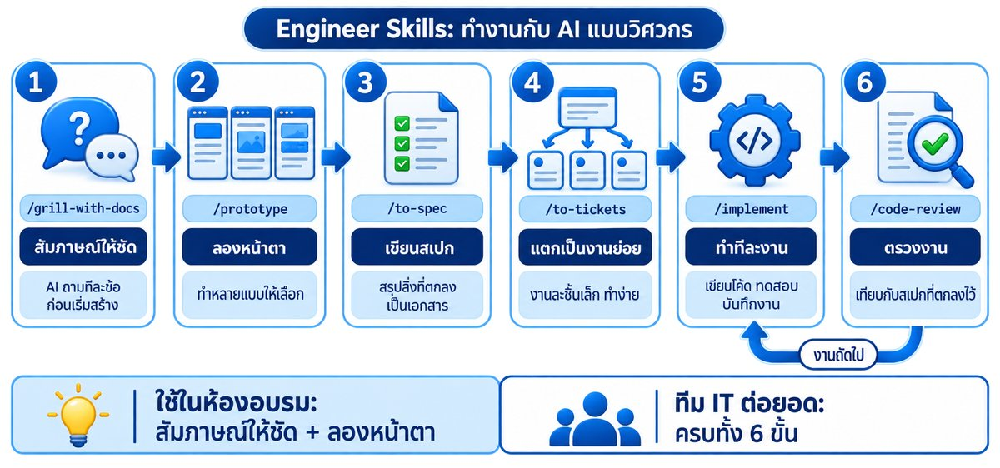
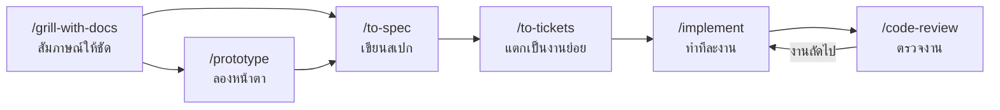

# 10 — คลัง Workshop ทั้ง 6 หัวข้อ (หลัก + สำรอง)

ชุดกิจกรรมเรียงตาม Agenda ทั้ง 6 ข้อ แต่ละหัวข้อมี

- ⭐ **Workshop หลัก** — ทำทุกคนตามกำหนดการ (รายละเอียดเต็มอยู่ในคู่มือ 01–07)
- ➕ **Workshop สำรอง** — หยิบมาใช้เมื่อเวลาเหลือ / ให้คนที่ทำเสร็จเร็วทำต่อ / ทำต่อเองหลังอบรม

**สัญลักษณ์เครื่องมือ:** 🌐 เว็บ AI (ChatGPT / Claude / Gemini / Copilot / Canva) · 🖥️ VM + Claude Code (เชื่อม AI GLM)

## เตรียมก่อนทำ Workshop บน VM (🖥️)

ทุก Workshop 🖥️ ทำใน **VS Code ที่เชื่อม VM ด้วย Remote - SSH** (ดูคู่มือ [02](02_SSH_VM.md) หัวข้อ 1) และส่งต่อ port `8080` กับ `3002` ในแท็บ **PORTS** ไว้ ใช้เปิดดูผลงานที่ `http://localhost:8080` และ `http://localhost:3002`

ไฟล์ตัวอย่างทั้งหมดอยู่บน VM แล้วที่ `~/training/manual/samples` — อัปเดตเป็นล่าสุดด้วย:

```bash
cd ~/training && git pull
```

**ข้อกำหนดทางเทคนิคมาตรฐาน** — ต่อท้าย prompt สร้างเครื่องมือทุกตัวใน Workshop สำรองหัวข้อ 2 (แทน `<ชื่อ>` ด้วยชื่อภาษาอังกฤษสั้น ๆ เช่น `queue`, `thaidate`):

```text
ข้อกำหนดทางเทคนิค:
- สร้างเป็นไฟล์เดียวชื่อ index.html ในโฟลเดอร์ ~/myapp/tools/<ชื่อ>/ (HTML + CSS + JavaScript ในไฟล์เดียว) ไม่ต้องมี backend
- ห้ามเก็บหรือส่งข้อมูลที่ผู้ใช้กรอกออกไปที่ไหน
- ถ้ายังไม่มีเซิร์ฟเวอร์ทดสอบที่ port 8080 ให้รัน python3 -m http.server 8080 แบบ background ในโฟลเดอร์ ~/myapp
- ทำเสร็จให้บอก URL สำหรับเปิดดู เช่น http://localhost:8080/tools/<ชื่อ>/ และสรุปเป็นภาษาไทยสั้น ๆ
```

---

## สารบัญ

| # | หัวข้อตาม Agenda | ⭐ หลัก | ➕ สำรอง |
|---|---|---|---|
| 1 | รู้จัก AI และการเขียนคำสั่งให้ได้ผล | 1A | 1B–1H |
| 2 | ใช้ AI สร้างเครื่องมือทำงานโดยไม่ต้องเขียนโปรแกรม | 2A | 2B–2M |
| 3 | การใช้ AI ในการผลิตสื่อ | 3A, 3B | 3C–3J |
| 4 | ใช้ AI อย่างปลอดภัยและถูกระเบียบ | 4A, 4B | 4C–4G |
| 5 | ระบบ AI ที่ค้นหาและตอบคำถามจากเอกสารของหน่วยงาน | 5A | 5B–5F |
| 6 | นำเครื่องมือที่สร้างเองขึ้นเว็บจริง | 6A | 6B–6H |

---

# 1. รู้จัก AI และการเขียนคำสั่งให้ได้ผล

| รหัส | Workshop | เวลา | ที่ทำ |
|---|---|---|---|
| ⭐ 1A | เขียนคำสั่ง 5 องค์ประกอบจากงานจริง | 15 | 🌐 |
| ➕ 1B | ล่า Hallucination — จับ AI แต่งข้อมูล | 10 | 🌐 |
| ➕ 1C | Prompt Battle — แข่งกันเขียนคำสั่ง | 10 | 🌐 |
| ➕ 1D | เลียนแบบสำนวนด้วยตัวอย่าง (One-shot) | 5 | 🌐 |
| ➕ 1E | งานต่อเนื่อง: บันทึกประชุม → รายงาน → อีเมล → ข้อความ LINE | 10 | 🌐 |
| ➕ 1F | ให้ AI ถามกลับก่อนเขียน (Interview mode) | 5 | 🌐 |
| ➕ 1G | สร้างคลัง Prompt ประจำตำแหน่งงานของตัวเอง | 5 | 🌐 |
| ➕ 1H | สรุปเอกสารหลายไฟล์ในครั้งเดียวด้วย Claude Code | 10 | 🖥️ |

### ⭐ 1A — เขียนคำสั่ง 5 องค์ประกอบจากงานจริง (15 นาที)

รายละเอียดใน [01_PROMPT_WORKSHOP](01_PROMPT_WORKSHOP.md) หัวข้อ 5

### ➕ 1B — ล่า Hallucination (10 นาที) 🌐

**เป้าหมาย:** เห็นกับตาว่า AI แต่งข้อมูลได้ และฝึกตรวจสอบ

1. ถาม AI (แชทใหม่):

```text
พระราชบัญญัติจัดหางานและคุ้มครองคนหางาน มาตราใดบ้างที่ว่าด้วยค่าบริการที่ผู้รับอนุญาตจัดหางานเรียกเก็บได้ ขอเลขมาตราและข้อความโดยย่อ
```

2. นำเลขมาตราที่ได้ ไปตรวจกับตัวบทจริงที่ <https://www.krisdika.go.th> (ระบบกฎหมายกลาง) หรือราชกิจจานุเบกษา
3. จดว่า AI **ตอบถูก / ผิดบางส่วน / แต่งขึ้น** กี่ข้อ
4. ถามซ้ำโดยเพิ่มท้าย prompt:

```text
ถ้าไม่แน่ใจเลขมาตราหรือข้อความ ให้บอกว่าไม่แน่ใจ ห้ามเดา และแนะนำแหล่งที่ควรไปตรวจสอบ
```

✅ **สิ่งที่ได้เรียนรู้:** คำตอบที่ "ฟังดูมั่นใจ" ไม่ได้แปลว่าถูก — ข้อกฎหมายต้องตรวจกับต้นฉบับทุกครั้ง

### ➕ 1C — Prompt Battle (10 นาที) 🌐

1. วิทยากรประกาศโจทย์เดียวกันทั้งห้อง เช่น "ร่างข้อความ SMS แจ้งผู้หางานให้มาสัมภาษณ์งาน ไม่เกิน 70 ตัวอักษร"
2. ทุกคนมี 4 นาทีเขียน prompt และได้ผลลัพธ์
3. จับคู่ ให้คะแนนผลลัพธ์ของอีกฝ่าย:

| เกณฑ์ | คะแนน |
|---|---|
| ตรงโจทย์ครบถ้วน | 0–3 |
| ความยาว / รูปแบบตรงที่กำหนด | 0–3 |
| ภาษาเหมาะสม ไม่ต้องแก้ | 0–3 |
| prompt ครบ 5 องค์ประกอบ | 0–1 |

4. คะแนนสูงสุดของห้องอ่าน prompt ให้ทุกคนฟัง

### ➕ 1D — เลียนแบบสำนวนด้วยตัวอย่าง (5 นาที) 🌐

```text
ด้านล่างคือตัวอย่างข่าวประชาสัมพันธ์ที่หน่วยงานเคยใช้ ให้วิเคราะห์ลักษณะสำนวน ความยาว และโครงสร้าง แล้วเขียนข่าวใหม่เรื่อง "[เรื่องของคุณ]" ในสำนวนเดียวกัน

--- ตัวอย่าง ---
[วางข่าวประชาสัมพันธ์เก่าของหน่วยงาน 1 ชิ้น]
```

### ➕ 1E — งานต่อเนื่องในแชทเดียว (10 นาที) 🌐

ใช้ [samples/01_meeting_notes.md](samples/01_meeting_notes.md) สั่งต่อกันทีละข้อ **ในแชทเดิม**:

```text
1) จากบันทึกนี้ ทำรายงานการประชุมแบบย่อ แยกตามวาระ พร้อมตาราง "งานที่มอบหมาย"
```
```text
2) จากรายงานการประชุม ร่างอีเมลถึงผู้เข้าประชุม สรุปงานที่แต่ละคนต้องทำ ไม่เกิน 10 บรรทัด
```
```text
3) ย่ออีเมลเป็นข้อความ LINE กลุ่ม ไม่เกิน 5 บรรทัด ใช้อีโมจิได้ 2 ตัว
```
```text
4) ทำตารางติดตามงานเป็นรูปแบบที่คัดลอกไปวางใน Excel ได้ (คั่นด้วย Tab)
```

✅ AI จำบริบทในแชทเดิม ไม่ต้องวางเอกสารซ้ำ

### ➕ 1F — ให้ AI ถามกลับก่อนเขียน (5 นาที) 🌐

```text
ฉันต้องเขียนรายงานผลการจัดงานนัดพบแรงงานเสนอผู้บริหาร
ก่อนเริ่มเขียน ให้ถามคำถามฉันทีละข้อ ไม่เกิน 6 ข้อ เพื่อเก็บข้อมูลที่ต้องใช้
เมื่อได้คำตอบครบแล้วจึงเขียนรายงาน 1 หน้า A4
```

### ➕ 1G — คลัง Prompt ประจำตำแหน่งงาน (5 นาที) 🌐

```text
ฉันทำงานตำแหน่ง [ตำแหน่ง] ที่ [กอง/สำนักงาน] งานประจำคือ [งาน 3–5 อย่าง]
ช่วยสร้าง prompt template 5 แบบสำหรับงานของฉัน แต่ละแบบต้องมีครบ 5 องค์ประกอบ (บทบาท บริบท งาน รูปแบบ ข้อจำกัด)
และเว้นส่วนที่ต้องเติมเป็น [วงเล็บเหลี่ยม] จัดเป็นหัวข้อพร้อมคัดลอกไปใช้
```

เก็บผลลัพธ์ไว้ในโน้ตของตัวเอง

### ➕ 1H — สรุปเอกสารหลายไฟล์ในครั้งเดียว (10 นาที) 🖥️

AI บน VM อ่านไฟล์ได้เอง ไม่ต้องคัดลอกวางทีละไฟล์

```bash
cd ~/training/manual/samples && claude
```

```text
อ่านไฟล์ 01_meeting_notes.md, 02_employment_stats_q2.md และ 03_letter_request.md
สรุปแต่ละไฟล์ไม่เกิน 3 บรรทัด แล้วเขียนผลลงไฟล์ใหม่ชื่อ ~/summary.md
ห้ามแก้ไขไฟล์ต้นฉบับ
```

ตรวจผล:

```bash
!cat ~/summary.md
```

> 💡 ใช้แบบไม่ต้องเปิดหน้าแชทก็ได้ (โหมดคำสั่งเดียว):
>
> ```bash
> cd ~/training/manual/samples && claude -p "สรุปไฟล์ 02_employment_stats_q2.md เป็น bullet 5 ข้อ ภาษาราชการ"
> ```

---

# 2. ใช้ AI สร้างเครื่องมือทำงานโดยไม่ต้องเขียนโปรแกรม

| รหัส | Workshop | เวลา | ที่ทำ |
|---|---|---|---|
| ⭐ 2A | สร้างเครื่องมือ 1 ชิ้น (โจทย์ A–E) | 30 | 🖥️ |
| ➕ 2B | ให้ AI เขียนสูตร Excel | 10 | 🌐 |
| ➕ 2C | ให้ AI จัดระเบียบข้อมูล CSV + ทำ Dashboard | 15 | 🖥️ |
| ➕ 2D | สร้างเครื่องมือเพิ่ม (เลือกจาก 8 โจทย์) | 10/ชิ้น | 🖥️ |
| ➕ 2E | แจ้งปัญหาให้ AI แก้ (Debug ด้วยภาษาพูด) | 10 | 🖥️ |
| ➕ 2F | หน้ารวมเครื่องมือของฉัน | 10 | 🖥️ |
| ➕ 2G | จุดบันทึก + ปุ่มย้อนกลับด้วย Git | 10 | 🖥️ |
| ➕ 2H | ให้ AI อธิบายและเขียนคู่มือใช้งานเครื่องมือ | 5 | 🖥️ |
| ➕ 2I | ให้ AI สัมภาษณ์ก่อนสร้าง (`/grill-with-docs`) | 10 | 🖥️ |
| ➕ 2J | ต้นแบบหน้าตา 3 แบบให้เลือก (`/prototype`) | 10 | 🖥️ |
| ➕ 2K | เขียนสเปกและแตกงานเป็น ticket (`/to-spec` → `/to-tickets`) | 15 | 🖥️ |
| ➕ 2L | ให้ AI ทำทีละ ticket แล้วตรวจงาน (`/implement` → `/code-review`) | 15 | 🖥️ |
| ➕ 2M | ครบวงจรแบบวิศวกร สำหรับทีม IT (`/work-on-issues`) | 30 | 🖥️ |

### ⭐ 2A — สร้างเครื่องมือ 1 ชิ้น (30 นาที)

รายละเอียดใน [03_VIBE_CODING_WORKSHOP](03_VIBE_CODING_WORKSHOP.md) Part B

### ➕ 2B — สูตร Excel (10 นาที) 🌐

รายละเอียดใน [03_VIBE_CODING_WORKSHOP](03_VIBE_CODING_WORKSHOP.md) Part A

### ➕ 2C — จัดระเบียบข้อมูล CSV + Dashboard (15 นาที) 🖥️

```bash
mkdir -p ~/myapp/tools/dashboard && cp ~/training/manual/samples/04_visitors_sep2569.csv ~/myapp/tools/dashboard/ && cd ~/myapp && claude
```

```text
ในโฟลเดอร์ tools/dashboard มีไฟล์ 04_visitors_sep2569.csv (ข้อมูลสมมติผู้มาติดต่อ)
1. คอลัมน์ "จังหวัด" พิมพ์ไม่เหมือนกัน เช่น กทม / กรุงเทพฯ / Bangkok ให้รวมเป็น "กรุงเทพมหานคร" แล้วบันทึกเป็นไฟล์ใหม่ visitors_clean.csv (ห้ามแก้ไฟล์เดิม)
2. สรุปจำนวนผู้มาติดต่อแยกตามจังหวัด ตามประเภทบริการ และตามสถานะ เป็นตาราง
3. สร้าง tools/dashboard/index.html เป็น dashboard ภาษาไทย มีกราฟแท่งแยกตามจังหวัด กราฟวงกลมแยกตามประเภทบริการ และตัวเลขสรุปด้านบน 3 ช่อง (ผู้มาติดต่อทั้งหมด / Active / จำนวนตำแหน่งที่สมัครรวม)
4. ฝังข้อมูลสรุปไว้ในไฟล์ html เลย ไม่ต้องโหลดไฟล์ csv ตอนเปิดเว็บ ใช้ Chart.js จาก CDN ได้
5. ถ้ายังไม่มีเซิร์ฟเวอร์ทดสอบที่ port 8080 ให้รัน python3 -m http.server 8080 แบบ background ในโฟลเดอร์ ~/myapp
6. บอกตัวเลขสรุปให้ฉันตรวจเทียบ และบอก URL สำหรับเปิดดู
```

เปิด `http://localhost:8080/tools/dashboard/`

✅ **ตรวจ:** ตัวเลขใน dashboard ตรงกับที่ AI สรุปไหม — ลองเปิดไฟล์ CSV ใน Excel นับเทียบ 1 จังหวัด

### ➕ 2D — สร้างเครื่องมือเพิ่ม (10 นาที/ชิ้น) 🖥️

เลือก 1 ข้อ วาง prompt แล้ว **ต่อท้ายด้วย "ข้อกำหนดทางเทคนิคมาตรฐาน"** (ด้านบนของหน้านี้)

| โจทย์ | Prompt (ชื่อโฟลเดอร์) |
|---|---|
| 1. แปลงวันที่ พ.ศ. ↔ ค.ศ. | `สร้างเครื่องแปลงวันที่ระหว่าง พ.ศ. และ ค.ศ. เลือกจากปฏิทินหรือพิมพ์ได้ แสดงผลแบบไทยเต็ม เช่น "วันพุธที่ 14 ตุลาคม พ.ศ. 2569" และแบบย่อ "14 ต.ค. 69"` (`thaidate`) |
| 2. จอเรียกบัตรคิว | `สร้างหน้าจอเรียกคิวสำหรับเคาน์เตอร์บริการ มีปุ่ม "เรียกคิวถัดไป" "เรียกซ้ำ" "รีเซ็ต" แสดงเลขคิวตัวใหญ่มาก และเลขช่องบริการ 1–4 ให้เลือกได้ มีเสียงแจ้งเตือนสั้น ๆ ตอนเรียกคิว` (`queue`) |
| 3. แปลงตัวเลขเป็นคำอ่านภาษาไทย | `สร้างเครื่องแปลงจำนวนเงินเป็นคำอ่านภาษาไทย เช่น 15,500.50 → "หนึ่งหมื่นห้าพันห้าร้อยบาทห้าสิบสตางค์" และ 1,000 → "หนึ่งพันบาทถ้วน" มีปุ่มคัดลอกผลลัพธ์ ทดสอบกับตัวเลข 21, 101, 1,000,001 ให้ถูกต้อง` (`bahttext`) |
| 4. ตัวนับตัวอักษร / คำ | `สร้างเครื่องนับจำนวนตัวอักษร บรรทัด และคำ สำหรับข้อความภาษาไทย แจ้งเตือนเมื่อเกิน 70 ตัวอักษร (สำหรับ SMS) และเกิน 280 ตัวอักษร` (`counter`) |
| 5. Checklist เอกสารสมัครงาน | `สร้าง checklist เอกสารที่ผู้หางานต้องเตรียมมาลงทะเบียน ติ๊กได้ แสดงความคืบหน้าเป็นเปอร์เซ็นต์ มีปุ่มพิมพ์ (print) ออกเป็นกระดาษ A4 สวยงาม` (`checklist`) |
| 6. แบบทดสอบ PDPA 10 ข้อ | `สร้างแบบทดสอบความรู้ PDPA และการใช้ AI อย่างปลอดภัย 10 ข้อ แบบ 4 ตัวเลือก ตอบแล้วแสดงเฉลยและเหตุผลทันที จบแล้วแสดงคะแนนรวม ใช้เนื้อหาระดับพื้นฐานสำหรับข้าราชการ` (`quiz`) |
| 7. นับถอยหลังวันงาน | `สร้างหน้านับถอยหลังถึง "งานนัดพบแรงงาน วันเสาร์ที่ 17 ตุลาคม 2569 เวลา 09.00 น." แสดงวัน ชั่วโมง นาที วินาที ตัวใหญ่ พื้นหลังโทนน้ำเงิน-ส้ม` (`countdown`) |
| 8. สุ่มลำดับ / จับฉลาก | `สร้างเครื่องสุ่มรายชื่อสำหรับจับฉลากหรือแบ่งกลุ่ม วางรายชื่อทีละบรรทัด เลือกได้ว่าจะสุ่ม 1 คน หรือแบ่งเป็นกี่กลุ่ม มีแอนิเมชันตอนสุ่ม` (`random`) |

> ⚠️ โจทย์ 3 และ 6: **ตรวจผลลัพธ์ด้วยตัวเองเสมอ** — AI เขียนคำอ่านตัวเลขหรือเฉลยผิดได้

### ➕ 2E — แจ้งปัญหาให้ AI แก้ (10 นาที) 🖥️

**เป้าหมาย:** ฝึก "อธิบายอาการ" แบบที่ใช้กับ IT ได้จริง

1. ลองใช้เครื่องมือของตัวเอง หาจุดที่ยังไม่ดี เช่น กรอกช่องว่าง / ตัวเลขติดลบ / ตัวอักษร
2. แจ้ง AI ด้วยรูปแบบ **ทำอะไร → คาดว่าจะเกิดอะไร → เกิดอะไรจริง**:

```text
ปัญหา: ฉันกรอกวันลาที่ใช้ไป = -5 แล้วกดคำนวณ
คาดว่า: ควรขึ้นข้อความเตือนว่าตัวเลขต้องไม่ติดลบ
ที่เกิดจริง: ระบบคำนวณวันคงเหลือเกินจำนวนที่มี
ช่วยแก้ และตรวจว่ามีกรณีอื่นที่ผิดแบบเดียวกันอีกไหม
```

3. ขอให้ AI ช่วยคิดกรณีทดสอบ:

```text
คิดกรณีทดสอบ 10 แบบที่อาจทำให้เครื่องมือนี้ทำงานผิด แล้วทดสอบให้ดูทีละกรณี
```

### ➕ 2F — หน้ารวมเครื่องมือของฉัน (10 นาที) 🖥️

```text
สร้างหน้า ~/myapp/tools/index.html เป็นหน้ารวมเครื่องมือทั้งหมดในโฟลเดอร์ tools/
แสดงเป็นการ์ด แต่ละใบมีชื่อเครื่องมือภาษาไทย คำอธิบาย 1 บรรทัด และลิงก์ไปที่เครื่องมือนั้น
ใส่ลิงก์ "กลับหน้าหลัก" ไปที่ ../index.html ด้วย และเพิ่มปุ่มลิงก์ไปหน้า tools/ ในหน้า index.html หลัก
```

เปิด `http://localhost:8080/tools/`

### ➕ 2G — จุดบันทึก + ปุ่มย้อนกลับด้วย Git (10 นาที) 🖥️

> 📘 อยากเข้าใจ Git มากขึ้น ดู [linux/05_GIT.md](linux/05_GIT.md)

Git คือ "ระบบบันทึกเวอร์ชัน" — แก้พังเมื่อไหร่ก็ย้อนกลับได้

```text
ช่วยตั้งค่า git ในโฟลเดอร์ ~/myapp ให้ฉัน (ชื่อผู้ใช้ trainee ใช้อีเมล trainee@example.com)
แล้วบันทึกเวอร์ชันปัจจุบันเป็น "เวอร์ชันแรกที่ใช้งานได้"
จากนี้ทุกครั้งที่แก้เสร็จและทดสอบผ่าน ให้บันทึกเวอร์ชันพร้อมคำอธิบายภาษาไทยสั้น ๆ
```

ลองแก้แล้วย้อนกลับ:

```text
เปลี่ยนสีหลักของหน้าเว็บเป็นสีชมพูทั้งหมด
```
```text
ไม่ชอบ ย้อนกลับไปเวอร์ชันก่อนหน้า
```
```text
แสดงประวัติเวอร์ชันทั้งหมดของฉันเป็นตารางภาษาไทย
```

### ➕ 2H — ให้ AI เขียนคู่มือใช้งาน (5 นาที) 🖥️

```text
เขียนคู่มือการใช้งานเครื่องมือใน index.html สำหรับเจ้าหน้าที่ที่ไม่เคยใช้คอมพิวเตอร์มาก
เป็นขั้นตอน 1-2-3 ไม่เกิน 1 หน้า บันทึกเป็นไฟล์ manual.html หน้าตาเข้าชุดกับเครื่องมือ พิมพ์ออกเป็น A4 ได้
```

---

### ➕ Engineer Skills (krit-skills) — 2I ถึง 2M




> 📌 flow หลัก `/grill-with-docs` → `/to-spec` → `/to-tickets` → `/implement` → `/code-review` **สอนเป็นภาคบังคับแล้วในคู่มือ 03 ขั้นที่ 3** — Workshop ชุดนี้ใช้ฝึกซ้ำกับแอปที่ 2 (`~/myproject`) หรือขยายแอปเดิม · ตัวอย่างผลลัพธ์ทุกขั้น: [`examples/leave-calculator/`](examples/leave-calculator/)

ใช้ skill จาก [krit-engineer-skills](https://github.com/Krit03W/krit-engineer-skills) ที่ติดตั้งแล้วในคู่มือ 03 ขั้นที่ 2.4 (ถ้ายังไม่ได้ติดตั้ง: `npx -y skills@latest add Krit03W/krit-engineer-skills -g -a claude-code -s '*' -y` แล้วเปิด `claude` ใหม่)



**เตรียมโปรเจกต์ครั้งเดียว** (ใช้กับ 2K–2M — ใช้ issue tracker แบบไฟล์ในเครื่อง ไม่ต้องมีบัญชี GitHub):

```bash
mkdir -p ~/myproject/docs/{specs,adr,tickets} && cd ~/myproject && git init -q
git config user.name "trainee" && git config user.email "trainee@example.com"
cat > CONTEXT.md <<'EOF'
# My Project

## Engineering Setup
- Tracker: local — repo: n/a (tickets อยู่ใน docs/tickets/)
- Labels: spec, ready, in-progress, needs-review, done
- Specs: docs/specs/  |  ADRs: docs/adr/
- Agent stack: n/a — not an agent project
EOF
ls
```

✅ เห็น `CONTEXT.md` และโฟลเดอร์ `docs` — skill ทุกตัวจะอ่านไฟล์นี้ก่อนทำงาน (แทนการรัน `/setup-krit-skills`)

#### ➕ 2I — ให้ AI สัมภาษณ์ก่อนสร้าง (10 นาที) 🖥️

**ทำไม:** ปัญหาส่วนใหญ่เกิดจาก "AI เข้าใจไม่ตรงกับที่เราคิด" skill นี้ให้ AI ถามเราทีละข้อจนชัด ก่อนเริ่มเขียนโค้ด

```bash
cd ~/myapp && claude
```

```text
/grill-with-docs ฉันอยากปรับปรุงเครื่องมือใน index.html ให้ใช้งานได้ดีขึ้น สัมภาษณ์ฉันทีละคำถามเป็นภาษาไทย ไม่เกิน 6 คำถาม ไม่ต้องตั้งค่า issue tracker และไม่ต้องสร้าง ADR ได้คำตอบครบแล้วสรุปสิ่งที่จะแก้เป็นข้อ ๆ แล้วรอฉันยืนยัน
```

ตอบคำถามจนครบ → ถ้าสรุปตรงใจ พิมพ์ `ยืนยัน แก้ได้เลย`

✅ **สังเกต:** AI ถามทีละข้อ ไม่ถามรวดเดียว · สรุปก่อนลงมือ · ผลลัพธ์ตรงใจกว่าการสั่งครั้งเดียว

#### ➕ 2J — ต้นแบบหน้าตา 3 แบบให้เลือก (10 นาที) 🖥️

```bash
cd ~/myapp && claude
```

```text
/prototype ฉันอยากเห็นหน้าตาของเครื่องมือใน index.html 3 แบบที่ต่างกันชัดเจน (เช่น แบบทางการราชการ · แบบการ์ดสดใส · แบบเรียบมินิมอล) ทำเป็นไฟล์เดียวชื่อ prototype.html ที่สลับดูได้ด้วยแถบปุ่มด้านล่าง ไม่ต้องแก้ index.html เดิม ใช้ข้อความภาษาไทย
```

เปิดดู `http://localhost:8080/prototype.html` (ถ้ายังไม่มีเซิร์ฟเวอร์ทดสอบ บอก AI ให้รัน `python3 -m http.server 8080` แบบ background) → เลือกแบบที่ชอบ:

```text
ฉันชอบแบบที่ 2 นำหน้าตาแบบนี้ไปใช้กับ index.html จริง แล้วลบ prototype.html ทิ้ง
```

#### ➕ 2K — เขียนสเปกและแตกงานเป็น ticket (15 นาที) 🖥️

ใช้โปรเจกต์ `~/myproject` ที่เตรียมไว้ด้านบน

```bash
cd ~/myproject && claude
```

1. สัมภาษณ์ก่อน:

```text
/grill-with-docs ฉันอยากสร้างเว็บ "สมุดนัดหมายผู้มาติดต่อ" หน้าเดียว สำหรับเจ้าหน้าที่เคาน์เตอร์ใช้บันทึกคิวนัดในเบราว์เซอร์ (ข้อมูลสมมติ ไม่เก็บข้อมูลส่วนบุคคลจริง) สัมภาษณ์ฉันทีละคำถามเป็นภาษาไทย ไม่เกิน 6 คำถาม
```

2. เขียนสเปก:

```text
/to-spec
```

✅ ได้ไฟล์ `docs/specs/<ชื่อ>.md` มีหัวข้อ Goal · Scope · Approach · Acceptance criteria

3. แตกเป็นงานย่อย:

```text
/to-tickets ใช้ tracker แบบ local ตาม CONTEXT.md แตกงานไม่เกิน 4 ticket
```

✅ ได้ไฟล์ ticket ใน `docs/tickets/` — เปิดดูในแถบซ้ายของ VS Code ได้

#### ➕ 2L — ให้ AI ทำทีละ ticket แล้วตรวจงาน (15 นาที) 🖥️

ต่อจาก 2K:

```text
/implement ทำ ticket แรกใน docs/tickets/ ให้เสร็จ เว็บเป็นไฟล์ HTML หน้าเดียวไม่มี backend แล้ว commit งานให้ด้วย
```

```text
/code-review ตรวจงานที่เพิ่งทำเทียบกับ acceptance criteria ในสเปก สรุปผลเป็นภาษาไทย
```

✅ **สังเกต:** AI ทำงานทีละชิ้นเล็ก ๆ · มี commit ทุกงาน (ย้อนกลับได้) · ตรวจกับสเปกที่ตกลงกันไว้ ไม่ใช่ตรวจตามความรู้สึก

#### ➕ 2M — ครบวงจรแบบวิศวกร สำหรับทีม IT (30 นาที) 🖥️

ต่อจาก 2L ให้ AI ทำ ticket ที่เหลือทั้งหมดต่อกันเอง:

```text
/work-on-issues ทำ ticket ที่เหลือใน docs/tickets/ ทีละงาน ทำเสร็จแต่ละงานให้ code-review ก่อนไปงานถัดไป ถ้าติดตรงไหนให้หยุดแล้วถามฉัน
```

> 💡 เหมาะกับบุคลากรสาย IT ที่อยากนำไปใช้กับงานจริง — ใช้กับ GitHub Issues ได้ด้วยโดยรัน `/setup-krit-skills` แล้วเลือก GitHub (ต้องมี `gh` CLI และบัญชี GitHub)
>
> ⚠️ ขั้นตอนเหล่านี้ใช้เวลาและ token มากกว่าปกติ — ถ้า AI ตอบช้า ให้ลด ticket เหลือ 2 ชิ้น

---

# 3. การใช้ AI ในการผลิตสื่อ

| รหัส | Workshop | เวลา | ที่ทำ |
|---|---|---|---|
| ⭐ 3A | เจนภาพโปสเตอร์ด้วยเว็บ AI | 10 | 🌐 |
| ⭐ 3B | ให้ AI ตัดต่อคลิปด้วย HyperFrames | 20 | 🖥️ |
| ➕ 3C | เจนอินโฟกราฟิกด้วยโค้ด (ภาษาไทยถูก 100%) | 15 | 🖥️ |
| ➕ 3D | วิดีโอกราฟสถิติเคลื่อนไหว | 15 | 🖥️ |
| ➕ 3E | คลิปเดียว หลายขนาด (แนวตั้ง / แนวนอน / จัตุรัส) | 10 | 🖥️ |
| ➕ 3F | Intro 5 วินาที + แถบชื่อผู้พูด (Lower third) | 10 | 🖥️ |
| ➕ 3G | ใส่เสียงบรรยายภาษาไทยลงในคลิป | 15 | 🌐 + 🖥️ |
| ➕ 3H | เจนภาพหลายสไตล์ แล้วเลือกให้เข้ากับหน่วยงาน | 10 | 🌐 |
| ➕ 3I | แก้ภาพด้วย AI + ย่อขยายเป็นหลายขนาด | 10 | 🌐 |
| ➕ 3J | สไลด์นำเสนอจาก outline | 10 | 🌐 / 🖥️ |

### ⭐ 3A — เจนภาพโปสเตอร์ (10 นาที) 🌐

รายละเอียดใน [04_MEDIA_WORKSHOP](04_MEDIA_WORKSHOP.md) หัวข้อ 3 — เครื่องมือที่ใช้ได้: ChatGPT, Gemini, Canva (Magic Media), Ideogram

### ⭐ 3B — ตัดต่อคลิปด้วย HyperFrames (20 นาที) 🖥️

รายละเอียดใน [04_MEDIA_WORKSHOP](04_MEDIA_WORKSHOP.md) หัวข้อ 4

### ➕ 3C — เจนอินโฟกราฟิกด้วยโค้ด (15 นาที) 🖥️

**ทำไม:** AI สร้างภาพมักเขียนภาษาไทยในภาพผิด แต่ถ้าให้ AI **เขียนอินโฟกราฟิกเป็นหน้าเว็บ** แล้วถ่ายเป็นภาพ ตัวหนังสือไทยและตัวเลขจะถูกต้องทุกตัว

```bash
mkdir -p ~/myapp/media && cd ~/myapp && claude
```

```text
อ่านไฟล์ ~/training/manual/samples/02_employment_stats_q2.md (ข้อมูลสมมติ)
สร้างอินโฟกราฟิกแนวตั้งขนาด 1080x1350 px เป็นไฟล์ media/infographic.html
เนื้อหา: หัวเรื่อง "สถิติบริการจัดหางาน ไตรมาส 2/2569", ตัวเลขเด่น 3 ตัว (ผู้ลงทะเบียน / ตำแหน่งงานว่าง / บรรจุงาน) พร้อมลูกศรขึ้นลง, กราฟแท่ง 5 อาชีพที่มีตำแหน่งว่างมากที่สุด, ข้อสังเกต 3 ข้อ
สไตล์: โทนน้ำเงินเข้มกับส้ม ฟอนต์ Noto Sans Thai ไอคอนแบบเส้นเรียบง่าย ไม่ใช้รูปจากภายนอก
ท้ายภาพมีข้อความเล็ก "ข้อมูลสมมติเพื่อการอบรม · สร้างด้วย AI"
จากนั้นแปลงเป็นภาพ PNG ชื่อ media/infographic.png ด้วย google-chrome แบบ headless ขนาด 1080x1350
ใช้ตัวเลขจากไฟล์เท่านั้น ห้ามแต่งตัวเลขเพิ่ม
```

ดูผล: `http://localhost:8080/media/infographic.png`

ดาวน์โหลดลงเครื่อง: VS Code แถบซ้าย → `myapp/media/infographic.png` → **คลิกขวา → Download...**

✅ **ตรวจ:** ตัวเลขทุกตัวตรงกับไฟล์ต้นฉบับ

### ➕ 3D — วิดีโอกราฟสถิติเคลื่อนไหว (15 นาที) 🖥️

```bash
mkdir -p ~/myvideo-stats && cd ~/myvideo-stats && claude
```

```text
/hyperframes สร้างวิดีโอสรุปสถิติ 15 วินาที แนวนอน 1920x1080 จากไฟล์ ~/training/manual/samples/02_employment_stats_q2.md (ข้อมูลสมมติ)
- 0–4 วินาที: หัวเรื่อง "สถิติบริการจัดหางาน ไตรมาส 2/2569"
- 4–10 วินาที: ตัวเลข 3 ตัวนับขึ้น (ผู้ลงทะเบียน 4,860 / ตำแหน่งว่าง 3,210 / บรรจุงาน 2,140) พร้อมเปอร์เซ็นต์เปลี่ยนแปลง
- 10–15 วินาที: กราฟแท่ง 5 อาชีพที่มีตำแหน่งว่างมากที่สุด แท่งค่อย ๆ ยืดขึ้น
สไตล์: โทนน้ำเงินเข้มกับส้ม ฟอนต์ Noto Sans Thai มุมล่างมีข้อความ "ข้อมูลสมมติเพื่อการอบรม · สร้างด้วย AI" ไม่มีเสียง
ใช้ค่าตามนี้ได้เลยไม่ต้องถามเพิ่ม ตรวจด้วย hyperframes lint เปิด preview แบบ background ที่ port 3002 แล้ว render แบบ draft เป็น renders/stats.mp4
```

ดูที่ `http://localhost:3002`

### ➕ 3E — คลิปเดียว หลายขนาด (10 นาที) 🖥️

ต่อจาก 3B ในโฟลเดอร์ `~/myvideo`:

```text
/hyperframes จากวิดีโอประชาสัมพันธ์เดิมในโฟลเดอร์นี้ ทำอีก 2 เวอร์ชัน
1) แนวนอน 1920x1080 สำหรับ YouTube / จอในสำนักงาน
2) จัตุรัส 1080x1080 สำหรับโพสต์ Facebook
จัดตำแหน่งข้อความใหม่ให้พอดีแต่ละขนาด ห้ามข้อความล้นขอบ render แบบ draft เป็น renders/promo-16x9.mp4 และ renders/promo-1x1.mp4
```

### ➕ 3F — Intro + แถบชื่อผู้พูด (10 นาที) 🖥️

```bash
mkdir -p ~/myvideo-intro && cd ~/myvideo-intro && claude
```

```text
/hyperframes ทำ 2 ชิ้น
1) intro 5 วินาที 1920x1080 ข้อความ "สำนักงานจัดหางานจังหวัดทดสอบ" และ "ใส่ใจทุกการหางาน" เคลื่อนเข้าอย่างนุ่มนวล โทนน้ำเงิน-ส้ม ห้ามใช้โลโก้จริง
2) แถบชื่อผู้พูด (lower third) 6 วินาที พื้นหลังโปร่งใส ข้อความ "นายตัวอย่าง ใจดี" บรรทัดบน และ "หัวหน้ากลุ่มงานส่งเสริมการมีงานทำ" บรรทัดล่าง
ฟอนต์ Noto Sans Thai ใช้ค่าตามนี้ได้เลย render ข้อ 1 เป็น renders/intro.mp4 และข้อ 2 แบบพื้นหลังโปร่งใสเป็น renders/lowerthird.webm
```

> 💡 ไฟล์ `.webm` พื้นหลังโปร่งใส นำไปวางทับวิดีโออื่นในโปรแกรมตัดต่อ (CapCut / Premiere / Canva) ได้

### ➕ 3G — ใส่เสียงบรรยายภาษาไทย (15 นาที) 🌐 + 🖥️

> ⚠️ ตัวสร้างเสียงในเครื่องของ HyperFrames **ยังไม่รองรับภาษาไทย** — ใช้เสียงจากเว็บ AI หรืออัดเสียงตัวเองแทน

1. ให้เว็บ AI เขียนบท 20 วินาที (ประมาณ 50–60 คำ) สำหรับคลิปใน 3B:

```text
เขียนบทบรรยายภาษาไทยความยาวอ่านออกเสียงประมาณ 20 วินาที สำหรับคลิปประชาสัมพันธ์งานนัดพบแรงงาน 2569 (วันเสาร์ที่ 17 ต.ค. 2569 09.00–15.00 น. ศาลากลางจังหวัด ตำแหน่งงานกว่า 1,000 อัตรา 50 บริษัท ฟรี)
ประโยคสั้น เป็นกันเอง เหมาะกับการอ่านออกเสียง
```

2. สร้างไฟล์เสียง MP3 ด้วยเครื่องมือ Text-to-Speech ที่รองรับภาษาไทย (เช่น ใน Canva) **หรืออัดเสียงตัวเองด้วยมือถือ**
3. อัปโหลดขึ้น VM: ลากไฟล์ `narration.mp3` จากเครื่องตัวเองไปวางในโฟลเดอร์ `myvideo/assets` ที่แถบซ้ายของ VS Code

4. สั่งใน Claude Code (โฟลเดอร์ `~/myvideo`):

```text
/hyperframes ใส่เสียงบรรยาย assets/narration.mp3 ลงในวิดีโอประชาสัมพันธ์ ปรับจังหวะภาพและข้อความให้ตรงกับเสียง ถ้าเสียงยาวกว่าวิดีโอให้ยืดวิดีโอตาม แล้ว render แบบ draft เป็น renders/promo-voice.mp4
```

### ➕ 3H — เจนภาพหลายสไตล์ (10 นาที) 🌐

ใช้ prompt เดิมจาก 3A แต่เปลี่ยนเฉพาะ "สไตล์" 4 แบบ แล้ววางเทียบกัน:

```text
flat design illustration · ภาพถ่ายสมจริง · 3D การ์ตูนน่ารัก · ภาพวาดสีน้ำ
```

ให้เพื่อนโหวตว่าแบบไหน "เหมาะกับภาพลักษณ์หน่วยงานราชการ" ที่สุดและเพราะอะไร

### ➕ 3I — แก้ภาพ + ย่อขยายหลายขนาด (10 นาที) 🌐

ใน Canva: เปิดโปสเตอร์จาก 3A →

1. **Magic Eraser** ลบวัตถุที่ไม่ต้องการ 1 จุด
2. **Magic Edit** เปลี่ยนสีเสื้อ / ฉากหลังบางส่วน
3. **Resize** (Magic Switch) → สร้างเวอร์ชัน Facebook Cover, Instagram Story, A4 ในคลิกเดียว แล้วจัดข้อความที่ล้นขอบ

### ➕ 3J — สไลด์นำเสนอจาก outline (10 นาที) 🌐 / 🖥️

**แบบเว็บ (Gamma / Canva):**

```text
สร้างงานนำเสนอ 6 สไลด์ หัวข้อ "ผลการจัดงานนัดพบแรงงาน 2569" สำหรับผู้บริหาร
ภาษาไทย ไม่เกิน 5 บรรทัดต่อสไลด์ โทนสีน้ำเงิน ดูเป็นทางการ
```

**แบบ VM (HyperFrames):**

```bash
mkdir -p ~/myslides && cd ~/myslides && claude
```

```text
/hyperframes ทำสไลด์นำเสนอ 6 หน้า หัวข้อ "ผลการจัดงานนัดพบแรงงาน 2569" จากข้อมูลใน ~/training/manual/samples/02_employment_stats_q2.md ภาษาไทย ฟอนต์ Noto Sans Thai โทนน้ำเงิน-ส้ม มีตัวเลขเด่นและกราฟ เปิด preview ที่ port 3002 แบบ background
```

---

# 4. ใช้ AI อย่างปลอดภัยและถูกระเบียบ

| รหัส | Workshop | เวลา | ที่ทำ |
|---|---|---|---|
| ⭐ 4A | "ใส่ AI ได้ไหม?" ยกป้าย 8 สถานการณ์ | 10 | ห้องอบรม |
| ⭐ 4B | ฝึกปกปิดข้อมูล (Masking) | 5 | กระดาษ / 🌐 |
| ➕ 4C | สร้างเครื่องมือปิดบังข้อมูลส่วนบุคคลใช้เอง | 15 | 🖥️ |
| ➕ 4D | จับผิดอีเมลปลอม | 10 | 🌐 |
| ➕ 4E | ร่างนโยบายการใช้ AI ของหน่วยงาน | 10 | 🌐 |
| ➕ 4F | ตรวจว่าเครื่องเรามีรหัสผ่าน / API Key หลุดไหม | 5 | 🖥️ |
| ➕ 4G | จับผิดภาพที่ AI สร้าง | 5 | 🌐 |

### ⭐ 4A, 4B

รายละเอียดใน [05_AI_SAFETY_WORKSHOP](05_AI_SAFETY_WORKSHOP.md) หัวข้อ 3 และ 6

### ➕ 4C — เครื่องมือปิดบังข้อมูลส่วนบุคคล (15 นาที) 🖥️

**เป้าหมาย:** เครื่องมือที่ปิดบังข้อมูล **ในเบราว์เซอร์ของเราเอง** ก่อนคัดลอกไปใช้กับ AI — ข้อมูลไม่ถูกส่งไปที่ไหน

```bash
cd ~/myapp && claude
```

```text
สร้างเครื่องมือ "ปกปิดข้อมูลส่วนบุคคลก่อนส่งให้ AI"
- ช่องใหญ่ด้านซ้ายให้วางข้อความ ด้านขวาแสดงข้อความที่ปกปิดแล้ว พร้อมปุ่มคัดลอก
- ปกปิดอัตโนมัติ: เลขบัตรประชาชน 13 หลัก (มีหรือไม่มีขีด) → X-XXXX-XXXXX-XX-X, เบอร์โทร (มือถือ บ้าน +66) → 0XX-XXX-XXXX, อีเมล → [อีเมล], เลขบัญชีธนาคาร → [เลขบัญชี]
- ชื่อที่ขึ้นต้นด้วย นาย / นาง / นางสาว ให้แทนเป็น นาย ก. / นาง ข. / นางสาว ค. ตามลำดับที่พบ (ชื่อเดิมซ้ำให้ได้ตัวอักษรเดิม)
- มีช่องให้พิมพ์คำเพิ่มเติมที่ต้องการปกปิดเอง (เช่น ชื่อบริษัท) คั่นด้วยจุลภาค
- แสดงสรุปว่าปกปิดอะไรไปกี่จุด และข้อความเตือน "ตรวจทานอีกครั้งก่อนส่งให้ AI เสมอ"
- ทำงานในเบราว์เซอร์ล้วน ห้ามส่งข้อมูลออกไปที่ไหน ห้ามโหลดสคริปต์จากภายนอก

ข้อกำหนดทางเทคนิค:
- สร้างเป็นไฟล์เดียวชื่อ index.html ในโฟลเดอร์ ~/myapp/tools/masking/
- ถ้ายังไม่มีเซิร์ฟเวอร์ทดสอบที่ port 8080 ให้รัน python3 -m http.server 8080 แบบ background ในโฟลเดอร์ ~/myapp
- ทดสอบกับข้อความในไฟล์ ~/training/manual/samples/05_pii_fake.txt แล้วรายงานว่าปกปิดครบหรือมีจุดไหนหลุด
```

เปิด `http://localhost:8080/tools/masking/` แล้ววางข้อความจาก [samples/05_pii_fake.txt](samples/05_pii_fake.txt) ทดสอบเอง

✅ **ตรวจ:** ไม่มีตัวเลข 13 หลัก เบอร์โทร อีเมล หลงเหลือ — ถ้ามี แจ้ง AI แก้ (ใช้วิธีแจ้งปัญหาแบบ 2E)

> ⚠️ เครื่องมือแบบนี้ **ช่วยลดความเสี่ยง แต่ไม่ครบ 100%** (เช่น ชื่อที่ไม่มีคำนำหน้า ที่อยู่) — คนต้องตรวจทานก่อนส่งเสมอ

### ➕ 4D — จับผิดอีเมลปลอม (10 นาที) 🌐

1. อ่าน [samples/06_phishing_emails.md](samples/06_phishing_emails.md) (4 ฉบับ) ตัดสินเองก่อนว่าฉบับไหนปลอม
2. จดจุดผิดปกติให้มากที่สุด แล้วเปิดดูเฉลย
3. ให้ AI ช่วยวิเคราะห์ (ข้อความสมมติ ไม่มีข้อมูลจริง ใช้กับ AI ได้):

```text
วิเคราะห์อีเมลด้านล่างว่ามีสัญญาณของอีเมลหลอกลวง (phishing) อะไรบ้าง ให้คะแนนความเสี่ยง 1–10 และแนะนำว่าเจ้าหน้าที่ควรทำอย่างไรต่อ

[วางอีเมลฉบับที่ 1]
```

4. ให้ AI ทำ "การ์ดเตือนภัย" สรุปวิธีสังเกต 5 ข้อ ไว้ติดโต๊ะทำงาน

### ➕ 4E — ร่างนโยบายการใช้ AI ของหน่วยงาน (10 นาที) 🌐

```text
คุณคือที่ปรึกษาด้านธรรมาภิบาลข้อมูลของหน่วยงานรัฐ
ช่วยร่าง "แนวปฏิบัติการใช้ปัญญาประดิษฐ์ของ [ชื่อหน่วยงาน]" ความยาวไม่เกิน 2 หน้า
หัวข้อ: 1) วัตถุประสงค์ 2) เครื่องมือ AI ที่อนุญาต 3) ข้อมูลที่ห้ามนำเข้า 4) การปกปิดข้อมูล 5) การตรวจทานผลลัพธ์ก่อนใช้ 6) การระบุว่าสร้างด้วย AI 7) การรายงานเหตุผิดปกติ
ข้อจำกัด: สอดคล้องกับ พ.ร.บ. คุ้มครองข้อมูลส่วนบุคคล พ.ศ. 2562 ในหลักการ ห้ามอ้างเลขมาตราถ้าไม่แน่ใจ ใช้ภาษาราชการ
ท้ายเอกสารให้ระบุว่า "ร่างเพื่อประกอบการพิจารณา ต้องผ่านการตรวจของฝ่ายกฎหมาย"
```

จับกลุ่ม 3–4 คน เปรียบเทียบร่าง แล้วเลือกข้อที่ "ใช้ได้จริงในหน่วยงานเรา"

### ➕ 4F — ตรวจความปลอดภัยของเครื่องตัวเอง (5 นาที) 🖥️

```bash
# ไฟล์ที่เก็บ API Key ต้องเป็น -rw------- (อ่านได้เฉพาะเจ้าของ)
ls -l ~/.claude/settings.json
```

```bash
# ประวัติคำสั่งไม่ควรมี API Key (ควรได้ 0 หรือไม่มีผลลัพธ์ — ประวัติจะถูกบันทึกเมื่อออกจาก SSH)
grep -cE "AUTH_TOKEN|sk-" ~/.bash_history 2>/dev/null || true
```

ให้ AI ตรวจโฟลเดอร์งาน:

```text
ตรวจทุกไฟล์ในโฟลเดอร์ ~/myapp ว่ามีรหัสผ่าน API key token อีเมลหรือเบอร์โทรจริงหลุดอยู่ไหม ห้ามแสดงค่าที่พบเต็ม ๆ ให้แสดงแค่ชื่อไฟล์และบรรทัด แล้วแนะนำวิธีแก้
```

### ➕ 4G — จับผิดภาพที่ AI สร้าง (5 นาที) 🌐

1. สร้างภาพ "เจ้าหน้าที่กำลังให้บริการประชาชนที่เคาน์เตอร์" แบบภาพถ่ายสมจริง
2. ซูมดูหาจุดผิดปกติ: นิ้วมือ ตัวหนังสือบนป้าย แสงเงา ขอบผม เครื่องแบบ
3. แลกกับเพื่อน ใครหาจุดผิดได้มากที่สุด

---

# 5. ระบบ AI ที่ค้นหาและตอบคำถามจากเอกสารของหน่วยงาน

> 📌 ตามขอบเขตหลักสูตร หัวข้อนี้เป็น **ระดับแนวคิด + สาธิต** — ผู้เข้าอบรม **ใช้งานและสังเกต** ระบบ ไม่ได้สร้างระบบ RAG เอง

| รหัส | Workshop | เวลา | ที่ทำ |
|---|---|---|---|
| ⭐ 5A | ดูการสาธิต + ถามระบบที่วิทยากรเตรียม | 10 | 🌐 |
| ➕ 5B | ให้ AI "ค้นแฟ้ม" ให้ดู — สังเกตขั้นค้นหาก่อนตอบ | 10 | 🖥️ |
| ➕ 5C | ถามคำถามเดียวกัน: AI ทั่วไป vs AI ที่มีเอกสาร | 5 | 🌐 + 🖥️ |
| ➕ 5D | เอกสารหลายฉบับปนกัน — AI ตอบอะไร? | 5 | 🖥️ |
| ➕ 5E | ออกแบบชุดคำถามทดสอบสำหรับเอกสารของหน่วยงาน | 10 | กระดาษ / 🌐 |
| ➕ 5F | ประเมินความพร้อมเอกสารของหน่วยงาน | 5 | กระดาษ |

### ⭐ 5A — สาธิต + ลองถาม (10 นาที)

วิทยากรสาธิตตาม [06_RAG_CONCEPT](06_RAG_CONCEPT.md) หัวข้อ 4 แล้วให้ผู้อบรมลองส่งคำถามของตัวเองเข้าระบบที่วิทยากรเตรียม (ผ่านลิงก์ / QR ที่วิทยากรแจก)

### ➕ 5B — ให้ AI "ค้นแฟ้ม" ให้ดู (10 นาที) 🖥️

Claude Code ต้อง **ค้นไฟล์ก่อน แล้วค่อยตอบ** — เหมือนขั้น Retrieval ของ RAG ที่เห็นได้บนจอ

```bash
cd ~/training/manual/samples/rag && claude
```

```text
ตอบคำถามต่อไปนี้จากเอกสารในโฟลเดอร์นี้เท่านั้น ยกเว้นไฟล์ rag_04_leave_rules_old_2560.md
ทุกคำตอบต้องบอกชื่อไฟล์และเลขข้อที่ใช้อ้างอิง ถ้าไม่พบให้ตอบว่า "ไม่พบข้อมูลในเอกสาร"
1. ผู้หางานต้องใช้เอกสารอะไรบ้างในการลงทะเบียน
2. ลาพักผ่อนสะสมได้สูงสุดกี่วัน ถ้าทำงานมา 12 ปี
3. นายจ้างต้องจองบูธงานนัดพบแรงงานล่วงหน้ากี่วัน
4. เงินเดือนข้าราชการแรกบรรจุเท่าไร
```

**สังเกตบนจอ:** ก่อนตอบ AI จะ "ค้น / อ่านไฟล์" (Search / Read) — นี่คือขั้น **ค้นแฟ้ม** และข้อ 4 ต้องตอบว่าไม่พบ

### ➕ 5C — AI ทั่วไป vs AI ที่มีเอกสาร (5 นาที) 🌐 + 🖥️

ถามคำถามข้อ 1 จาก 5B ในเว็บ AI (ไม่แนบเอกสาร) แล้ววางคำตอบเทียบกับคำตอบใน 5B — จดว่าต่างกันอย่างไร (ความเจาะจง / แหล่งอ้างอิง / ความถูกต้อง)

### ➕ 5D — เอกสารหลายฉบับปนกัน (5 นาที) 🖥️

ในหน้าต่างเดิมของ 5B:

```text
คราวนี้ใช้ทุกไฟล์ในโฟลเดอร์ รวมไฟล์ rag_04 ด้วย แล้วตอบใหม่ว่า ลาพักผ่อนสะสมได้สูงสุดกี่วัน และต้องยื่นใบลาล่วงหน้ากี่วัน
ถ้าเอกสารขัดกัน ให้บอกว่าขัดกันอย่างไร และควรเชื่อฉบับไหน เพราะอะไร
```

✅ **สิ่งที่ได้เรียนรู้:** ถ้าคลังเอกสารมีฉบับเก่าปนอยู่ ระบบอาจตอบผิด — หน่วยงานต้อง **คัดเฉพาะฉบับที่ใช้อยู่** และระบุวันที่ / สถานะเอกสาร

### ➕ 5E — ออกแบบชุดคำถามทดสอบ (10 นาที)

ก่อนเปิดใช้ระบบจริง ต้องมี "ข้อสอบ" ไว้วัดว่าระบบตอบถูกกี่ % — เลือกเอกสาร 1 ฉบับที่ใช้บ่อยในงานของตัวเอง แล้วเขียน:

| # | คำถาม (แบบที่คนจะถามจริง) | คำตอบที่ถูก | อยู่ในเอกสารข้อ/หน้า | ประเภท |
|---|---|---|---|---|
| 1 | | | | ถามตรง ๆ |
| 2 | | | | ต้องรวมหลายข้อ |
| 3 | | | | ไม่มีในเอกสาร (ต้องตอบว่าไม่พบ) |
| … | | | | |

เป้าหมาย 10 ข้อ ให้มีครบ 3 ประเภท — ใช้เว็บ AI ช่วยคิดคำถามได้ แต่ **คำตอบที่ถูกต้องต้องมาจากเจ้าของเนื้อหา**

### ➕ 5F — ประเมินความพร้อมเอกสาร (5 นาที)

ให้คะแนนเอกสารชุดที่อยากให้ AI ตอบคำถามได้ (ข้อละ 0–2):

| ข้อ | เกณฑ์ | คะแนน |
|---|---|---|
| 1 | เป็นไฟล์ดิจิทัลที่คัดลอกข้อความได้ (ไม่ใช่ภาพสแกน) | |
| 2 | มีหัวข้อ / เลขข้อ ชัดเจน | |
| 3 | มีฉบับล่าสุดฉบับเดียว ระบุวันที่ | |
| 4 | มีผู้รับผิดชอบอัปเดตเนื้อหา | |
| 5 | ระบุได้ว่าใครมีสิทธิ์เห็นเอกสาร | |
| 6 | ไม่มีข้อมูลส่วนบุคคลปนอยู่ในเนื้อหา | |

**9–12** พร้อมทำต้นแบบ · **5–8** ต้องจัดระเบียบก่อน · **0–4** เริ่มจากแปลงเป็นดิจิทัล

---

# 6. นำเครื่องมือที่สร้างเองขึ้นเว็บจริง

| รหัส | Workshop | เวลา | ที่ทำ |
|---|---|---|---|
| ⭐ 6A | Nginx + Certbot + Cloudflare DNS | 30 | 🖥️ + 🌐 |
| ➕ 6B | หน้าผลงานของฉันวันนี้ (เครื่องมือ + โปสเตอร์ + วิดีโอ) | 10 | 🖥️ |
| ➕ 6C | แชร์ลิงก์ใน LINE / Facebook ให้ขึ้นภาพตัวอย่างสวย | 5 | 🖥️ |
| ➕ 6D | QR Code ไปที่เว็บตัวเอง | 5 | 🖥️ |
| ➕ 6E | หน้า 404 และหน้า "กำลังปรับปรุง" | 5 | 🖥️ |
| ➕ 6F | ปรับให้ใช้บนมือถือและอ่านง่ายสำหรับทุกคน | 10 | 🖥️ |
| ➕ 6G | สลับกันทดสอบเว็บเพื่อน แล้วแก้ตาม feedback | 10 | 🌐 + 🖥️ |
| ➕ 6H | ตรวจสุขภาพเว็บด้วยคำสั่งเดียว | 5 | 🖥️ |

> 📌 ทุก Workshop สำรองในหัวข้อนี้ ทำ **หลัง 6A สำเร็จ** และจบด้วยคำสั่งอัปเดตเว็บจริงเสมอ:
>
> ```text
> แก้เสร็จแล้วให้คัดลอกไฟล์ทั้งหมดใน ~/myapp ไปทับที่ /var/www/myapp แล้วตรวจด้วย curl ว่าเว็บจริงอัปเดตแล้ว
> ```

### ⭐ 6A — Deploy จริง (30 นาที)

รายละเอียดใน [07_DEPLOY_CLOUDFLARE](07_DEPLOY_CLOUDFLARE.md)

### ➕ 6B — หน้าผลงานของฉัน (10 นาที) 🖥️

```bash
cd ~/myapp && claude --continue
```

```text
สร้างหน้า ~/myapp/showcase.html "ผลงานของฉันจากการอบรม AI"
- ส่วนที่ 1: เครื่องมือที่สร้าง (ลิงก์ไป index.html และทุกเครื่องมือใน tools/ ถ้ามี)
- ส่วนที่ 2: วิดีโอ — คัดลอก ~/myvideo/renders/promo.mp4 มาไว้ที่ media/promo.mp4 แล้วแสดงเป็นเครื่องเล่นวิดีโอ
- ส่วนที่ 3: อินโฟกราฟิก media/infographic.png (ถ้ามี)
- ส่วนที่ 4: ช่องว่างสำหรับโปสเตอร์ พร้อมข้อความ "อัปโหลด poster.png ไว้ที่ media/" (ถ้ามีไฟล์ให้แสดงเลย)
- ทุกชิ้นมีคำอธิบาย 1 บรรทัด และป้าย "สร้างด้วย AI"
- เพิ่มลิงก์ไปหน้านี้ในหน้า index.html
แก้เสร็จให้คัดลอกไฟล์ทั้งหมดใน ~/myapp ไปทับที่ /var/www/myapp แล้วตรวจด้วย curl
```

อัปโหลดโปสเตอร์จาก 3A: ลากไฟล์ `poster.png` จากเครื่องตัวเองไปวางในโฟลเดอร์ `myapp/media` ที่แถบซ้ายของ VS Code

เปิด `https://trainee01.your-training-domain.com/showcase.html`

### ➕ 6C — แชร์ลิงก์ให้ขึ้นภาพตัวอย่าง (5 นาที) 🖥️

```text
เพิ่มข้อมูลสำหรับการแชร์ลิงก์ (Open Graph) ในหน้า index.html: ชื่อหน้า คำอธิบาย 1 ประโยค และภาพตัวอย่าง
สร้างภาพตัวอย่างขนาด 1200x630 เป็น media/og.png ด้วย google-chrome แบบ headless (ชื่อเครื่องมือตัวใหญ่ โทนสีเดียวกับเว็บ)
ใช้ URL เต็ม https://trainee01.your-training-domain.com สำหรับภาพ เพิ่ม favicon เป็นอีโมจิที่เข้ากับเครื่องมือ
แก้เสร็จให้คัดลอกไปทับที่ /var/www/myapp
```

ทดสอบ: ส่งลิงก์เว็บตัวเองเข้า LINE "Keep memo" แล้วดูว่าขึ้นภาพตัวอย่างไหม

### ➕ 6D — QR Code ไปที่เว็บตัวเอง (5 นาที) 🖥️

```text
สร้างภาพ QR code ขนาด 1000x1000 ที่ลิงก์ไป https://trainee01.your-training-domain.com บันทึกเป็น media/qr.png
ใช้โปรแกรม qrencode (ถ้ายังไม่มีให้ติดตั้งด้วย sudo apt-get install -y qrencode)
แล้วเพิ่ม QR นี้ที่ท้ายหน้า showcase.html พร้อมข้อความ "สแกนเพื่อเปิดบนมือถือ"
แก้เสร็จให้คัดลอกไปทับที่ /var/www/myapp
```

ลองสแกนด้วยมือถือ — นำ `qr.png` ไปใส่ในโปสเตอร์ของ 3A ได้

### ➕ 6E — หน้า 404 และหน้ากำลังปรับปรุง (5 นาที) 🖥️

```text
สร้างหน้า 404.html ภาษาไทย "ไม่พบหน้าที่คุณต้องการ" มีปุ่มกลับหน้าหลัก หน้าตาเข้าชุดกับเว็บ
แล้วตั้งค่า nginx ให้ใช้หน้านี้เมื่อไม่พบหน้า (error_page 404) ตรวจด้วย nginx -t แล้ว reload
แก้เสร็จให้คัดลอกไปทับที่ /var/www/myapp แล้วทดสอบด้วย curl ไปที่ /ไม่มีหน้านี้
```

ทดสอบ: เปิด `https://trainee01.your-training-domain.com/abc`

### ➕ 6F — ใช้บนมือถือและอ่านง่ายสำหรับทุกคน (10 นาที) 🖥️

```text
ตรวจหน้า index.html ในเรื่องการใช้งานบนมือถือและการเข้าถึง (accessibility) สำหรับผู้สูงอายุและผู้มีสายตาเลือนราง:
ขนาดตัวอักษรขั้นต่ำ 18px, ความต่างของสีตัวอักษรกับพื้นหลังเพียงพอ, ปุ่มใหญ่พอกดด้วยนิ้ว, ช่องกรอกมีป้ายชื่อชัดเจน, ใช้คีย์บอร์ดกดได้ครบ
สรุปปัญหาที่พบเป็นตาราง แล้วแก้ให้ แก้เสร็จให้คัดลอกไปทับที่ /var/www/myapp
```

ทดสอบบนมือถือจริง

### ➕ 6G — สลับกันทดสอบเว็บเพื่อน (10 นาที) 🌐 + 🖥️

1. แลก URL กับเพื่อน เปิดบนมือถือ ใช้งานจริง 3 นาที
2. เขียน feedback 3 ข้อ: **ชอบอะไร / สับสนตรงไหน / อยากให้เพิ่มอะไร**
3. นำ feedback ที่ได้ไปสั่ง AI แก้:

```text
เพื่อนทดสอบแล้วให้ความเห็นว่า [วาง feedback] ช่วยแก้ตามความเห็นที่เหมาะสม ข้อไหนไม่ควรทำให้อธิบายเหตุผล แก้เสร็จให้คัดลอกไปทับที่ /var/www/myapp
```

### ➕ 6H — ตรวจสุขภาพเว็บ (5 นาที) 🖥️

```bash
# ตรวจทั้งฝั่ง VM และฝั่งอินเทอร์เน็ตในครั้งเดียว (แทน trainee01 ด้วย subdomain ของตัวเอง)
D=trainee01.your-training-domain.com
echo "nginx: $(systemctl is-active nginx)"
echo "local: $(curl -s -o /dev/null -w '%{http_code}' http://localhost)"
echo "https: $(curl -s -o /dev/null -w '%{http_code}' https://$D)"
curl -sI https://$D | grep -i "^server:"
```

✅ **ผลที่ควรเห็น:** `nginx: active` · `local: 200` (หรือ `301` ถ้า Certbot ตั้ง redirect ไป https) · `https: 200` · `server: nginx`
